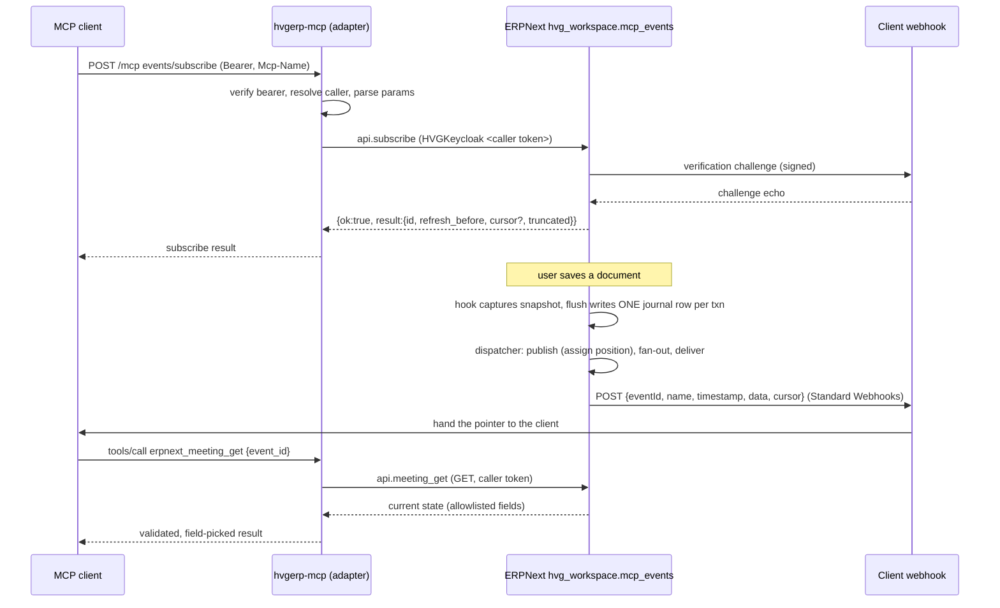

# Extending MCP Events to more event types

This document is the engineering guide for adding new event families (tasks,
leave approvals, orders, ...) to MCP Events. It records how the meeting events
shipped in 3.6.0 and 3.7.0 actually work end to end, which parts are already
generic, which parts are hard-wired to meetings, and the exact steps and checks
a new family needs on both sides.

Read [mcp-events-meetings.md](mcp-events-meetings.md) first: it is the operator
and client reference for the protocol. This document is for whoever builds the
next family.

State described here: hvgerp-mcp 3.7.0 and ERP release `rel-20261008-03`
(`hvg_workspace.mcp_events`), both in production since 2026-10-08.

## 1. The model in one paragraph

A client subscribes to a named event (`meeting.updated`) with optional arguments
(`{event_id}`) and a webhook URL plus signing secret. This server validates the
request and forwards it, under the caller's own bearer token, to ERPNext.
ERPNext stores the subscription, records every relevant change in a durable
journal inside the same database transaction as the change, and later delivers a
small signed webhook that only **points** at what changed (id, revision, which
fields). The client then calls a re-read tool (`erpnext_meeting_get`) to fetch
the current state under its own permissions. Content never travels in the
webhook, and this server never stores anything.

## 2. Data flow



### 2.1 Subscribe path (this repository)

| Step | Where                                             | What happens                                                                                                                                                                      |
| ---- | ------------------------------------------------- | --------------------------------------------------------------------------------------------------------------------------------------------------------------------------------- |
| 1    | `server.ts`                                       | `eventsFlagEnabled()` reads `MCP_EVENTS_ENABLED`; `assertEventsPolicy()` refuses to start unless `MCP_CALLER_IDENTITY=required`, OAuth JWKS is set and no static tokens exist.    |
| 2    | `src/events/adapter.ts` `createEventsAdapter`     | Wraps the SDK fetch handler. It only acts when the SDK answers 404 / `-32601` for an `events/*` method, so every other method is untouched.                                       |
| 3    | adapter                                           | Re-verifies the bearer, resolves the caller identity, checks `Mcp-Name` against `params.name`, applies the limiter (10 active, 50 queued) and the peek budget.                    |
| 4    | `src/events/protocol.ts` `parseSubscribeParams`   | Strict key allowlist, event name, `delivery` (`webhook` only, https URL, `whsec_` secret of 24 to 64 bytes), then `arguments` against the input schema, then ttl, maxAge, cursor. |
| 5    | `src/events/erp-store.ts` `createErpEventsStore`  | Calls `hvg_workspace.mcp_events.api.subscribe` with the caller's client (`actsAs === "caller"` is enforced), unwraps the `{ok,result                                              |
| 6    | `protocol.ts` `toSubscribeResult` / `mapErpError` | Validates the ERP result shape and maps ERP errors through a closed allowlist with fixed messages.                                                                                |

### 2.2 Change capture and delivery (ERPNext, `hvg_workspace/mcp_events/`)

| Module            | Role                                                                                                                                                                                                       |
| ----------------- | ---------------------------------------------------------------------------------------------------------------------------------------------------------------------------------------------------------- |
| `events.py`       | `doc_events` hooks on `Event`, `DocShare` and `User` (wired in `hooks.py`). First touch in a transaction snapshots committed state; `flush()` before COMMIT diffs and writes one net journal row.          |
| `outbox.py`       | The journal (`HVG MCP Event Journal`). `write_row()` inserts `(source_name, revision, change, data, scope)`. Positions are assigned by a single publisher, not auto-increment, so cursors never skip rows. |
| `access.py`       | Who is a member, who may read. The recipient proof (`scope.members` / `scope.readers`, hashed user keys) is computed at write time and rechecked at delivery.                                              |
| `subscription.py` | Lifecycle: eligibility (`subscribe_enabled`, client allowlist, account), callback verification outside row locks, CAS activation, quota (20 per user), rate limits, TTL and auth lease.                    |
| `dispatch.py`     | `run()`: publish, expire, fan-out (`_fan_out_matches`), deliver with claim tokens, retries (12 attempts, 30 s to 30 min backoff), permission recheck before every send.                                    |
| `webhook.py`      | Standard Webhooks signing (`webhook-id`, `webhook-timestamp`, `webhook-signature: v1,<base64>`), DNS-pinned egress, no redirects, 256 KiB body limit.                                                      |
| `readback.py`     | `meeting_get`: current state for a reader, tombstone for a reader who saw the deletion, the same "not available" answer otherwise.                                                                         |
| `contract.py`     | Loads the verbatim copy of the contract JSON, exposes `event_names()`, `change_for_event()`, `contract_digest()`.                                                                                          |
| `api.py`          | Whitelisted entry points `subscribe`, `unsubscribe`, `meeting_get`. The principal always comes from `mcp_auth.verified_identity()`, never from arguments.                                                  |
| `config.py`       | Site-config flags, all off by default: `mcp_events_journal_enabled`, `mcp_events_subscribe_enabled`, `mcp_events_dispatch_enabled`, and the list `mcp_events_allowed_clients`.                             |

The webhook body is built in `dispatch.envelope()`:

```json
{
  "eventId": "evt_...",
  "name": "meeting.updated",
  "timestamp": "2026-10-08T11:02:03Z",
  "data": {
    "event_id": "EV00075",
    "revision": 4,
    "change": "updated",
    "...": "..."
  },
  "cursor": "c2...."
}
```

`data` must validate against the event's `payloadSchema` in the contract.

### 2.3 Re-read path

`erpnext_meeting_get` (`src/tools/calendar.ts`) validates its own arguments,
refuses a shared client (`actsAs !== "caller"`), calls `fetchMeeting()`
(`erp-store.ts`) which does a fresh GET to `api.meeting_get`, then
`pickMeetingFields()` copies only published keys after checking the shape of
every value. Any mismatch becomes the fixed error `Events backend error`.

## 3. What is generic and what is meeting-specific

### 3.1 Already generic (no change needed for a new family)

- `src/events/adapter.ts`: routing, auth, identity, `Mcp-Name`, limiter, peek
  budget, `capabilities.events` injection. It never looks at event names.
- `protocol.ts`: delivery, callback URL, secret, ttl, maxAge and cursor parsing,
  `toSubscribeResult`, `mapErpError`, error codes and fixed messages.
- `erp-store.ts`: `subscribe` / `unsubscribe` forward `name` and `arguments`
  untouched.
- `src/compat/legacy-shim.ts`: `NAME_SOURCE` maps `events/subscribe` and
  `events/unsubscribe` to `params.name` for every event.
- `src/auth/config.ts`: the flag and the policy.
- `deno.json` `publish.include` already ships `src/events/contract/*.json`, and
  the Node bundle inlines JSON imports.
- ERP: subscription lifecycle, outbox positions and cursors, webhook signing and
  egress, retry policy, quota and rate limits.

### 3.2 Hard-wired to meetings (must be generalised once)

This repository:

| Location                                                                            | Coupling                                                                                                                        |
| ----------------------------------------------------------------------------------- | ------------------------------------------------------------------------------------------------------------------------------- |
| `protocol.ts` top-level import                                                      | Imports exactly one file, `meeting-events.v1.json`.                                                                             |
| `protocol.ts` `MEETING_EVENT_NAMES`                                                 | `parseEventName` accepts only these names; anything else is `-32011`.                                                           |
| `protocol.ts` `PAYLOAD_SCHEMA`, `EVENT_INPUT_SCHEMA`                                | One payload schema and one input schema shared by every descriptor; `parseArguments` uses the single input schema.              |
| `protocol.ts` `CHANGE_BY_EVENT`, `validateEventPayload`                             | Read from the one contract.                                                                                                     |
| `src/events/contract_test.ts`                                                       | Hashes one file, reads the hash from `docs/mcp-events-meetings.md`, asserts exactly three event names.                          |
| `src/events/json-schema.ts`                                                         | Supports only the keywords the meeting contract uses (no `pattern`, `minItems`, `maxItems`, `uniqueItems`, `oneOf`, `$ref`...). |
| `src/tools/calendar.ts`, `EVENTS_TOOL_NAMES`                                        | The only re-read tool. `src/client.ts` adds `calendarTools` when `includeEventsTools` is on.                                    |
| `erp-store.ts` `ERP_EVENTS_METHODS.meetingGet`, `fetchMeeting`, `pickMeetingFields` | Meeting read-back and its output validator.                                                                                     |

ERPNext (`hvg_workspace/mcp_events/`):

| Location                                        | Coupling                                                                                                                                                                                                                                                                |
| ----------------------------------------------- | ----------------------------------------------------------------------------------------------------------------------------------------------------------------------------------------------------------------------------------------------------------------------- |
| `dispatch.envelope()`                           | `"name": "meeting." + journal.change`: the family is implied, not stored.                                                                                                                                                                                               |
| `contract.py` `CONTRACT_PATH`                   | One contract file; `change_for_event` and `require_event_name` read only it.                                                                                                                                                                                            |
| Journal columns and keys                        | Rows are keyed by `source_name` (the Event name) with no doctype. `source_change_id` hashes `(site, source_name, revision)`, the unique index is `(source_name, revision)`, and the revision fence is keyed by `source_name`. A Task named like an Event would collide. |
| `dispatch._fan_out_matches`                     | Matches `change_for_event(sub.event_name) == row.change` and `event_filter_id` against `source_name`, with no family check.                                                                                                                                             |
| `events.py`, `hooks.py`                         | Hooks only on `Event` (plus `DocShare` and `User` for meeting audiences).                                                                                                                                                                                               |
| `access.py`                                     | Meeting membership (`MEETING_CATEGORY`, participants, owner, DocShare).                                                                                                                                                                                                 |
| `subscription.normalize_subscription_arguments` | `event_id` is resolved with `access.canonical_event_name` (an Event lookup).                                                                                                                                                                                            |
| `readback.py`, `api.meeting_get`                | Meeting read-back only.                                                                                                                                                                                                                                                 |

## 4. Design decisions for the next version

These are the recommended rules. Changing one of them is a design change, not an
implementation detail.

1. **One contract lineage per family, versioned on its own.** A family's
   contract files are `src/events/contract/<family_slug>-events.v<K>.json`,
   where `K` counts the revisions of that family alone and starts at 1 (for
   example `task-events.v1.json`). A released contract file is frozen: never
   edit it in place, its hash is the agreement between the two repositories.
   Clients validate payloads with `additionalProperties: false`, so any change
   to an existing event's schema, even one added optional field, breaks a client
   that still holds the old schema. Two kinds of release follow from that:
   - **New events only.** `<family_slug>-events.v<K+1>.json` keeps every
     existing event with a byte-for-byte identical effective schema and adds new
     event names. It replaces `v<K>` in `CONTRACTS`; the old file stays in the
     repository (step 2 keeps testing it). Old clients see no difference for the
     events they already use.
   - **Any schema change to an existing event.** A new parallel family
     `<family>.v<G>`, where `G` is the next generation (2, 3, ...), with event
     names `<family>.v<G>.<change>`. It starts its own lineage under its own
     slug: `task.v2` begins at `task_v2-events.v1.json`. The base family keeps
     its lineage, so both can still gain events independently and their file
     names never collide. Both are loaded until clients move, and ERP journals
     each change once per loaded family (decision 6). The first generation never
     carries a version segment.
2. **Event names are `<family>.<change>` and globally unique** across all loaded
   contracts. The registry must refuse to start if two loaded contracts declare
   the same name or the same family. Keep the `change` enum inside each family.
   Family names follow a fixed grammar: a base family is lowercase letters and
   digits starting with a letter (`^[a-z][a-z0-9]*$`, so no `_`, `-` or `.`),
   and a parallel family adds one generation suffix
   (`^[a-z][a-z0-9]*\.v([2-9]|[1-9][0-9]+)$`). Where a family appears inside an
   identifier (file name, tool name, ERP method, flag), use its slug: the family
   with `.` replaced by `_`, so `task.v2` becomes `task_v2`. Frappe reads dots
   in a method path as module separators, and tool names must stay snake_case.
   Under the grammar the slug is snake_case and one-to-one; the registry still
   rejects any family that breaks the grammar and any two families with the same
   slug.
3. **Per-event schemas.** Each contract keeps a shared `inputSchema` and
   `payloadSchema` as the default, and an event entry may override either. The
   catalog descriptor exposes the effective schemas. `parseSubscribeParams`
   already parses `name` before `arguments`, so validating arguments against the
   schema of that name is a local change.
4. **Payload stays a pointer.** Ids, revision, change, changed field names and
   the minimum scheduling or status data needed to decide whether to re-read.
   Never titles, descriptions, amounts, emails, names of people or free text.
   Content belongs in the re-read tool, behind a live permission check. When a
   family spans several doctypes (decision 6), the pointer carries
   `source_doctype` as a closed enum next to the id, and the re-read tool takes
   both, because two doctypes can hold records with the same `name`.
5. **Each family has exactly one re-read tool**,
   `erpnext_<family_slug>_event_get`, built like `erpnext_meeting_get`: strict
   argument allowlist, `actsAs === "caller"`, fresh GET with no cache, output
   passed through an allowlist validator that checks every value's shape, fixed
   error messages, a deleted record returns only the tombstone keys. The name
   must not collide with any existing tool: `erpnext_task_get` and
   `erpnext_leave_application_get` already exist with different semantics (they
   run under shared credentials too), and a second tool with the same name would
   be listed twice by `toMCPFormat` and overwrite the first in
   `buildHandlersMap`. Add a test that the combined tool list has no duplicate
   name. A versioned family `<family>.v<G>` (decision 1) reuses the base
   family's tool and ERP method when the read-back shape is unchanged; if it
   needs a different shape, its tool is `erpnext_<family>_v<G>_event_get` and
   its ERP method `<family>_v<G>_get` (the slug, decision 2), registered and
   tested the same way.
6. **The journal records the family and the source doctype.** ERP adds two
   columns: `family` (drives the event name and matching) and `source_doctype`
   (identifies the record; one family can span several doctypes, such as `Task`
   and `ToDo`). The canonical source identity is
   `(source_doctype, source_name)`. One source change produces one row per
   family that covers it (two while `<family>` and `<family>.v2` run side by
   side), so the row identity includes the family: `source_change_id` hashes
   `(site, family, source_doctype, source_name, revision)`, the unique index
   becomes `(family, source_doctype, source_name, revision)` and the revision
   fence is keyed by `(family, source_doctype, source_name)`. `_fan_out_matches`
   compares `family` as well as change, and `envelope()` builds `name` from
   `family`. Existing rows are backfilled as family `meeting`, doctype `Event`.
   This is the largest and riskiest change of the whole extension and must ship,
   migrate and be verified before any new family writes a row.
7. **Each new family gets its own ERP gates**, each also gated by the matching
   global flag: `mcp_events_<family_slug>_journal_enabled`,
   `mcp_events_<family_slug>_subscribe_enabled` and
   `mcp_events_<family_slug>_dispatch_enabled`, all default off (a missing key
   reads as off). The meeting family has no per-family keys and keeps following
   the global flags alone, so an upgrade that adds the gates cannot switch
   meetings off on a site where they already run. The gates give the rollout
   states:
   - **shadow**: journal on, subscribe off and dispatch off. Rows are written
     and measured; `events/subscribe` for the family answers `-32012`. Dispatch
     must be off explicitly: turning subscribe off does not remove subscriptions
     already stored in ERPNext (they expire on their own TTL, see the rollback
     section of [mcp-events-meetings.md](mcp-events-meetings.md)), so a family
     rolled back to shadow with dispatch still on would deliver its new rows to
     them.
   - **subscribe on, dispatch off**: subscriptions are accepted; deliveries are
     created and stay pending (paused), never dropped or marked skipped, and go
     out once dispatch is on, as long as they are still inside the delivery
     window.
   - **all on**: normal delivery.
8. **Discovery stays static.** `events/list` lists every family compiled into
   the server. Ship a family in an MCP release only after ERP serves it in
   production, otherwise clients see events that always fail with `-32012`.
   `capabilities.events` stays `{}`.
9. **Semver.** Adding a family, adding events to a family (decision 1, first
   case) or adding a `<family>.v<G>` family is a minor release. Removing any
   event, family or `<family>.v<G>` family is a major release.

## 5. Recipe: this repository

Do the one-time registry refactor (steps 1 to 3) in its own pull request, with
the meeting contract as the only entry and no behaviour change. Then each new
family is steps 4 to 9.

### Step 1. Registry of contracts (one time)

Replace the single import in `protocol.ts` with a registry. Sketch:

```ts
import meetingContract from "./contract/meeting-events.v1.json" with {
  type: "json",
};

interface ContractFile {
  family?: string; // required in every new file; meeting-events.v1 predates it
  contract: string;
  protocolVersion: string;
  changeByEvent: Record<string, string>;
  inputSchema: JsonSchemaObject;
  payloadSchema: JsonSchemaObject;
  events: {
    name: string;
    description: string;
    inputSchema?: JsonSchemaObject;
    payloadSchema?: JsonSchemaObject;
  }[];
}

interface ContractEntry {
  family: string;
  file: ContractFile;
}

export const CONTRACTS: readonly ContractEntry[] = [
  { family: "meeting", file: meetingContract },
];

interface RegisteredEvent {
  family: string;
  contract: string;
  change: string;
  descriptor: EventDescriptor;
}

const REGISTRY: ReadonlyMap<string, RegisteredEvent> = buildRegistry(CONTRACTS);
```

The family is explicit: each entry of `CONTRACTS` names it, and every new
contract file also carries a top-level `family` that must equal it (the frozen
`meeting-events.v1.json` has none, which is why the entry holds it). Never
derive the family from the file name, the contract id or the first event: a file
name says nothing about which of two parallel families it belongs to, and a
mistyped prefix on a later event must not move it into another family's gates.
`buildRegistry` throws at module load on a duplicate name, on two entries for
the same family (decision 1), on a family name outside the grammar or a slug
shared by two families (decision 2), on a file `family` that differs from its
entry, on any event whose name is not exactly `<family>.<changeByEvent[name]>`,
on a name missing from `changeByEvent`, or on a `protocolVersion` other than the
one this server speaks. Then:

- `parseEventName` checks `REGISTRY.has(name)`.
- `parseArguments(name, value)` validates against
  `REGISTRY.get(name).descriptor.inputSchema`.
- `validateEventPayload(name, data)` uses the event's own payload schema and
  change.
- `eventCatalog()` / `handleEventsList` return descriptors in registry order.
- Keep `MEETING_EVENT_NAMES`, `PAYLOAD_SCHEMA`, `EVENT_INPUT_SCHEMA` and
  `CHANGE_BY_EVENT` only as long as tests need them; they are not exported from
  `mod.ts`, so removing them is not a public API change.

### Step 2. Contract test per file (one time)

Generalise `contract_test.ts` to discover every `*.json` file in
`src/events/contract/`, not just the entries of `CONTRACTS`: a retired version
is still published and its hash is still an agreement, so an accidental edit to
it must fail. For each file, hash it and compare with its own
`SHA-256 of the contract file` line in that family's doc
(`docs/mcp-events-<family>.md` keeps one line per version), assert the event
list, and run `collectKeywords` over every schema, including per-event
overrides. Also assert that every entry of `CONTRACTS` is one of the discovered
files.

When a release replaces `v<K>` with `v<K+1>` in `CONTRACTS` (decision 1, new
events only), add a cross-version test: every event of `v<K>` exists in `v<K+1>`
with a deeply equal effective `inputSchema` and `payloadSchema` and the same
`changeByEvent` entry. Keep that test for as long as `v<K>` is in the
repository. Without it, a changed schema with a freshly recorded hash would pass
every other check.

### Step 3. Schema keywords (only when needed)

If a new contract needs a keyword that `SUPPORTED_KEYWORDS` lacks, add it to
`json-schema.ts` with tests first (valid, invalid, error message without the
value). Error messages must keep carrying only the path and keyword, never the
value. Prefer a schema that avoids the keyword over growing the validator.

### Step 4. Write the contract

Create `src/events/contract/<family_slug>-events.v1.json` with `family`,
`contract`, `protocolVersion: "2026-07-28"`, `changeByEvent`, `inputSchema`,
`payloadSchema` (`additionalProperties: false`, every field bounded), and
`events` with one sentence of description each. Add it to `CONTRACTS`. Write the
payload as a pointer (decision 4). Typical required set: `<id>`, `revision`,
`change`, `changed_fields`, `deleted`, plus `source_doctype` for a multi-doctype
family. For such a family the `inputSchema` also requires `source_doctype`
whenever the id filter is supplied (an `if`/`then` with `required`, keywords the
validator already supports).

### Step 5. ERP method names

Add the read-back method to `ERP_EVENTS_METHODS` in `erp-store.ts`
(`hvg_workspace.mcp_events.api.<family_slug>_get`, using the slug from decision
2, so `task.v2` maps to `api.task_v2_get`, never `api.task.v2_get`). Subscribe
and unsubscribe stay the same methods for every family.

### Step 6. Re-read tool

Add `src/tools/<family>.ts` (or extend `calendar.ts` only for calendar-like
families) exporting the tool `erpnext_<family_slug>_event_get` (decision 5) and
its name. Check the name against every existing tool first. Register the name in
`EVENTS_TOOL_NAMES` and the tool in the array `ErpNextToolsClient` appends when
`includeEventsTools` is on. Keep it out of `toolsByCategory`, `allTools` and
`getToolByName` (see the comment in `src/tools/mod.ts`): the public registries
would otherwise let a library user run it under service credentials with Events
off. Add a `fetch<Family>()` and a `pick<Family>Fields()` in `erp-store.ts`,
modelled on `fetchMeeting` / `pickMeetingFields`:

- check `result.<id> === args.<id>` before anything else, and for a
  multi-doctype family also `result.source_doctype === args.source_doctype`,
  since `Task` and `ToDo` can share an id;
- tombstone keys only when `deleted === true`;
- every enum is a closed `Set`, every date and instant is checked as real, every
  string is bounded, unknown keys are dropped;
- never copy a value you did not validate.

### Step 7. Tests

| File                        | Add                                                                                                                                                                                                                                                                                                               |
| --------------------------- | ----------------------------------------------------------------------------------------------------------------------------------------------------------------------------------------------------------------------------------------------------------------------------------------------------------------- |
| `protocol_test.ts`          | Registry builds, duplicate name throws, catalog lists the new descriptors with their own schemas, arguments validated per event, `validateEventPayload` for valid and invalid fixtures of each new event.                                                                                                         |
| `adapter_wire_test.ts`      | `events/list` over HTTP returns the new names; `events/subscribe` with a new name reaches the store with `name` and `arguments` unchanged; unknown name still `-32011`.                                                                                                                                           |
| `erp-store_test.ts`         | The new fetch: id mismatch, doctype mismatch for a multi-doctype family, extra keys dropped, every shape violation is `Events backend error`, 401 / 403 / 429 mapping.                                                                                                                                            |
| `contract_test.ts`          | Covered by step 2.                                                                                                                                                                                                                                                                                                |
| tool test (`src/tools/...`) | Happy path: the handler, called with a caller-scoped client, makes exactly one GET to the read-back method with the expected arguments and returns the picked result. Then unknown argument refused with the fixed message, shared client refused, input bounds, and no duplicate name in the combined tool list. |

Run `deno task pre-commit` and `deno task test`, then `deno task release:check`:
a new family adds a contract import and a tool, which changes the published
surfaces, and only that task runs `scripts/build-node.sh` to prove the npm
bundle still builds. CI on a branch runs only on manual dispatch:
`gh workflow run Test --ref <branch>`, so it cannot replace the local check.

### Step 8. Documentation

- `docs/mcp-events-<family>.md`: purpose, the contract hash line, the event
  table, the re-read tool rules. Link it from
  [mcp-events-meetings.md](mcp-events-meetings.md) and this file.
- `docs/tools.md` and the README tool count if they list tools.
- `CHANGELOG.md` under the new minor version.

### Step 9. Release

Follow the normal release flow (version in `deno.json` and `src/version.ts`,
release PR, tag, npm, bundle image). Give ERP the new contract hash so their
verbatim copy can be checked against it.

## 6. Recipe: ERPNext side (owned by the ERP repository)

Listed here so both sides agree on the order; the ERP team implements it.

1. **Journal `family` and `source_doctype` columns** (decision 6), with
   migration, backfill, the new unique index in `install.ensure_indexes()`, the
   new `source_change_id` and revision fence key (both including `family`), and
   tests proving meeting rows, cursors and replays are unchanged.
2. **Contract loading**: copy the new contract file verbatim next to
   `meeting-events.v1.json`, generalise `contract.py` to a registry with the
   same explicit family and name rules as `buildRegistry` here, and add a digest
   test against the hash published in this repository.
3. **Capture**: `doc_events` hooks for the new doctype in `hooks.py`, the same
   snapshot then `flush()` pattern as `events.py` (one net row per transaction,
   nothing on rollback, transient DB errors re-raised, other errors logged
   without content and marked with `outbox.note_skipped`).
4. **Audience and proof**: an `access` function returning hashed `members` and
   `readers` for a record, used at write time, at delivery recheck and in the
   read-back. Same rule in all three places.
5. **Subscription arguments**: the family's id argument resolved to a stable
   identity, like `event_identity` for meetings. For a multi-doctype family the
   filter is the pair `(source_doctype, id)`: refuse an id without its doctype,
   persist and match the pair, and test two records with equal ids in both
   doctypes.
6. **Dispatch**: `envelope()` takes the name from the row's `family`;
   `_fan_out_matches` compares family as well as change.
7. **Read-back**: `api.<family_slug>_get` with the fixed `{ok,result|error}`
   envelope, the not-available answer for no permission and for missing records
   alike, and a tombstone only for a user the journal proves saw it.
8. **Flags**: `mcp_events_<family_slug>_journal_enabled`,
   `mcp_events_<family_slug>_subscribe_enabled` and
   `mcp_events_<family_slug>_dispatch_enabled` for each new family, all default
   off, each also gated by the global flag (decision 7). Meetings keep the
   global flags only. Subscribe off answers `-32012`; dispatch off leaves
   deliveries pending, never dropped.
9. **Rollout**: shadow mode (journal on, subscribe and dispatch off) in
   production, measure row volume and hook latency, then subscribe on with
   dispatch off, check that deliveries queue as pending, then dispatch on.

## 7. Invariants that must not break

- This server stores nothing: no secret, token, URL, cursor or subscription.
- Every ERP call runs as the caller (`HVGKeycloak <token>`,
  `actsAs ===
  "caller"`); a shared service account never subscribes or reads
  back.
- Events require `MCP_CALLER_IDENTITY=required`, OAuth JWKS and no static
  tokens. `capabilities.events` appears only for a verified identity.
- Error messages are fixed per code. ERP messages are never reflected; `data`
  passes only through the allowlist in `mapErpError`.
- No log line carries a token, secret, callback path or query, title or email.
- Payloads are pointers. Content only comes from the re-read tool after a live
  permission check.
- Delivery is at least once. The generic dedupe key is the envelope `eventId`,
  unique per journal row across all families once `family` and `source_doctype`
  are part of `source_change_id` (decision 6). Ordering is per record: compare
  `revision` only between events of the same family and the same source
  (`source_doctype` and id when the family spans several doctypes), and a lower
  revision never overrides a higher one. Clients must tolerate replays and
  out-of-order arrival. The meetings rule "dedupe on `(event_id, revision)`" is
  that family's instance of this rule.
- A user who loses access stops receiving events and gets the same answer for
  "no permission" as for "does not exist".
- A contract file never changes after release; its hash is the agreement between
  the two repositories.

## 8. Acceptance checklist for a new family

- [ ] ERP journal `family` and `source_doctype` columns migrated in production,
      meeting events still delivered (compare one real `meeting.updated` before
      and after).
- [ ] Contract hash identical in both repositories.
- [ ] `events/list` from a client with a verified identity shows the new events;
      without identity there is no `capabilities.events`.
- [ ] Subscribe with the allowed client succeeds; with any other client
      `-32012`; unknown name `-32011`; bad arguments `-32602`.
- [ ] A real change produces exactly one journal row with a stable `eventId`.
      Each subscriber receives it at least once; every repeat (a retry after a
      timeout, a replay after re-subscribe) carries the same `eventId` and is
      deduplicated by the client. The body validates with `validateEventPayload`
      and the signature verifies.
- [ ] Two quick saves in one transaction produce one row; a rollback produces
      none.
- [ ] Re-read returns current state for a reader, the not-available error for a
      non-reader, a tombstone after deletion for a former reader.
- [ ] Removing a user's permission stops delivery to that user.
- [ ] Unsubscribe is idempotent and stops delivery.
- [ ] No content in webhook bodies or logs (grep a sample for titles and
      emails).

## 9. Known limitations to keep in mind

- **Only webhook delivery.** `delivery.mode` other than `webhook` is `-32014`.
- **Hooks only see ORM writes.** SQL and `frappe.db.set_value` bypass the
  capture; any family whose doctype is changed that way needs a wrapper like
  `update_attending_status`.
- **Not every visible change emits.** The journal compares a fixed set of
  columns. For meetings a title change alone emits nothing (the title is read
  live by `erpnext_meeting_get`). Decide and document the compared columns per
  family.
- **One client allowlist for all families.** `mcp_events_allowed_clients` holds
  only `hvgerp-mcp` today; the smoke-test client gets `-32012` by design.
  Widening it is a production change for the ERP team, with user approval.
- **The catalog is one page.** `events/list` rejects a cursor. That is fine for
  tens of events; past that, add pagination before adding events.
- **Auth lease.** Delivery pauses when the subscriber's token lease runs out (at
  most 24 h, never past the token's `exp`); the client must re-subscribe before
  `refreshBefore`. With Keycloak offline sessions (30 days idle) a connector
  like ChatGPT keeps refreshing on its own.

## 10. Candidate families

Not decided. Listed with the pointer each would carry, to help pick the next
one.

| Family     | ERPNext doctype      | Events                                                | Pointer fields                                                                                                   | Re-read tool                                                                                           |
| ---------- | -------------------- | ----------------------------------------------------- | ---------------------------------------------------------------------------------------------------------------- | ------------------------------------------------------------------------------------------------------ |
| `task`     | `Task`, `ToDo`       | `task.assigned`, `task.updated`, `task.closed`        | `source_doctype` (`Task` or `ToDo`), `task_id`, `revision`, `change`, `changed_fields`, `status`, `exp_end_date` | `erpnext_task_event_get`, taking `source_doctype` and `task_id` (not `erpnext_task_get`, which exists) |
| `leave`    | `Leave Application`  | `leave.submitted`, `leave.approved`, `leave.rejected` | `leave_id`, `revision`, `change`, `status`, `from_date`, `to_date`                                               | `erpnext_leave_event_get` (not `erpnext_leave_application_get`, which exists)                          |
| `approval` | Workflow transitions | `approval.requested`, `approval.decided`              | `doctype`, `doc_id`, `revision`, `change`, `workflow_state`                                                      | `erpnext_approval_event_get`, taking `doctype` and `doc_id`                                            |

Prefer a family where the audience rule is simple (assignee and owner) for the
first extension, since the access proof is the hardest part to get right.
