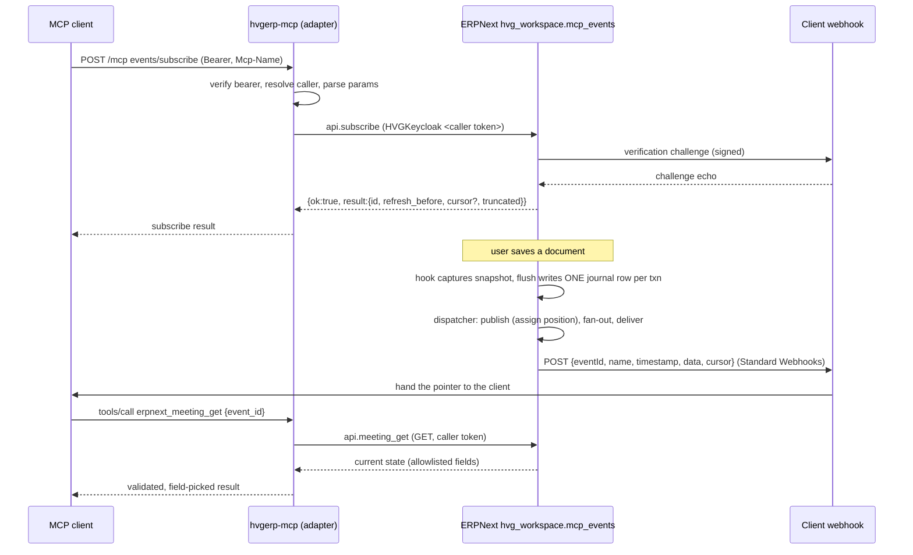

# Extending MCP Events to more event types

This document is the engineering guide for adding new event families (tasks,
leave approvals, orders, ...) to MCP Events. It records how the meeting events
shipped in 3.6.0 and 3.7.0 actually work end to end, which parts are already
generic, which parts are hard-wired to meetings, and the exact steps and checks
a new family needs on both sides.

Read [mcp-events-meetings.md](mcp-events-meetings.md) first: it is the operator
and client reference for the protocol. This document is for whoever builds the
next family.

State described here: hvgerp-mcp 3.7.0 and ERP release `rel-20261008-03`
(`hvg_workspace.mcp_events`), both in production since 2026-10-08.

## 1. The model in one paragraph

A client subscribes to a named event (`meeting.updated`) with optional arguments
(`{event_id}`) and a webhook URL plus signing secret. This server validates the
request and forwards it, under the caller's own bearer token, to ERPNext.
ERPNext stores the subscription, records every relevant change in a durable
journal inside the same database transaction as the change, and later delivers a
small signed webhook that only **points** at what changed (id, revision, which
fields). The client then calls a re-read tool (`erpnext_meeting_get`) to fetch
the current state under its own permissions. Content never travels in the
webhook, and this server never stores anything.

## 2. Data flow



### 2.1 Subscribe path (this repository)

| Step | Where                                             | What happens                                                                                                                                                                      |
| ---- | ------------------------------------------------- | --------------------------------------------------------------------------------------------------------------------------------------------------------------------------------- |
| 1    | `server.ts`                                       | `eventsFlagEnabled()` reads `MCP_EVENTS_ENABLED`; `assertEventsPolicy()` refuses to start unless `MCP_CALLER_IDENTITY=required`, OAuth JWKS is set and no static tokens exist.    |
| 2    | `src/events/adapter.ts` `createEventsAdapter`     | Wraps the SDK fetch handler. It only acts when the SDK answers 404 / `-32601` for an `events/*` method, so every other method is untouched.                                       |
| 3    | adapter                                           | Re-verifies the bearer, resolves the caller identity, checks `Mcp-Name` against `params.name`, applies the limiter (10 active, 50 queued) and the peek budget.                    |
| 4    | `src/events/protocol.ts` `parseSubscribeParams`   | Strict key allowlist, event name, `delivery` (`webhook` only, https URL, `whsec_` secret of 24 to 64 bytes), then `arguments` against the input schema, then ttl, maxAge, cursor. |
| 5    | `src/events/erp-store.ts` `createErpEventsStore`  | Calls `hvg_workspace.mcp_events.api.subscribe` with the caller's client (`actsAs === "caller"` is enforced), unwraps the `{ok,result                                              |
| 6    | `protocol.ts` `toSubscribeResult` / `mapErpError` | Validates the ERP result shape and maps ERP errors through a closed allowlist with fixed messages.                                                                                |

### 2.2 Change capture and delivery (ERPNext, `hvg_workspace/mcp_events/`)

| Module            | Role                                                                                                                                                                                                       |
| ----------------- | ---------------------------------------------------------------------------------------------------------------------------------------------------------------------------------------------------------- |
| `events.py`       | `doc_events` hooks on `Event`, `DocShare` and `User` (wired in `hooks.py`). First touch in a transaction snapshots committed state; `flush()` before COMMIT diffs and writes one net journal row.          |
| `outbox.py`       | The journal (`HVG MCP Event Journal`). `write_row()` inserts `(source_name, revision, change, data, scope)`. Positions are assigned by a single publisher, not auto-increment, so cursors never skip rows. |
| `access.py`       | Who is a member, who may read. The recipient proof (`scope.members` / `scope.readers`, hashed user keys) is computed at write time and rechecked at delivery.                                              |
| `subscription.py` | Lifecycle: eligibility (`subscribe_enabled`, client allowlist, account), callback verification outside row locks, CAS activation, quota (20 per user), rate limits, TTL and auth lease.                    |
| `dispatch.py`     | `run()`: publish, expire, fan-out (`_fan_out_matches`), deliver with claim tokens, retries (12 attempts, 30 s to 30 min backoff), permission recheck before every send.                                    |
| `webhook.py`      | Standard Webhooks signing (`webhook-id`, `webhook-timestamp`, `webhook-signature: v1,<base64>`), DNS-pinned egress, no redirects, 256 KiB body limit.                                                      |
| `readback.py`     | `meeting_get`: current state for a reader, tombstone for a reader who saw the deletion, the same "not available" answer otherwise.                                                                         |
| `contract.py`     | Loads the verbatim copy of the contract JSON, exposes `event_names()`, `change_for_event()`, `contract_digest()`.                                                                                          |
| `api.py`          | Whitelisted entry points `subscribe`, `unsubscribe`, `meeting_get`. The principal always comes from `mcp_auth.verified_identity()`, never from arguments.                                                  |
| `config.py`       | Site-config flags, all off by default: `mcp_events_journal_enabled`, `mcp_events_subscribe_enabled`, `mcp_events_dispatch_enabled`, and the list `mcp_events_allowed_clients`.                             |

The webhook body is built in `dispatch.envelope()`:

```json
{
  "eventId": "evt_...",
  "name": "meeting.updated",
  "timestamp": "2026-10-08T11:02:03Z",
  "data": {
    "event_id": "EV00075",
    "revision": 4,
    "change": "updated",
    "...": "..."
  },
  "cursor": "c2...."
}
```

`data` must validate against the event's `payloadSchema` in the contract.

### 2.3 Re-read path

`erpnext_meeting_get` (`src/tools/calendar.ts`) validates its own arguments,
refuses a shared client (`actsAs !== "caller"`), calls `fetchMeeting()`
(`erp-store.ts`) which does a fresh GET to `api.meeting_get`, then
`pickMeetingFields()` copies only published keys after checking the shape of
every value. Any mismatch becomes the fixed error `Events backend error`.

## 3. What is generic and what is meeting-specific

### 3.1 Already generic (no change needed for a new family)

- `src/events/adapter.ts`: routing, auth, identity, `Mcp-Name`, limiter, peek
  budget, `capabilities.events` injection. It never looks at event names.
- `protocol.ts`: delivery, callback URL, secret, ttl, maxAge and cursor parsing,
  `toSubscribeResult`, `mapErpError`, error codes and fixed messages.
- `erp-store.ts`: `subscribe` / `unsubscribe` forward `name` and `arguments`
  untouched.
- `src/compat/legacy-shim.ts`: `NAME_SOURCE` maps `events/subscribe` and
  `events/unsubscribe` to `params.name` for every event.
- `src/auth/config.ts`: the flag and the policy.
- `deno.json` `publish.include` already ships `src/events/contract/*.json`, and
  the Node bundle inlines JSON imports. New JSON files outside that directory
  (the ledger and the read-back schemas of step 2) must be added to it.
- ERP: subscription lifecycle, outbox positions and cursors, webhook signing and
  egress, retry policy, quota and rate limits.

### 3.2 Hard-wired to meetings (must be generalised once)

This repository:

| Location                                                                            | Coupling                                                                                                                        |
| ----------------------------------------------------------------------------------- | ------------------------------------------------------------------------------------------------------------------------------- |
| `protocol.ts` top-level import                                                      | Imports exactly one file, `meeting-events.v1.json`.                                                                             |
| `protocol.ts` `MEETING_EVENT_NAMES`                                                 | `parseEventName` accepts only these names; anything else is `-32011`.                                                           |
| `protocol.ts` `PAYLOAD_SCHEMA`, `EVENT_INPUT_SCHEMA`                                | One payload schema and one input schema shared by every descriptor; `parseArguments` uses the single input schema.              |
| `protocol.ts` `CHANGE_BY_EVENT`, `validateEventPayload`                             | Read from the one contract.                                                                                                     |
| `src/events/contract_test.ts`                                                       | Hashes one file, reads the hash from `docs/mcp-events-meetings.md`, asserts exactly three event names.                          |
| `src/events/json-schema.ts`                                                         | Supports only the keywords the meeting contract uses (no `pattern`, `minItems`, `maxItems`, `uniqueItems`, `oneOf`, `$ref`...). |
| `src/tools/calendar.ts`, `EVENTS_TOOL_NAMES`                                        | The only re-read tool. `src/client.ts` adds `calendarTools` when `includeEventsTools` is on.                                    |
| `erp-store.ts` `ERP_EVENTS_METHODS.meetingGet`, `fetchMeeting`, `pickMeetingFields` | Meeting read-back and its output validator.                                                                                     |

ERPNext (`hvg_workspace/mcp_events/`):

| Location                                        | Coupling                                                                                                                                                                                                                                                                |
| ----------------------------------------------- | ----------------------------------------------------------------------------------------------------------------------------------------------------------------------------------------------------------------------------------------------------------------------- |
| `dispatch.envelope()`                           | `"name": "meeting." + journal.change`: the family is implied, not stored.                                                                                                                                                                                               |
| `contract.py` `CONTRACT_PATH`                   | One contract file; `change_for_event` and `require_event_name` read only it.                                                                                                                                                                                            |
| Journal columns and keys                        | Rows are keyed by `source_name` (the Event name) with no doctype. `source_change_id` hashes `(site, source_name, revision)`, the unique index is `(source_name, revision)`, and the revision fence is keyed by `source_name`. A Task named like an Event would collide. |
| `dispatch._fan_out_matches`                     | Matches `change_for_event(sub.event_name) == row.change` and `event_filter_id` against `source_name`, with no family check.                                                                                                                                             |
| `events.py`, `hooks.py`                         | Hooks only on `Event` (plus `DocShare` and `User` for meeting audiences).                                                                                                                                                                                               |
| `access.py`                                     | Meeting membership (`MEETING_CATEGORY`, participants, owner, DocShare).                                                                                                                                                                                                 |
| `subscription.normalize_subscription_arguments` | `event_id` is resolved with `access.canonical_event_name` (an Event lookup).                                                                                                                                                                                            |
| `readback.py`, `api.meeting_get`                | Meeting read-back only.                                                                                                                                                                                                                                                 |

## 4. Design decisions for the next version

These are the recommended rules. Changing one of them is a design change, not an
implementation detail.

1. **One contract lineage per family, versioned on its own.** A family's
   contract files are `src/events/contract/<family_slug>-events.v<K>.json`,
   where `K` counts the revisions of that family alone and starts at 1 (for
   example `task-events.v1.json`). A released contract file is frozen: never
   edit it in place, its hash is the agreement between the two repositories.
   Clients validate payloads with `additionalProperties: false`, so any change
   to an existing event's schema, even one added optional field, breaks a client
   that still holds the old schema. Two kinds of release follow from that:
   - **New events only.** `<family_slug>-events.v<K+1>.json` keeps every
     existing event with a byte-for-byte identical effective schema and adds new
     event names. It replaces `v<K>` in `CONTRACTS`; the old file stays in the
     repository (step 2 keeps testing it). Old clients see no difference for the
     events they already use.
   - **Removing events (major release only).**
     `<family_slug>-events.v<K+1>.json` may also omit names, but only in a major
     release (decision 9): every name it keeps still has a byte-for-byte
     identical effective schema, and every name it drops moves to
     `RETIRED_EVENTS`. This is how one event leaves a family whose other events
     stay live; the cross-version test (step 2) allows a missing name only with
     a retirement record in the ledger.
   - **Any schema change to an existing event.** A new parallel family
     `<family>.v<G>`, where `G` is the next generation (2, 3, ...), with event
     names `<family>.v<G>.<change>`. It starts its own lineage under its own
     slug: `task.v2` begins at `task_v2-events.v1.json`. The base family keeps
     its lineage, so both can still gain events independently and their file
     names never collide. Both are loaded until clients move, and ERP journals
     each change once per loaded family (decision 6). The first generation never
     carries a version segment. A generation re-versions the same records: it
     keeps the base family's doctypes, and a family over another doctype is a
     new family with its own name, never a generation.
2. **Event names are `<family>.<change>` and globally unique** across all loaded
   contracts. The registry must refuse to start if two loaded contracts declare
   the same name or the same family. Keep the `change` enum inside each family.
   Family names follow a fixed grammar: a base family is lowercase letters and
   digits starting with a letter (`^[a-z][a-z0-9]*$`, so no `_`, `-` or `.`),
   and a parallel family adds one generation suffix
   (`^[a-z][a-z0-9]*\.v([2-9]|[1-9][0-9]+)$`). Where a family appears inside an
   identifier (file name, tool name, ERP method, flag), use its slug: the family
   with `.` replaced by `_`, so `task.v2` becomes `task_v2`. Frappe reads dots
   in a method path as module separators, and tool names must stay snake_case.
   Under the grammar the slug is snake_case and one-to-one; the registry still
   rejects any family that breaks the grammar and any two families with the same
   slug.
3. **Per-event schemas.** Each contract keeps a shared `inputSchema` and
   `payloadSchema` as the default, and an event entry may override either. The
   catalog descriptor exposes the effective schemas. `parseSubscribeParams`
   already parses `name` before `arguments`, so validating arguments against the
   schema of that name is a local change. An override replaces the default
   whole, so it must restate the default's guarantees: every effective input and
   payload schema, override or not, is `type: object` with
   `additionalProperties: false` and every field bounded. Otherwise a misspelled
   argument could become an unfiltered subscription, or a payload could carry
   undeclared content. "Bounded" is a checked rule for every new contract.
   First, every field, nested ones and array `items` included, declares exactly
   one `type` as a single string naming a type `json-schema.ts` implements,
   never missing and never a list: the validator applies `maxLength`, `minimum`
   or `maxItems` only to values of the matching type, so `{ "maxLength": 140 }`
   with no `type` accepts an object or array of any size. "Field" means a
   declaration: a schema under `properties` or `items` of a schema that itself
   declares a `type`. A conditional subschema (the value of `allOf`, `anyOf`,
   `not`, `if`, `then` or `else`, and the `properties` inside it) declares
   nothing; it only constrains fields its enclosing typed object already
   declares, so it carries no `type` and may use only `required`, `properties`,
   `const`, `enum`, `not`, `anyOf`, `allOf`, `if`, `then` and `else` (so a
   nested if/then clause, as in each meeting `allOf` element and the
   multi-doctype pair rule, is a conditional subschema too, under the same shape
   checks), every property it names must be declared by that enclosing object,
   and every `const` or `enum` value it uses must be of that declared field's
   type and accepted by its declaration. The meeting payload's `if`/`then`
   clauses (`deleted: { "const": true }`, `change: { "const": "cancelled" }`,
   `all_day: { "const": false }`) are exactly this form and pass without an
   exemption. Then a string has `maxLength`, `enum` or `const`, or
   `format: date` (fixed length); `format: date-time` is not a bound on its own,
   because its pattern accepts any number of fractional-second digits, so a
   date-time field also needs `maxLength` (35 covers nanoseconds with an
   offset); an `integer` or `number` has both `minimum` and `maximum`, finite
   and inside the safe-integer range (`-9007199254740991` to
   `9007199254740991`), because `Number.isInteger` accepts larger values that no
   longer round-trip exactly and two revisions could then compare equal; an
   array has `maxItems` (not yet in `SUPPORTED_KEYWORDS`, so the first contract
   with an array adds it through step 3) and bounded `items`; a nested object is
   closed the same way. A bound only counts when it is well formed, because the
   validator silently skips a malformed one (it applies `maxLength` only when it
   is a number): `minLength`, `maxLength` and `maxItems` are non-negative
   integers with `minLength` not above `maxLength`, `minimum` and `maximum` are
   finite numbers with `minimum` not above `maximum`, `enum` is a non-empty
   array of values of the declared type, and `const` is a value of the declared
   type (a string field's `const` is a string, so
   `{ "type": "string", "const": 7 }` is rejected rather than left as a field no
   value can ever satisfy). `maxLength: "140"` is therefore an unbounded string.
   The same holds for every other supported keyword, since the validator also
   skips a control keyword of the wrong container type (`required: "field"` is
   never enforced, an object-valued `allOf` is never applied):
   `checkSchemaShape` in `json-schema.ts` walks every schema and requires `type`
   and `format` and `description` to be strings, `properties` an object whose
   values are schemas, `required` an array of distinct strings (in a typed
   object schema at any depth, each also declared in that object's own
   `properties`, so an optional nested object cannot require a key no value can
   carry; in a conditional subschema, each declared by its enclosing typed
   object), `additionalProperties` a boolean, `items` one schema, `allOf` and
   `anyOf` non-empty arrays of schemas, `not`, `if`, `then` and `else` schemas,
   and `then` or `else` only beside an `if`. `buildRegistry` runs it on every
   effective schema, the meeting contract included (it already passes), and the
   test fixtures cover each malformed shape. `format` is limited to the values
   `formatMatches` in `json-schema.ts` really checks (`date` and `date-time`
   today), because it returns `true` for any other format; a new format is
   implemented and tested there first. The frozen `meeting-events.v1.json`
   predates this rule (`time_zone` has no `maxLength`, `changed_fields` no item
   limit, `revision` no `maximum`) and is the only exemption. The exemption is
   bound to the schemas, not to a string: `protocol.ts` imports that exact file
   as `LEGACY_MEETING_V1`, and an effective schema is exempt only when it
   belongs to a `meeting` family entry, its event name is an event of
   `LEGACY_MEETING_V1`, and it deeply equals that event's effective schema
   there. So the `v1` entry itself and a later `meeting-events.v<K>` that keeps
   the `v1` events unchanged (as decision 1 requires) both load, while an event
   the successor adds, or a `v1` event whose schema changed, gets the full
   rules. `buildRegistry` rejects duplicate contract ids and any other file that
   claims the id `meeting-events.v1`. Subscription arguments are identity-only:
   the family's id filter and, for a multi-doctype family, its `source_doctype`,
   given together or not at all (a lone doctype is not an identity). The filter
   is optional for every family: `{}` is a valid, unfiltered subscription, so no
   effective input schema may require the identity. The id field is declared,
   never guessed: each `CONTRACTS` entry names it as `identityField` (`event_id`
   for meetings; candidates use different conventions such as `task_id`,
   `leave_id` or `doc_id`), chosen only from `IDENTITY_FIELD_ALLOWLIST`
   (decision 4), and every effective input schema of the family must declare
   exactly that property, plus `source_doctype` for a multi-doctype family, and
   nothing else. Whether a family is multi-doctype is declared the same way: the
   entry lists its closed doctype set as `sourceDoctypes` (every family, a
   single-doctype one with one member: `["Event"]` for meetings), and only when
   that set has two or more members does every effective input and payload
   schema carry `source_doctype` with an `enum` equal to it, so an override that
   drops the property cannot turn the family single-doctype for one event. Every
   effective payload schema also requires the canonical pointer fields: the
   `identityField`, `revision`, `change` and, for a multi-doctype family,
   `source_doctype`; without them a webhook could not name the record to re-read
   or take part in revision ordering. Two of those fields have one canonical
   schema per family. The identity property (and `source_doctype`) must be
   deeply equal in every effective input and payload schema of the family, so an
   override cannot let a payload carry an id longer than the input, and the
   re-read tool, accept. That identity schema is always exactly `type: string`
   with an explicit `minLength` of at least 1 and a `maxLength`, and no other
   keyword, never an integer, boolean, an `enum`/`const` string or one narrowed
   by `pattern` or `not`: ERP document names are strings, the re-read tool
   derives its argument bounds from those two keywords, and its strict id
   comparison against ERP's string value would fail on anything else. `revision`
   must be `type: integer` with exactly `minimum: 1` and
   `maximum: 9007199254740991`, the full range the source-global allocator can
   emit: a bounded `number` would let a fractional revision validate that no
   journal counter, fence or read-back validator can produce, and a narrower
   range (`minimum: 2`, `maximum: 100`) would reject legitimate rows the
   allocator does produce. These canonical schemas are also the only constraint
   on those fields: no conditional subschema of an effective payload schema may
   name the identity field, `source_doctype` or `revision` in its `properties`
   or `required` (the meeting payload's clauses name only `deleted`, `change`,
   `all_day` and the time fields), because a declaration deeply equal to the
   canonical one could otherwise be narrowed beside it, as
   `not: { properties: { event_id: { const: "EVT-1" } } }` would refuse every
   event for one record. The input schema needs no such rule, since it is
   compared whole against the canonical input. ERP persists and matches only
   that identity, so any other argument would either be refused there or
   silently ignored, which widens the subscription. A new kind of filter is a
   design change that ERP ships first (normalise, persist, match in
   `_fan_out_matches`).
4. **Payload stays a pointer.** Ids, revision, change, changed field names and
   the minimum scheduling or status data needed to decide whether to re-read.
   Never titles, descriptions, amounts, emails, names of people or free text.
   Content belongs in the re-read tool, behind a live permission check. This is
   enforced, not left to the author: `protocol.ts` keeps
   `PAYLOAD_FIELD_ALLOWLIST`, a closed map from each payload property name any
   family may use to the append-only list of reviewed schemas that name may
   stand for. A later generation that changes an allowlisted field's schema (a
   `task.v2` whose `starts_at` takes another bound) appends its new schema to
   that name's list in the allowlist pull request and never replaces the old
   one, which the still-loaded base family keeps using. Today each list holds
   one schema, the meeting payload's the meeting payload's names with bounded
   schemas: `deleted`, `series_changed` and `all_day` `{ "type": "boolean" }`,
   `time_zone` a string with `minLength: 1` and `maxLength: 64`, `starts_at` and
   `ends_at` `format: date-time` with `maxLength: 35`, `start_date` and
   `end_date_exclusive` `format: date`, `revision` the canonical schema of
   decision 3, plus two shapes whose values are the family's own: `change` is
   `{ "type": "string", "enum": [...] }` whose values are drawn from the
   `changeByEvent` values of every contract file of the family in
   `CONTRACT_FILES` up to and including this one, so a retained event's schema
   that a removing release keeps byte-for-byte may still list a retired event's
   change (the exact event-to-change mapping is checked separately by
   `validateEventPayload`), and include `changeByEvent[name]` for every event
   the schema is effective for (an override for `task.closed` declaring only
   `"updated"` fails, since no payload could satisfy both it and
   `validateEventPayload`), `changed_fields` is an array with `maxItems` whose
   `items` are `{ "type": "string", "enum": [...] }`, and `source_doctype` is
   the decision 3 enum. `buildRegistry` rejects any effective payload property
   that is neither the entry's `identityField` nor in the map, any entry whose
   `identityField` is not in `IDENTITY_FIELD_ALLOWLIST` (the closed, centrally
   reviewed set of opaque pointer names, each holding the ERP document `name`
   and nothing else: today `event_id`; `task_id`, `leave_id` or `doc_id` join it
   in the pull request that first needs one), and any listed property whose
   schema is not deeply equal to one of its name's listed schemas (for the three
   family-valued shapes: equal in every keyword except the `enum` values, which
   must be non-empty distinct strings, and `maxItems`), so a reserved name
   cannot be redefined as an integer or object carrying content. The exempt `v1`
   meeting schemas (decision 3, the same `LEGACY_MEETING_V1` match) predate the
   bounds and are checked by name only. Adding a name or changing its schema is
   its own reviewed pull request, with a comment saying why the field is routing
   or scheduling metadata and not content, never a line slipped into a family's
   pull request. When a family spans several doctypes (decision 6), the pointer
   carries `source_doctype` as a closed enum next to the id, and the re-read
   tool takes both, because two doctypes can hold records with the same `name`.
5. **Each family has exactly one re-read tool**,
   `erpnext_<family_slug>_event_get`, built like `erpnext_meeting_get`: strict
   argument allowlist, `actsAs === "caller"`, fresh GET with no cache, output
   passed through an allowlist validator that checks every value's shape, fixed
   error messages, a deleted record returns only the tombstone keys. The name
   must not collide with any existing tool: `erpnext_task_get` and
   `erpnext_leave_application_get` already exist with different semantics (they
   run under shared credentials too), and a second tool with the same name would
   be listed twice by `toMCPFormat` and overwrite the first in
   `buildHandlersMap`. Add a test that the combined tool list has no duplicate
   name. A versioned family `<family>.v<G>` (decision 1) reuses the base
   family's tool and ERP method when the read-back shape is unchanged; if it
   needs a different shape, its tool is `erpnext_<family>_v<G>_event_get` and
   its ERP method `<family>_v<G>_get` (the slug, decision 2), registered and
   tested the same way. Since a client cannot tell from a `<family>.v<G>` name
   which of the two applies, `events/list` publishes the binding:
   `EventDescriptor` gains `readBackTool`, set by `eventCatalog()` from the
   entry, so a client discovering an event knows which tool re-reads it. The
   dependency is recorded, not implied: each `CONTRACTS` entry names both its
   `readBackTool` and its `readBackMethod` (the key in `ERP_EVENTS_METHODS`),
   and a test asserts that every entry's tool is in `EVENTS_TOOL_NAMES`, its
   method in `ERP_EVENTS_METHODS` and neither `subscribe` nor `unsubscribe` (a
   lifecycle endpoint takes subscription arguments, not an identity, so a GET
   routed there could never re-read a record), and that every tool there and
   every read-back method there (all keys but `subscribe` and `unsubscribe`) is
   named by at least one entry, so no endpoint is left unused. The tool and the
   method are bound one to one: a tool has no family selector and calls one
   fixed method, and an ERP method serves one argument and record shape, so
   every entry that names a given `readBackTool` must name the same
   `readBackMethod`, and every entry that names a given `readBackMethod` must
   name the same `readBackTool` (a family that needs another method needs its
   own tool, and a new tool needs its own method), and the tool test asserts
   that the handler's one GET goes to exactly that method. The binding is
   checked on the resolved paths too, since two distinct keys could name the
   same Frappe endpoint: a test asserts that `ERP_EVENTS_METHODS` is injective
   (no two keys, `subscribe` and `unsubscribe` included, resolve to the same
   path), so a path serves exactly one method, and through it one tool and one
   base family's generations. The pair also has one input schema, derived from a
   single identity contract, so every entry that names it must also share the
   same `identityField`, a deeply equal identity schema and the same
   `sourceDoctypes` (or none on all of them); a family whose identity differs in
   any of these needs its own tool and method, or the shared pair would refuse
   identities that family's webhooks carry, or read the wrong doctype. Equal
   identities are not enough on their own: a read-back request carries neither a
   family nor, for a single-doctype family, a doctype, so the method can only
   query the doctypes of one family. Every entry naming a given tool or method
   must therefore belong to the same base family (the family itself or its
   versions `<family>.v<G>`, decision 1, which keep its doctypes); two unrelated
   single-doctype families with the same `identityField` and schema still need a
   tool and method each. A test groups the entries both by tool and by method
   and asserts all of this for every group. A shared tool and method therefore
   stay registered until the last family that names them is retired; removing
   the base family while `<family>.v<G>` still points at its tool fails that
   test instead of leaving v<G> events without a re-read path. ERP outlives the
   tool on its side: ERP deploys a retirement before the MCP release that drops
   the tool, and the MCP instances still running meanwhile keep advertising it
   to clients that are still processing delivered events, so ERP keeps every
   read-back method whitelisted after its last event retires and removes it only
   once every event of every ledger row naming its `readBackPath` is in ERP's
   `acknowledged_retirement_ends` (section 6, item 2). An acknowledgement is
   admitted only after a successful MCP production deployment attests that the
   end release is out and the instances before it have drained, and the end
   release comes after the release that dropped the tool, so no deployed MCP
   instance can still call the method; ERP's tests assert this for every
   whitelisted read-back method. A path a successor contract stopped naming
   without retiring its events stays whitelisted; it is read-only and runs under
   the caller's permissions, so keeping it costs nothing.
6. **The journal records the family and the source doctype.** ERP adds two
   columns: `family` (drives the event name and matching) and `source_doctype`
   (identifies the record; one family can span several doctypes, such as `Task`
   and `ToDo`). The canonical source identity is
   `(source_doctype, source_name)`. One source change produces one row per
   family that covers it (two while `<family>` and `<family>.v2` run side by
   side), so the row identity includes the family: `source_change_id` hashes
   `(site, family, source_doctype, source_name, revision)` and the unique index
   becomes `(family, source_doctype, source_name, revision)`. The migration
   drops the legacy `(source_name, revision)` unique index in the same step that
   creates the new one; adding the new index alone leaves the old constraint in
   place, and it would still reject the second family's row for the same
   revision and collide across doctypes with equal names. The new hash applies
   only to rows inserted after the migration: the backfill sets `family` and
   `source_doctype` on existing rows and never rewrites their
   `source_change_id`, because it is what the webhook `eventId` is built from,
   and a pre-migration row retried or replayed later must keep the id the client
   already deduplicates on. The revision itself stays source-global: it is
   allocated once per source change from a counter keyed by
   `(source_doctype, source_name)`, and every family's row for that change
   carries the same number. Allocation is atomic across transactions: an atomic
   increment of the counter row (or a row lock taken on it) inside the source
   transaction, never a read followed by a separate write, so two concurrent
   transactions on the same source cannot both take the same number and have the
   fence or the unique index drop one of their rows. The fence that rejects a
   stale or repeated revision is checked per
   `(family, source_doctype, source_name)`, so each family's row passes once. A
   shared counter keeps the read-back unambiguous: the revision the ERP method
   returns is the same whichever family the client follows, so a `<family>.v2`
   client never discards a newer event because the base family counted
   differently. `_fan_out_matches` compares `family` as well as change, and
   `envelope()` builds `name` from `family`. Existing rows are backfilled as
   family `meeting`, doctype `Event`, and the legacy per-source fence is copied
   into the new `meeting` fence in the same migration, so a source whose old
   rows were already pruned keeps rejecting stale revisions. This is the largest
   and riskiest change of the whole extension and must ship, migrate and be
   verified before any new family writes a row.
7. **Each new family gets its own ERP gates**, each also gated by the matching
   global flag: `mcp_events_<family_slug>_journal_enabled`,
   `mcp_events_<family_slug>_subscribe_enabled` and
   `mcp_events_<family_slug>_dispatch_enabled`, all default off (a missing key
   reads as off). The meeting family has no per-family keys and keeps following
   the global flags alone, so an upgrade that adds the gates cannot switch
   meetings off on a site where they already run. The gates give the rollout
   states:
   - **shadow**: journal on, subscribe off and dispatch off. Rows are written
     and measured; `events/subscribe` for the family answers `-32012`. Dispatch
     must be off explicitly: turning subscribe off does not remove subscriptions
     already stored in ERPNext (they expire on their own TTL, see the rollback
     section of [mcp-events-meetings.md](mcp-events-meetings.md)), so a family
     rolled back to shadow with dispatch still on would deliver its new rows to
     them. The subscribe gate blocks only creating or refreshing a subscription:
     `events/unsubscribe` from an authenticated caller bypasses it and stays
     idempotent, so a client can always drop a subscription made before the
     rollback instead of waiting for its TTL.
   - **subscribe on, dispatch off**: subscriptions are accepted; deliveries are
     created and stay pending (paused), never dropped or marked skipped, and go
     out once dispatch is on, as long as they are still inside the delivery
     window.
   - **all on**: normal delivery.
8. **Discovery stays static.** `events/list` lists every family compiled into
   the server. Ship a family in an MCP release only after ERP serves it in
   production, otherwise clients see events that always fail with `-32012`.
   `capabilities.events` stays `{}`.
9. **Semver.** Adding a family, adding events to a family (decision 1, first
   case) or adding a `<family>.v<G>` family is a minor release. Removing any
   event, family or `<family>.v<G>` family is a major release, and so is
   renaming the read-back tool of a family that has shipped, pointing it at
   another method or another ERP path, removing or changing an argument it
   takes, or changing its result schema in any way, adding a field included:
   clients that already handle its events call that tool by name and may
   validate its output against the frozen result schema, which is closed, so
   even a new optional key fails their validation. Any change to its input
   schema is major too, an added optional argument included, as the repository's
   semver policy (`AGENTS.md`, Versioning) requires for every changed tool input
   schema, and so is any change to its frozen checks module (step 2): a new or
   tightened argument rule or response guard refuses calls or ERP responses the
   shipped tool accepted. Retiring an event must not strand the subscriptions
   ERP still stores for it, because ERP keeps delivering to them until their
   lease expires. So retirement runs in this order: before the MCP major release
   ships, ERP first refuses `subscribe` and lease refresh for the retired names
   (the family's subscribe gate off when a whole family with its own gates
   retires, a name-level refusal otherwise, and always a name-level refusal for
   meetings: they have no per-family gates, and every family's gates are also
   conditioned on the global flags, so turning those off would stop every
   family), so no client on an older MCP release can create or extend one, and
   only then stops delivery for them. Callback verification runs outside row
   locks and activation comes later by compare-and-set, so a subscribe or
   refresh that passed eligibility before the refusal could otherwise activate
   after it, even after the cleanup migration: ERP rechecks the name-level
   refusal and the family gates inside the activating compare-and-set, in the
   same transaction, and refuses the activation if either now applies. An ERP
   test pauses a subscribe in callback verification, retires its name and runs
   the cleanup, then resumes it and asserts that no stored subscription exists
   for the name. Not writing new rows is not enough, and neither is a dispatch
   gate, which leaves queued deliveries pending rather than dropping them: ERP
   stops writing those events, its dispatcher refuses at send time every
   delivery whose event name is retired (a name-level check, used for meetings
   and single names and also beside the family's dispatch gate when a whole
   family retires), the fan-out that creates deliveries rechecks that refusal in
   the same transaction that inserts them, and the two are serialized, not
   merely co-located: the refusal lives on one retirement lock row per event
   name ERP serves (created with the contract that introduces the name), the
   transaction that activates a refusal takes that row `FOR UPDATE`, and every
   journal flush and every fan-out takes, in share mode (`LOCK IN SHARE MODE`),
   the row of each event it writes or delivers before it reads the refusal and
   holds it until its inserts commit (a flush runs inside the source document's
   transaction, so it holds the row until that transaction commits), so
   activation waits for every flush and fan-out already past the check, no
   journal row or delivery for the name can commit after activation does, and
   the cleanup that runs after activation commits sees every row they inserted;
   a fan-out that selected a subscription before the refusal therefore cannot
   commit a new delivery for the name after it. An ERP test pauses a fan-out
   between its refusal read and its insert, activates the refusal from a second
   connection, and asserts that activation blocks until the fan-out commits and
   that the cleanup then marks its delivery `retired`; a second test does the
   same with a source transaction paused between its capture refusal read and
   its journal insert, and asserts that activation blocks until that transaction
   commits and that the fan-out of its row, which runs after activation, creates
   no delivery for the name, and a migration marks every queued, pending or
   retrying delivery for those names terminally `retired`. Marking rows does not
   cancel a send already under way: a worker that claimed a delivery before the
   refusal may have passed the check already. So the dispatcher rechecks the
   refusal in the same transaction that takes the claim, every claim carries a
   bounded lease and a worker starts a send only while at least the send timeout
   is left on it, so each send ends before its lease does, and the cleanup
   reports the cutoff complete only once every claim on those names taken before
   the refusal has finished or its lease has expired. Only then is none sent
   after the cutoff. An ERP test claims a delivery, retires its name, and
   asserts that the cleanup does not report the cutoff while the claim is live
   and that the worker sends nothing once it has. That release ships the
   family's next contract version without the removed names (decision 1),
   appends a retirement record for each to the ledger (step 2) and moves every
   removed name into `RETIRED_EVENTS` in `protocol.ts` instead of deleting it: a
   map from the name to the effective `inputSchema` of the retired contract file
   that last shipped it (retired files stay in `src/events/contract/`, step 2).
   The schema is not written by hand: `RETIRED_EVENTS` is built at module load
   from the `from` contract of each ledger retirement record that has no end
   record, read through the runtime archive of step 2 (`CONTRACT_FILES` and the
   statically imported ledger), because a retired file is no longer in
   `CONTRACTS` and the test-only discovery of step 2 is not part of the
   published module graph, and a test asserts that every entry deeply equals
   that event's effective `inputSchema` there, override included.
   `events/subscribe` with a retired name answers `-32011` like any unknown
   name, while an authenticated `events/unsubscribe` still accepts it, validates
   `arguments` against that retained schema and forwards the request to ERP,
   which stays idempotent. ERP must still recognise the name at that point,
   although its active contract no longer lists it: its contract registry keeps
   each retired name with its argument schema in a retired list that only the
   unsubscribe path accepts, until the MCP release that drops the name from
   `RETIRED_EVENTS` (ERP recipe, step 2). Waiting out the leases is not enough,
   because a subscription can have no expiry, so ERP deletes every stored
   subscription for the retired names with a migration once subscribe is
   refused. A name leaves `RETIRED_EVENTS` only in a later major release, after
   ERP production reports zero stored subscriptions for it (checked by the
   publishing `preflight`, step 9 of section 5, never by a manual ordering
   alone), and it leaves by an end record, not by deleting history: that release
   appends `{ "event": ..., "release": ... }` to an append-only `retirementEnds`
   array in the ledger, checked against the tag like the rest and accepted only
   when its `release` is the version in `deno.json` and that version is a major
   release (`X.0.0`) whose major is above both the retirement record's and the
   newest reachable `v*` tag's, as for a retirement record, so a release cannot
   end a retirement under an unused older major (`4.0.0` while `v5.3.0` is out).
   Removing the name turns `events/unsubscribe` for it from an idempotent `{}`
   into `-32011`, which is a breaking change to input an earlier release
   accepted, and zero stored subscriptions does not stop a client of the
   previous release from retrying an unsubscribe, so a minor or patch release
   cannot end a retirement, so the retirement record stays as audit history
   while the name drops out of `RETIRED_EVENTS` (and ERP drops it from its
   mirror in step).

## 5. Recipe: this repository

Do the one-time registry refactor (steps 1 to 3) in its own pull request, with
the meeting contract as the only entry and no behaviour change other than one
additive wire member, `readBackTool` on each event descriptor (decision 5): the
meeting read-back tool keeps the exact `v3.7.0` wire form, with no
`outputSchema` and no `structuredContent` (step 2). `execute()` results, event
names, schemas and errors stay as they are, so it ships as a minor release. Then
each new family is steps 4 to 9.

### Step 1. Registry of contracts (one time)

Replace the single import in `protocol.ts` with a registry. Sketch:

```ts
// Every contract file, retired ones included, reaches the bundle through the
// static archive of step 2, never through a filesystem read.
import { CONTRACT_FILES } from "./contract/archive.ts";

interface ContractFile {
  family?: string; // required in every new file; meeting-events.v1 predates it
  sourceDoctypes?: string[]; // likewise; meeting-events.v1 means ["Event"]
  contract: string;
  protocolVersion: string;
  changeByEvent: Record<string, string>;
  inputSchema: JsonSchemaObject;
  payloadSchema: JsonSchemaObject;
  events: {
    name: string;
    description: string;
    inputSchema?: JsonSchemaObject;
    payloadSchema?: JsonSchemaObject;
  }[];
}

interface ContractEntry {
  family: string;
  identityField: string; // the only id property subscription arguments may use; must be in IDENTITY_FIELD_ALLOWLIST
  sourceDoctypes: readonly string[]; // every family; one member when single-doctype
  readBackTool: string; // shared by <family>.v<G> when the shape is unchanged
  readBackMethod: string; // key in ERP_EVENTS_METHODS, shared the same way
  file: ContractFile;
}

export const CONTRACTS: readonly ContractEntry[] = [
  {
    family: "meeting",
    identityField: "event_id",
    sourceDoctypes: ["Event"],
    readBackTool: "erpnext_meeting_get",
    readBackMethod: "meetingGet",
    file: CONTRACT_FILES["meeting-events.v1"],
  },
];

interface RegisteredEvent {
  family: string;
  contract: string;
  change: string;
  descriptor: EventDescriptor;
}

const REGISTRY: ReadonlyMap<string, RegisteredEvent> = buildRegistry(CONTRACTS);
```

The family is explicit: each entry of `CONTRACTS` names it, and every new
contract file also carries a top-level `family` that must equal it (the frozen
`meeting-events.v1.json` has none, which is why the entry holds it). Never
derive the family from the file name, the contract id or the first event: a file
name says nothing about which of two parallel families it belongs to, and a
mistyped prefix on a later event must not move it into another family's gates.
`buildRegistry` throws at module load on a duplicate name, on two entries for
the same family (decision 1), on a family name outside the grammar or a slug
shared by two families (decision 2), on a file `family` that differs from its
entry, on any event whose name is not exactly `<family>.<changeByEvent[name]>`,
on a name missing from `changeByEvent` or a `changeByEvent` key that names no
event (the keys must equal the event names exactly, or ERP's copy of the
contract would recognise an event this registry does not), on a field without
exactly one supported `type`, on an effective input or payload schema that is
not `type: object` with `additionalProperties: false`, on an unbounded field
(string, number, integer or array), on a `format` outside the implemented set,
on an identity schema whose keys are not exactly `type: "string"`, `minLength`
(an integer, at least 1) and `maxLength` (so no `pattern`, `enum`, `const` or
`not` can narrow it), on an identity or `source_doctype` schema that differs
between any two effective schemas of the family, on a missing, empty or
duplicated `sourceDoctypes`, on a `source_doctype` present when `sourceDoctypes`
has one member, missing when it has more, or with a schema other than exactly
`{ "type": "string", "enum": <sourceDoctypes> }`, on a `<family>.v<G>` entry
whose `sourceDoctypes` differs as a set from that of its base family (decision
1: a generation re-versions the same records; the base family's set is read from
its newest ledger row, step 2, so the check still holds once the base family is
retired), on an effective input schema, overrides included, that is not deeply
equal to the canonical identity input derived from the entry (below), on an
effective payload schema that does not require every canonical pointer field, on
a `revision` that is not an integer with exactly `minimum: 1` and
`maximum: 9007199254740991` (all decision 3, with the `LEGACY_MEETING_V1`
schemas, in `v1` or unchanged in a meeting successor, exempt only from the bound
rule, which covers their missing `revision` maximum), on a duplicate contract id
or a reuse of `meeting-events.v1` by another file, or on a `protocolVersion`
other than the one this server speaks.

The canonical identity input is derived, never authored. For a single-doctype
family it is
`{ "type": "object", "additionalProperties": false, "properties": { "<id>": <identity schema> } }`.
A multi-doctype family adds
`"source_doctype": { "type": "string", "enum": <sourceDoctypes> }` to
`properties` and the pair rule
`"allOf": [{ "if": { "required": ["<id>"] }, "then": { "required": ["source_doctype"] } }, { "if": { "required": ["source_doctype"] }, "then": { "required": ["<id>"] } }]`,
with no top-level `required`. Comparing structure, not sampling values, is what
makes "the whole identity or nothing" hold for every identity: a probe only
shows that one chosen identity passes, while an override using `not` or `const`
could still refuse one doctype or one id that payloads advertise and pass every
probe. Probes stay as tests (`{}` and the complete identity accepted, each lone
half refused), not as the check. The meeting input is already canonical.

Then:

- `parseEventName` checks `REGISTRY.has(name)`. `parseUnsubscribeParams` also
  accepts a name in `RETIRED_EVENTS` (decision 9) and validates its arguments
  against the retained schema; the map is empty until an event is retired, and
  module load asserts it shares no name with the registry.
- `parseArguments(name, value)` validates against
  `REGISTRY.get(name).descriptor.inputSchema`.
- `validateEventPayload(name, data)` uses the event's own payload schema and
  change.
- `eventCatalog()` / `handleEventsList` return descriptors in registry order.
- Keep `MEETING_EVENT_NAMES`, `PAYLOAD_SCHEMA`, `EVENT_INPUT_SCHEMA` and
  `CHANGE_BY_EVENT` only as long as tests need them; they are not exported from
  `mod.ts`, so removing them is not a public API change.

### Step 2. Contract test per file (one time)

Generalise `contract_test.ts` to discover every `*.json` file in
`src/events/contract/`, not just the entries of `CONTRACTS`: a retired version
is still published and its hash is still an agreement, so an accidental edit to
it must fail. For each file, hash it and compare with its own
`SHA-256 of the contract file` line in that family's doc
(`docs/mcp-events-<family>.md` keeps one line per version), assert the event
list, and run `collectKeywords` over every schema, including per-event
overrides. Also assert that every entry of `CONTRACTS` is one of the discovered
files, and that across the whole discovered set, retired files included, every
`contract` id is unique and equals its file name without `.json` (so
`task-events.v2.json` holds `task-events.v2`), that each file name is
`<family_slug>-events.v<K>.json` with `<family_slug>` the slug of the file's own
`family` (decision 2; `meeting-events.v1.json` predates that field, so the test
holds a fixed `LEGACY_CONTRACT_FAMILIES` map,
`{ "meeting-events.v1": "meeting" }`, used only for a file with no `family`, and
the frozen bytes stay untouched), that for each family the `K` values found are
exactly `1` to `n` with no gap or duplicate, that for each base family the
generations found across the discovered files' `family` values (the base family
counting as generation 1, `task.v2` as 2) are likewise exactly `1` to `m`, so
the first incompatible successor of `task` can only be `task.v2` and a release
cannot freeze `task.v3` or `task.v9` into the ledger, and that every discovered
family with at least one event that no retirement record names has exactly one
live entry, on its highest `K`, while a family whose every event is retired has
none. The check runs in both directions, and in every CI run, a patch release
included: a release cannot add `task-events.v2.json` and its row while
`CONTRACTS` stays on `v1`, nor ship a new family's contract and row with no live
entry, which a later release could then activate by adding only the entry and
the tool, stamping no new row and so escaping the readiness check of step 9.
`buildRegistry` sees only the live entries, and without this check a successor
could reuse a retired version's id, or a file named `task-event.v1.json` could
be frozen into the ledger outside the lineage that successor discovery and the
cross-version test rely on.

Discovery is a test-time check, not how the server reads contracts: the
published JSR module and the single-file Node bundle contain only what the
production module graph imports. So `src/events/contract/archive.ts` statically
imports every contract file, retired ones included, as `CONTRACT_FILES`, a map
from `contract` id to the parsed file, and `protocol.ts` builds `CONTRACTS` and
`RETIRED_EVENTS` from it and from a static import of the ledger, never from the
filesystem. `contract_test.ts` asserts that the keys of `CONTRACT_FILES` equal
the discovered set exactly and that each value deeply equals its file, and a
bundle test, run after `scripts/build-node.sh`, starts the built Node bundle as
a child process, `node dist-node/bin/hvgerp-mcp.mjs --print-events-registry`,
and asserts that its stdout equals the same diagnostic under Deno, so a retired
file or the ledger missing from the bundle fails before release. The bundle
cannot be imported for this: `server.ts` calls `main()` unconditionally and the
bundle exports nothing, so an import would start the server and expose no value.
So `main()` handles that flag first, before reading any environment or
configuration and without starting the stdio or HTTP server: it prints a
canonical JSON of the loaded contract ids, of the event names each live
`CONTRACTS` entry serves, and of `RETIRED_EVENTS` (names and retained schemas,
all already public in the shipped contract files) and exits 0.

The doc hash alone does not freeze a released file: a commit that edits the JSON
and the hash line together passes it. So every contract version is also pinned
in a release ledger, `src/events/contract-ledger.json` (outside
`src/events/contract/`, so step 2's discovery does not treat it as a contract),
from the release that first ships it, not from the release that replaces it.
Each row holds the `contract` id, its SHA-256, its `family` and
`sourceDoctypes`, the `readBackTool` and `readBackMethod` it shipped with, and
`readBackPath`, the Frappe path that key resolved to
(`hvg_workspace.mcp_events.api.meeting_get` for meetings): a key alone would let
a later release keep the key and point `ERP_EVENTS_METHODS[key]` at another
endpoint. Each row also records `readBackInput` and `readBackResult`, the id and
SHA-256 of the input schema the tool accepted and of the result schema it
returned when that version shipped, `readBackChecks`, the SHA-256 of the tool's
checks module (below), and `release`, the version that first shipped the row.
Rows are append-only: a row is never edited or removed, not even when its
version is retired. A retirement is recorded only by appending a record to the
ledger's `retirements` array (decision 9, and the record format later in this
step), so every comparison below, the tag check, the release pull request freeze
and ERP's re-pin subset test, can treat each existing row as frozen without an
exception for retirement. Before resolving any row, `contract_test.ts` asserts
that the ledger holds at most one row per `contract` id, so a second row
appended for a released id cannot carry a new tool, method or path past the tag
check, which only sees that the first row is unchanged. It then asserts that
every discovered file has exactly one row with its exact digest, that every
row's `contract` names exactly one discovered file (an orphan row would
otherwise be frozen at the next tag and could be picked as a base family's
newest row), that every row's `family` equals its file's own `family` (or the
legacy map's) and, for a live row, its `CONTRACTS` entry's `family`, with
`sourceDoctypes` equal as a set to that entry's, so a `task-events.v1` row
cannot freeze family `leave` or doctypes `["ToDo"]`, and that every live
`CONTRACTS` entry names the `readBackTool` and `readBackMethod` of its row and
that `ERP_EVENTS_METHODS[readBackMethod]` equals the row's `readBackPath`, so a
minor release cannot rename the tool, switch the method or re-point its path for
a version that is still live. What makes the ledger itself immutable is the
release tag: a test in `release:check` (step 9) reads the ledger and every
contract file at the newest `v*` tag with `git show <tag>:<path>`, where "newest
tag" everywhere in this check means the tag `v<X>` of the baseline version `X`,
which is chosen from what npm has published, not from the tags this checkout can
reach: a release tag cut from a branch that was never merged, or a tag deleted
after its release, would otherwise drop out of a tag scan while its npm version
and its contracts stay published, and a later release would compare with an
older tag and silently omit that release's contracts and retirement history. The
selector lists every version of `@hvgllc/hvgerp-mcp` on the public npm registry
(`npm view @hvgllc/hvgerp-mcp versions --json`), which only a run that passed
`preflight` can publish and which never lets a version be republished, and takes
the highest by SemVer precedence, leaving out only a version whose provenance
(below) names the checked commit itself, so a run from a freshly created release
tag, or a rerun after its publish, compares against the preceding release
instead of against itself. Version existence alone does not bind a version to a
commit, so the selector checks the npm provenance, which depends on no hidden
repository setting: trusted publishing attaches a signed SLSA provenance
attestation to every version (`v3.7.0` carries one naming `refs/tags/v3.7.0` and
its commit), and the selector installs `@hvgllc/hvgerp-mcp@X` into a temporary
directory, runs `npm audit signatures` there so the attestation's signature is
verified, then reads the attestation from the registry and requires its source
repository to be `hvgllc/hvgerp-mcp`. Its `gitCommit` is the baseline commit:
the check fails unless the tag `v<X>` exists and points at it, so a missing,
moved or recreated tag fails rather than being skipped and a published `vX` can
never be repointed at a commit with a rewritten ledger, and fails unless that
commit is an ancestor of the checked commit, so a release cut from an unmerged
branch must be merged before any later release can pass (the release runbook
merges it, or restores a deleted tag at the attested commit). A version whose
attestation is missing or unverifiable fails the check too. The baseline's own
`deno.json` (read with `git show <gitCommit>:deno.json`) must say `X`. A tag no
published version attests, left behind by a refused publish, mislabeled or with
a matching name but a rewritten contract, therefore never becomes a baseline
even after later commits make it an ancestor (the release runbook deletes it,
and the next attempt may reuse the version only through a new tag at the
corrected commit); a fixture with a stubbed registry asserts the selected
baseline is the previous published version, and that a newest published version
whose commit is not an ancestor, or whose tag is missing, fails the check. The
check then fails if any row present at the baseline changed or disappeared, or
if any contract file present there is not byte-identical now. A row absent at
the tag is new in this release: in release mode (defined below) its `release`
must equal the version in `deno.json`, and that version must be a feature bump
over the newest tag `vM.N.P` as SemVer defines it: either `M.K.0` with `K`
greater than `N`, or `J.0.0` with `J` greater than `M`, so a bump resets every
lower component (`3.8.1` after `v3.7.0` and `4.2.7` after any `3.x` fail) but
may skip an abandoned or reserved number (`3.9.0` after `v3.7.0` passes),
because a new contract version adds an event, a tool or both, which is a feature
and never a patch. The one exception is the `meeting-events.v1` bootstrap row
while the newest tag carries no ledger: it describes what `v3.7.0` already
shipped, so its `release` must be exactly `3.7.0`, not the `deno.json` version,
and the tagged-source verification below replaces the new-row check for it (it
keeps `3.7.0` in both modes, and in release mode the `deno.json` version must
still be such a feature bump over the newest tag, since the registry refactor is
itself a feature). Any other row absent at that tag stays under the new-row
check. Feature work never bumps the version (AGENTS.md: a bump needs explicit
approval and lands in the release pull request), so the version checks run in
two modes, chosen by comparing `deno.json` with the newest tag. A `deno.json`
version below it by SemVer fails the check in every run, before either mode is
chosen and whatever records the release stamps, so a patch or internal release
with no new record cannot publish newer source under an older, unused version
number. While the two are equal (a feature pull request), every record absent at
the tag (a row, a retirement record or an end record) other than that bootstrap
row must carry `"release": "unreleased"`, and only the checks that do not depend
on the version run on it: digests, discovery, bindings, `RETIRED_EVENTS`
membership and the cross-version comparison, which accepts a missing name with
an `unreleased` retirement record. Once `deno.json` is above the tag (the
approved release pull request), no record may still say `unreleased`: the
release pull request replaces each with the `deno.json` version, and every
version rule above and in decision 9 then applies to it as written, so a
retirement or a new binding still ships only in an `X.0.0` release. The publish
workflow runs the same check from the release tag before either registry
publication (step 9), so a release tag left with an `unreleased` record
publishes nothing. A tag cannot be edited, so a released schema or binding
cannot be blessed again by rewriting the ledger in the same commit. The one-time
registry pull request creates the ledger with the `meeting-events.v1` row
(release `3.7.0`, family `meeting`, doctypes `["Event"]`, tool
`erpnext_meeting_get`, method `meetingGet`, path
`hvg_workspace.mcp_events.api.meeting_get`, input
`erpnext_meeting_get.input.v1`, result `erpnext_meeting_get.result.v1`, checks
`erpnext_meeting_get.checks.ts`). That row and its files describe what `v3.7.0`
already shipped, so they are verified against `v3.7.0`, not trusted as written:
while the newest tag carries no ledger, the `release:check` test checks out
`v3.7.0` into a temporary detached worktree (`git worktree add --detach`),
imports its `calendarTools`, `fetchMeeting` and `ERP_EVENTS_METHODS` from there,
and fails unless the row's tool is a tool of that release whose `inputSchema`
deeply equals `erpnext_meeting_get.input.v1.json`,
`ERP_EVENTS_METHODS[<row's readBackMethod>]` there equals the row's
`readBackPath`, the contract digest equals that of `meeting-events.v1.json` at
the tag, and the `v3.7.0` handler sends exactly the frozen `erpCall` and gives
exactly the frozen result for every argument case and sample case (accepted,
rejected and normalizing) with every output validating against
`erpnext_meeting_get.result.v1.json`. Authored cases alone cannot prove the
schema complete (a schema and sample set that both leave out `title` would
pass), so the check also derives the shipped shape from the tagged source: it
reads `src/events/erp-store.ts` at `v3.7.0`, collects every name in its `*_KEYS`
arrays (`MEETING_KEYS`, `TOMBSTONE_KEYS`, `RECURRENCE_KEYS`, `OCCURRENCE_KEYS`)
and every `picked.<name> =` assignment in `pickMeetingFields` (`title`,
`meeting_url`, `recurrence`, `occurrences`), and fails unless that set equals
the property names declared in `result.v1` at every level (record, tombstone,
recurrence, occurrence). Names alone are not the shipped domain, so it also
collects every closed value set (each `ReadonlySet<string> = new Set([...])`:
`MEETING_STATUSES`, `RECURRENCE_FREQUENCIES`, `WEEKDAY_NAMES`) and every length
bound (`MEETING_TITLE_MAX_CODE_POINTS`, `MEETING_URL_MAX_LENGTH`), maps each
through a fixed table in the test to its place in `result.v1` (`status`,
recurrence `frequency`, the `weekdays` items, the `title` and `meeting_url`
`maxLength`), and fails unless every `enum` there equals its tagged set and
every `maxLength` its tagged bound, and unless every other bound in `result.v1`
(`maxLength`, `maxItems`, `minimum`, `maximum`) is in that table: a field the
tagged reader leaves unbounded (the number of `occurrences`, the length of a
timestamp with fractional seconds) stays unbounded in `result.v1`, which is
exempt from the decision 3 bound rule as `LEGACY_MEETING_RESULT_V1`, the way the
`v1` contract is. Since every declared property must be set by some sample case
and every `enum` value returned by one, every shipped field and value (`Closed`
included) is then exercised against the `v3.7.0` handler. A key, set or bound
the extraction cannot classify fails the check rather than being skipped.

Requiredness and the guards themselves cannot be read off constants, and
authored cases could be tailored to a narrower schema or a narrower refactored
check (a title guard that stops accepting punctuation-only or emoji titles, with
samples that use only letters). So the bootstrap check also runs a differential
test whose inputs come from a fixed generator in the test, not from the schema
or the samples: with a fixed seed it generates arguments over every temporal
form, calls from a caller and from a shared client, argument sets that combine
faults (no identity or an invalid one next to an unknown key or an invalid
temporal value, an unknown key alone such as `{ foo: 1 }`), and ERP results with
each key present, absent, null and of the wrong type, titles drawn from every
Unicode general category (punctuation only, emoji, hidden characters) up to and
past the tagged bound, URLs of every scheme, timestamps with fractional seconds
of any length, every status, frequency and weekday combination, and occurrence
lists from empty to several hundred entries. For every generated input the
`v3.7.0` handler and the refactored handler must send the same ERP call and
either return the same output, which must validate against `result.v1` (so a
`required` key the tagged reader may omit, or a bound it does not enforce,
fails), or throw the same message. A finite generator still cannot prove that no
new predicate was written (a check that rejects one particular `window_start`
year or one schema-valid title would pass it), so the meeting checks module is
not rewritten at all. In `v3.7.0` these decisions are not all standalone
declarations: the argument and window checks are statements inside the anonymous
`handler` method of the `erpnext_meeting_get` element of `calendarTools`
(`src/tools/calendar.ts`), and the response guards sit inside `fetchMeeting`
(`src/events/erp-store.ts`) next to its transport mapping, so a closure over
top-level declarations cannot select them, and cutting statements out of those
bodies would change the tokens. The refactor therefore moves complete
declarations and runs them behind adapters. A fixed table in the test names the
roots by AST address: `fetchMeeting` and `pickMeetingFields` by declaration name
in `src/events/erp-store.ts`, and the handler as the `handler` method of the
object literal in `calendarTools` whose `name` property is the string
`"erpnext_meeting_get"`, moved as
`export const meetingHandler: MeetingHandler = async function (input, ctx) { ... }`,
a function expression whose parameter list and body are token-identical to the
method's; `MeetingHandler` is a glue type,
`(input: Record<string, unknown>, ctx: { client: FrappeClient }) => Promise<unknown>`,
which gives the parameters the contextual types the method took from
`ErpNextTool[]`, so strict `noImplicitAny` passes without annotating them (that
method-to-expression rewrite and its annotation are the one listed change). From
those roots the test computes, from the `v3.7.0` sources
(`git show v3.7.0:<path>`) with the TypeScript compiler API, the transitive
closure of every identifier that resolves to a top-level declaration, value or
type, wherever it was declared in the tagged tree (`TEMPORAL_PATTERN`,
`TEMPORAL_MAX_LENGTH`, `MEETING_STATUSES`, `MEETING_KEYS`, `VISIBLE_CHARACTER`,
`DATE_ONLY` and `TemporalInstant` among them, and the transport mapping
`fetchMeeting` uses: `classifyTransportError`, `unwrapErpEnvelope`,
`mapErpError`, `EventsAuthError`, `EventsProtocolError`, `EventsErrorCode`,
`isRecord` and `ERP_EVENTS_METHODS`), since the module's import allowlist
excludes their original modules and inlining them would change the tokens. The
closure stops only at a fixed boundary list in the test, `FrappeClient` and
`FrappeAPIError` from `src/api/frappe-client.ts`, whose real module would pull
in the HTTP client: `src/events/read-back/errors.ts` holds a copy of the tagged
`FrappeAPIError` declaration (its own closure checked the same way) and a
`FrappeClient` type naming only `callMethod` and `actsAs`, typed as in the
tagged `FrappeClient`: the members the frozen code uses (`fetchMeeting` calls
`callMethod`, and the handler reads `ctx.client.actsAs`), so the copies
type-check against the narrow boundary. The closure is not merged into one file,
because the tagged tree declares more than one top-level `isRecord`
(`src/events/erp-store.ts` and `src/events/protocol.ts`), and one module cannot
hold both unchanged: the frozen copies live in
`src/events/read-back/meeting-v3.7.0/`, one module per tagged source file the
closure reaches, at the same relative path (`events/erp-store.ts`,
`events/protocol.ts`, `tools/calendar.ts` and so on). The test asserts that each
of these modules declares exactly the closure members declared in its tagged
file, and that each copy is token-identical apart from an added `export` and its
import specifiers, which may name only sibling frozen modules and
`src/events/read-back/errors.ts`; `src/events/read-back/meeting.checks.ts` holds
the glue and imports the frozen modules. The adapters are what lets the copies
run unchanged: the module's `readBack` builds a client whose `callMethod`
performs the injected `erpGet` once and returns the raw message on HTTP 200 or
throws what the tagged `FrappeClient` threw for that outcome (a `FrappeAPIError`
carrying the status, or the network error as `erpGet` reported it), and a `ctx`
whose `client` is that adapter with the caller's `actsAs`, then calls
`meetingHandler`; the `transport` cases and the differential run compare every
resulting message with the `v3.7.0` handler's, so an adapter that throws a
different error fails there. The only other code in the module is the glue the
registry needs (`meetingPrecheck`, the `readBack` wrapper, the client and `ctx`
adapters and the `MEETING_READ_BACK` object), listed by name in the test, which
fails on any top-level declaration outside the closure and that list; the glue
may only call moved functions, compare argument keys with the input schema's
properties, map an `erpGet` outcome to the tagged client's return value or
thrown error, and return the fixed messages, and the test asserts it contains no
other literal, comparison or regular expression. The differential test then
covers the glue and the wiring. So the bootstrap pull request cannot change the
tool, method, path or behaviour and bless the change in the first row. Once a
tag carries the ledger, the ordinary tag check takes over.

The tool's own interface is pinned the same way, because a binding is not the
whole promise: a release could keep the tool, method and path and still drop an
argument (`erpnext_meeting_get` also takes `occurrence_start`, `window_start`
and `window_end`) or drop or reinterpret a field in the family's picker. Each
read-back tool has two frozen schema files in `src/events/read-back/`:
`<tool>.input.v<N>.json`, its complete `inputSchema` (the tool test asserts the
registered tool's `inputSchema` deeply equals the live file), and
`<tool>.result.v<N>.json`, a closed, bounded JSON Schema for both shapes it
returns, written as an object-rooted schema whose only keys are `type: "object"`
and an `anyOf` of two closed object schemas, the record and the tombstone. The
root keeps `type: "object"` because protocol revisions before 2026-07-28 require
an object `outputSchema`, and the legacy shim forwards `tools/list` unchanged to
those clients, so a root-level `anyOf` alone could be rejected by a strict
pre-2026 client and turn this minor release into a breaking one; the tool test
asserts the root keys are exactly `type` and `anyOf`, and a legacy-shim test
asserts the `outputSchema` a pre-2026 client receives has `type: "object"`.
Result schemas follow the decision 3 rules (the meeting `result.v1` exempt from
the bound rule only, above) with one addition, because a returned field may be
null where a contract field never is (`title`, `meeting_url`, `recurrence` and
the schedule fields of the meeting result): a nullable field is written exactly
as `{ "anyOf": [{ "type": "null" }, <schema>] }`, with no other keyword beside
`anyOf` and `<schema>` itself following the single-type rule. The pointer fields
a result carries are bound to the contract, not authored: in both the record and
the tombstone branch the identity field (and `source_doctype` for a
multi-doctype family) is required and deeply equal to the family's canonical
identity schema (decision 3), `revision` where present is deeply equal to the
canonical revision schema (`integer`, `minimum: 1`, `maximum: 9007199254740991`,
exactly what the `v3.7.0` meeting picker accepts), and no conditional subschema
of a result schema may name any of them, so a result schema cannot turn a record
whose pointer a webhook legitimately carries into `Events backend error`;
fixtures cover a narrowed identity, a `not`/`const` clause on it and a
`revision` with a smaller `maximum`, each refused. These two `anyOf` forms are
the only ones a result schema may use; `checkSchemaShape` enforces that, and
fixtures cover the nullable form (null accepted, a bounded value accepted, an
over-long value and another type refused). Cross-field rules the picker enforces
(for meetings, which schedule fields `all_day` requires or forbids) are written
with `if`/`then`, so the samples below are checked against them. The tool test
validates every happy-path and tombstone output against the live result schema,
and asserts that the pick function cannot emit a key outside it. Clients can
only rely on the schema if they can discover it, and today `ErpNextTool`,
`MCPToolWireFormat` and `toMCPFormat()` carry only `inputSchema`. So the
registry pull request adds an optional `outputSchema` to all three, sets it on
each read-back tool whose entry has `identityMode: "runner"` (below) to its live
result file, and wraps the result only for MCP transport: the handler and
`ErpNextToolsClient.execute()` keep returning the picked object exactly as
`v3.7.0` did, and `buildHandlersMap()` turns it into
`{ content, structuredContent }` for any tool that declares `outputSchema`, as
the MCP specification requires of such a tool (the way it already does for
viewer tools). The tool test asserts that `execute()` still returns each
sample's `expected` unchanged, that the `tools/list` descriptor's `outputSchema`
deeply equals the live result file, and that the `tools/call` response's
`structuredContent` deeply equals `expected`. The meeting tool, the one
`"legacy"` entry, is the exception: `v3.7.0` advertised no `outputSchema` for
it, and its `result.v1` uses `if`/`then` over the schedule fields, a grammar in
which a rule narrower than the frozen picker (one aimed at a particular
schema-valid title or combination of status and schedule fields) could escape
every finite sample and generator. Advertising that schema would oblige the
server to make every success conform to it, so a mistake in `result.v1` would
turn a success `v3.7.0` returns into an error. The minor refactor therefore does
not advertise it: the meeting tool declares no `outputSchema`, gets no
`structuredContent`, and its `result.v1` is checked only in tests (the samples,
the bootstrap derivation and the differential run below), where a narrowed rule
fails CI and never a call. Advertising an `outputSchema` for a legacy tool is
left to a major release under a new tool name, whose result schema then follows
the runner rules.

Both kinds of file are immutable like contract files: the tag check also
requires every one present at the tag to be byte-identical now, and the ledger
row records `readBackInput` and `readBackResult`, the id and SHA-256 of each as
that version shipped. A test asserts that the registered tool's `inputSchema`
deeply equals the input file its row names, and that the live result file equals
the one its row names byte for byte. Neither file has a successor under the same
tool: the repository's semver policy (`AGENTS.md`, Versioning) makes any change
to a tool's input schema a major release, an added optional argument included,
and the result schema is closed, so a client validating against it rejects any
new key. Adding, removing or changing an argument or a returned field is
therefore a major release (decision 9) that ships under a new tool name or a new
contract version, never as an update of a live row. The one-time registry pull
request writes both meeting files from what `erpnext_meeting_get` accepts and
`pickMeetingFields` returns today.

A schema does not capture every rule a handler enforces: `erpnext_meeting_get`
declares its temporal arguments as bounded strings, while the handler accepts
only ISO dates and date-times (with or without an offset or fractional seconds)
and refuses a `window_start` after `window_end`. So each input file has an
argument case set beside it,
`src/events/read-back/<tool>.input.v<N>.cases.json`, with `accepted` (an array
of `{ "arguments": ..., "erpCall": ... }`, where `erpCall` is the exact ERP
method path and parameters the handler must send for those arguments) and
`rejected` (an array of `{ "arguments": ..., "error": ... }`, the fixed message
it must throw before any ERP call). Recording the call, not just acceptance,
keeps the meaning of each argument: a handler that still accepts
`{ event_id, window_start }` but stops forwarding `window_start` fails. It lists
every handler-only rule by name in a `rules` array, and each rule needs at least
one accepted and one rejected case (for meetings: each accepted temporal form, a
date-only and a date-time window bound compared across forms, and a reversed
window). The tool test runs every case against the handler, with a fake client
that records each call and returns a fixed valid record, and asserts that an
accepted case sends exactly its `erpCall`, once, and a rejected case sends
nothing. Case sets are immutable and checked against the tag like the schemas.
Every sample case below also carries its `erpCall`, checked the same way.

Finite cases cannot prove that a handler refuses nothing it used to accept or
sends nothing different: a later release could keep every recorded case and add
a maximum window length, tighten an existing check, or stop forwarding
`window_start` for one unrecorded timestamp, and every case would still pass. So
the code that decides these things is frozen. The registry pull request moves
every handler-only argument rule, the mapping from arguments to the ERP call,
every response guard and the picker that maps a valid ERP result to the returned
object of a read-back tool into one self-contained module,
`src/events/read-back/<tool>.checks.ts`, whose only imports are its family's
contract file (immutable and pinned by its ledger digest, so the identity bounds
and the `source_doctype` enum it derives from that file are frozen with it), the
tool's live result schema file (pinned by `readBackResult`), and
`src/events/read-back/code-points.ts`, which exports `codePointLength` and
`checkIdentity` and imports nothing (`json-schema.ts` imports `codePointLength`
from there, so the validator and the tool count the same way); a test parses
each checks module and asserts its import list equals exactly that allowlist.
The meeting module is the one exception, because its frozen code must reach the
`FrappeClient` and `FrappeAPIError` boundary copies: `meeting.checks.ts` and the
frozen modules under `meeting-v3.7.0/` may also import
`src/events/read-back/errors.ts` and one another, and nothing else (below). The
module exports `MEETING_READ_BACK`, a frozen
`{ precheck, readBack, identity, identityMode, resultSchema }`: `identityMode`
is `"legacy"` (the runner rules below), `precheck` is
`meetingPrecheck(keys, actsAs)`, which reproduces, in the `v3.7.0` order and
with its fixed messages, the checks the tagged handler makes before it reads the
identity (a shared client is refused with `Not authorized to read this meeting`,
then a key outside the input schema's properties with the `Unknown argument`
message); it sees only the argument key list and `actsAs`, never a value, and
returns either nothing or the fixed error. `identity` is the canonical identity
derived from the contract file (the identity field, its code-point `minLength`
and `maxLength`, and the `sourceDoctypes` enum when there is more than one), and
`resultSchema` is the imported result schema. The orchestration is frozen with
the rules and guards, because a handler that decides which values reach a rule
or guard could feed one an altered value for an unrecorded input. For the
meeting module that freeze is the verbatim `v3.7.0` code described above: its
`meetingReadBack(arguments, erpGet)` (the `readBack` of `MEETING_READ_BACK`)
runs the moved `meetingHandler` behind the client and `ctx` adapters, so the
tagged statements check the arguments, build and send the one call through the
adapter's `erpGet`, map the transport outcome, apply the guards and
`pickMeetingFields`, and the wrapper returns `{ output }`, `{ argumentError }`
or `{ backendError }` with the message the tagged code threw. It has no
decomposed predicates of its own: `MEETING_ARGUMENT_RULES` and `MEETING_GUARDS`
are fixed name lists in the test, each name mapped to the moved code that
implements it, and the meeting's ERP call is the one the adapter records. A new
family's module, written fresh (step 6), is decomposed instead: it holds the
named predicates `<FAMILY>_ARGUMENT_RULES` and `<FAMILY>_GUARDS`,
`<family>ErpCall(arguments)`, which returns the method path and parameters, and
`pick<Family>Fields(result)`, which returns either `{ output }` or `{ guard }`
naming the first guard the result breaks, and its `<family>ReadBack` checks the
non-identity arguments, builds the call with `<family>ErpCall`, calls the
injected `erpGet` once, maps the transport outcome, applies the guards and the
picker, and returns the same three outcomes with the fixed messages. `erpGet`
returns the raw HTTP status and body, or the network error, without interpreting
them. The handler is one generic adapter shared by every read-back tool,
`runReadBack(entry, arguments, client)` in `src/events/read-back/run.ts`. It
first calls `entry.precheck(Object.keys(arguments), client.actsAs)` and throws
the error it returns, so a call combining faults (a shared client with no id, a
caller sending only `{ foo: 1 }`) reports the same error as `v3.7.0`; it then
checks the identity with `checkIdentity(arguments, entry.identity)`, which tests
only the canonical type, code-point bounds and doctype enum and refuses with the
fixed argument error, then passes the caller's `arguments` object unchanged and
a GET bound to the caller-scoped client to `entry.readBack`, and turns the three
outcomes into the return value, the argument error and the backend error; for a
`"runner"` entry, before returning an `{ output }` it validates it against
`entry.resultSchema` with `src/events/read-back/result-validator.ts` and turns a
mismatch into `Events backend error`, so `structuredContent` can never break the
advertised `outputSchema` whatever the picker accepts. For the `"legacy"` entry
it validates nothing at run time and returns the picker's output unchanged,
since that tool advertises no `outputSchema` (above) and a rejecting step there
could only narrow what `v3.7.0` returns; `run_test.ts` asserts that a legacy
fixture entry whose output breaks its result schema still returns it. The tool's
handler is exactly
`(args, ctx) => runReadBack(MEETING_READ_BACK, args, ctx.client)`, and a test
asserts that the registered handler calls `runReadBack` once with that entry and
the very same `arguments` object. `result-validator.ts` is a frozen validator
for exactly the keywords and formats a result schema may use (the decision 3
rules plus the two `anyOf` forms and `if`/`then` above), importing only
`code-points.ts`; it is deliberately not `json-schema.ts`, which step 3 extends
for contracts in minor releases, because a change to how a keyword or format is
checked would change which shipped results are returned or refused. `run.ts`
imports only `src/events/read-back/errors.ts` (the read-back error classes,
which imports nothing), `code-points.ts` and `result-validator.ts`, and
`readBackChecks` covers it together with the checks module, `errors.ts`,
`code-points.ts` and `result-validator.ts`; the two validators share no
reimplemented logic for that subset: `result-validator.ts` holds the one
implementation of every keyword and format a result schema may use, `date` and
`date-time` included, and `json-schema.ts` imports those predicates for the same
keywords and formats instead of carrying its own, adding code only for keywords
and formats a result schema may not use, so extending `json-schema.ts` cannot
change a result check and the two cannot disagree on a value no sample or
generator produced. A parity table still pins the shared predicates: for every
allowed keyword and format it lists accepted and refused edge cases, each with
its expected verdict (for `date-time`: lowercase `t` and `z`, a leap second
`:60`, fractional seconds of 1, 3 and 10 digits, offsets `+00:00` and `-23:59`,
a missing offset, February 29 in a leap and a non-leap year; for `date`: the
same calendar cases and a trailing time), asserted through both modules' entry
points, and `readBackChecks` hashes the table together with the validator; a
test also runs both validators over every sample and generated output and fails
on any disagreement. Identity is the canonical check's alone, and for every
family after meetings the checks module never sees it. Which path `runReadBack`
takes is read from the entry's required `identityMode`, never inferred from a
function or field name: `"legacy"` passes the arguments through unchanged and
leaves the result's identity to the module, and `"runner"` does what follows. A
registry test asserts that at most one entry has `"legacy"`, and only the one
registered for the `meeting-events.v1` read-back tool, present exactly while a
live `CONTRACTS` entry still names `erpnext_meeting_get` as its read-back tool
(so retiring every meeting event, which leaves no live meeting entry and removes
the tool, also removes the legacy entry), that every other entry has `"runner"`,
and that `buildRegistry` refuses a missing or unknown mode, and `run_test.ts`
exercises both paths with fixture entries. In `"runner"` mode `runReadBack`
removes the identity field and `source_doctype` from the arguments it passes to
`entry.readBack`, wraps `erpGet` so the runner itself adds them to the ERP
params, checks that the record or tombstone ERP returns carries exactly the
requested identity (a mismatch is `Events backend error`) and strips it before
the picker runs, and sets it on the picker's output itself; a test parses each
such checks module and fails if the identity field or `source_doctype` appears
in it as an identifier, property name or string literal, so no branch on an
identity value can exist. The meeting module is exempt only because its identity
handling is the token-identical `v3.7.0` code (above), which is what shipped.
Beyond that, each argument rule declares the `fields` it reads, a test asserts
that no rule of any checks module lists the identity field or `source_doctype`,
and a fixed-seed run of generated identities (every Unicode general category,
punctuation, symbols and control characters included, at the minimum, the
maximum and lengths between, counted in code points) must reach `erpGet`
unrefused, so a module cannot add a predicate that rejects a document name the
contract allows. The picker likewise reads every enum it accepts and every bound
it enforces from the imported result schema, never from a literal, and the
fixed-seed result generator reads that schema and adds, for every enum, each
member and one non-member and, for every string, array and number bound, the
boundary value and one past it: members and boundary values must succeed and the
others must throw `Events backend error`. Tests fail if an argument error or a
response-shape backend error is thrown any other way, if the names in
`MEETING_ARGUMENT_RULES` differ from the case set's `rules` or those in
`MEETING_GUARDS` from the sample set's `guards`, or if, for any recorded case or
generated valid arguments, the parameters the fake client receives do not hold
each canonical identity field the arguments carry (the identity field and, for a
multi-doctype family, `source_doctype`) under the same name with a value
strictly equal (`===`) to the argument's, an assertion the test writes from the
contract's `identityField` and never through the module's call builder, so a
helper that trims, lowercases or truncates an accepted id fails even though both
sides of the next comparison would agree, or if the parameters the fake client
receives differ from the call the module defines for those arguments (for
meetings, the call the `v3.7.0` handler sends; for a new family,
`<family>ErpCall(arguments)`) for any recorded case or for a fixed-seed run of
generated valid arguments (every temporal form, fractional seconds of every
length, each argument present and absent), or if the handler's output differs
from the module's `pickMeetingFields` for any sample case or for a fixed-seed
run of generated ERP results (each key present, absent and null, titles from
every Unicode general category, URLs of every scheme, long occurrence lists), so
trimming a title or rewriting a URL that no sample covers fails. The
`assertShape` rule covers only rejections of a response body: a transport
failure or a malformed envelope fails before there is a body to inspect, so the
sample set pins those in a separate `transport` array, each
`{ "failure": ..., "error": ... }` with `failure` a thrown client error (network
failure, HTTP 429, 401, 403, 500) or a raw message that is not a valid
`{ ok, result | error }` envelope, and `error` the fixed message the handler
must throw for it; it is immutable like the rest of the sample set. The ledger
row records `readBackChecks`, the SHA-256 of the checks module, `run.ts`,
`errors.ts`, `code-points.ts` and `result-validator.ts` together as the version
shipped (the contract file the module imports is pinned by its own ledger
digest), and the tag check requires it byte-identical for every live row.
Adding, removing, tightening or loosening a rule or guard, changing how an
argument is forwarded or how a result field is mapped, is therefore a new checks
module, and so a major release under a new tool name or contract version, like
any other change to what the tool accepts, sends or returns.

The digest stops at `runReadBack`'s return. What reaches the client after it,
`buildHandlersMap()` in `src/client.ts`, the server's `toolErrorMapper` and the
`@casys/mcp-server` framework, is shared with every tool and cannot be frozen
per row, so it is pinned by behaviour instead. A wire test drives every sample
case, every `transport` case and the fixed-seed argument and result runs through
a real `tools/call` on the assembled server, not through the handler, and
asserts the one wire form a read-back tool has: a success has no `isError`, a
`structuredContent` deeply equal to the expected output and a `content` of
exactly one `text` item whose JSON parses to the same value; an error has
`isError: true` and exactly one `text` item equal to the fixed message, with
nothing else. The same test runs in `release:check` and, while the newest tag
carries no ledger, against the `v3.7.0` worktree of the bootstrap check with its
own legacy expectation: `v3.7.0` declared no `outputSchema` for
`erpnext_meeting_get` and its `buildHandlersMap()` adds `structuredContent` only
for viewer-bound tools, so a tagged success has no `isError`, no
`structuredContent` and exactly one `text` item whose JSON parses to the
expected output, and a tagged error is the same as above. The refactored release
must then return, for every input, exactly the tagged response, and its
`tools/list` descriptor for the meeting tool must equal the tagged one (no
`outputSchema`). So the wire form the meeting tool already ships is the one
asserted, and the bootstrap release changes no read-back wire response. An edit
to any shared layer that changes a read-back tool's wire response therefore
fails in the release that makes it.

Validation alone cannot catch a pick function that stops copying an optional
field or stops passing one variant of a field: every output still validates. So
each result schema has a sample set beside it,
`src/events/read-back/<tool>.result.v<N>.samples.json`, a JSON object whose
`cases` array holds
`{ "arguments": ..., "erpCall": ..., "erpResult": ..., "expected": ... }` cases
and whose other members are the `normalizations`, `rejected`, `guards` and
`transport` arrays described here, where `erpResult` is the raw ERP response and
`expected` validates against the schema and is what the tool must return for it.
The tool test calls the handler with each case's `arguments`, has the fake
client return `erpResult`, and asserts that the output deeply equals `expected`.
The file also lists the picker's published normalizations by name in a
`normalizations` array (for meetings: `meeting_url` canonicalized, an over-long
`meeting_url` returned as `null`), and each one must be exercised by a case
whose `erpResult` differs from `expected` in that field, so removing a
normalization fails a test. Some guarantees cannot be written in the result
schema at all, so the file also holds `rejected` cases,
`{ "arguments": ..., "erpResult": ..., "error": "Events backend error" }`, and a
`guards` array naming every check the whole read-back handler makes on the ERP
response beyond the schema, in the fetch function before the picker as well as
in the picker; each guard needs a rejected case whose `erpResult` breaks only
that check and for which the handler must throw the fixed backend error. The
list is not written from memory: it must equal the names in `MEETING_GUARDS`
(above), so a check missing from the list fails a test, and since the checks
module is frozen per live row, a guard cannot be added, removed or changed
without a major release. For meetings that covers today's roughly thirty checks,
among them a response whose `event_id` differs from the requested one (checked
in `fetchMeeting`, so an `EVT-2` record is never returned for `EVT-1`), a
`meeting_url` that is not absolute `https` (`javascript:`, `http:`) or carries
credentials, a title with hidden characters, an end before its start, a
recurrence `until` before the first date, duplicate weekdays, a `time_zone` or
occurrence `zone` that `Intl` cannot read, an occurrence `zone` differing from
the meeting's `time_zone`, an occurrence whose `series_id` is not the meeting or
whose end precedes its start, an occurrence outside the requested window, and a
missing `occurrences` on a windowed read. Because each frozen guard has a frozen
rejected case, deleting any check fails a test. Coverage is derived from the
schema, not left to the author: a test fails unless every declared property,
nested ones included, is set by some case, every `anyOf` branch (record and
tombstone, null and non-null of each nullable field) is taken by some case,
every `if` holds in one case and fails in another, and every value of every
`enum` and `const` in the schema is returned by some successful case (for
meetings each `status` and each recurrence `frequency`, `Closed`, `Cancelled`
and `Yearly` included), so a picker that starts refusing one supported value
fails, and every property that its object branch does not list in `required` is
absent from both `erpResult` and `expected` in some successful case, so a picker
that starts refusing an ERP response without an optional key (an older record
with no `meeting_url`) fails. The registry pull request therefore lists in
`required` exactly the keys `pickMeetingFields` always emits, null or not, and
leaves optional only the keys it can omit. Since the live result schema is the
one every live row names, this pins the output each row promises, so a field or
variant the schema still promises cannot be dropped by editing only the
happy-path expectation. Sample sets are immutable like the schemas and checked
against the tag the same way.

`deno.json` `publish.include` lists only `src/**/*.ts` and
`src/events/contract/*.json` today, so the one-time registry pull request adds
`src/events/read-back/*.json` (schemas, case sets and sample sets) and
`src/events/contract-ledger.json`; otherwise the JSR package ships a tool that
imports a schema it does not contain, while local tests and the esbuild bundle
still pass. `release:check` then runs `deno publish --dry-run --allow-dirty` and
fails unless its file list contains the ledger and every file under
`src/events/contract/` and `src/events/read-back/` that the `publish` block of
`deno.json` does not exclude: the expected list is computed by applying that
block's `include` and `exclude` globs (so the colocated `*_test.ts` modules,
excluded on purpose, are not expected), never hard-coded, and it must still
contain every runtime `.ts` module and every `.json` artifact there.

When a release replaces `v<K>` with `v<K+1>` in `CONTRACTS` (decision 1, new
events or removed events), add a cross-version test: every event of `v<K>`
exists in `v<K+1>` with a deeply equal effective `inputSchema` and
`payloadSchema` and the same `changeByEvent` entry, except a name with a
retirement record for exactly that pair of versions, and the `v<K+1>` row's
`sourceDoctypes` equals the `v<K>` row's as a set, in every release, major ones
and a successor that retires every event included: a singleton family's payload
carries no doctype, so without this a successor could move `task` from `Task` to
`ToDo` with identical schemas, and existing names would point at other records.
A different doctype set is a new family, never a successor. A retired name is
never reintroduced: `contract_test.ts` fails if a name with a retirement record,
ended or not, appears in any contract file except the files of its own family up
to that record's `from` version, retired files included and other families
included (a `change` may contain a dot, so base family `task` retiring
`task.v2.updated` must not let family `task.v2` publish the same name with
change `updated` later), because older servers and clients still hold the old
contract for that name and would receive an incompatible payload under it; a
change that needs the name back ships a new name. Retirement records live in the
ledger beside its rows, in an append-only `retirements` array of
`{ "event": ..., "from": "<contract id of v<K>>", "to": "<contract id of v<K+1>>", "release": "<X.0.0>" }`,
checked against the tag like the rows. A record not yet present at the newest
`v*` tag carries `"release": "unreleased"` in a feature pull request (the two
modes of the ledger check in step 2), and in release mode it is accepted only if
its `release` equals the version in `deno.json`, that version is `X.0.0` with
`X` above the newest tag's major, and the name is in `RETIRED_EVENTS`; so a
minor release that drops a name fails, and so does a major one that drops it
without retiring it. A record already present at the tag is history and is
trusted as written, so later patch releases, and the release that finally
removes the name from `RETIRED_EVENTS`, still pass the test for that old pair.
In a release that is not major, the `v<K+1>` entry names the `readBackTool` and
`readBackMethod` of the `v<K>` ledger row, `ERP_EVENTS_METHODS[readBackMethod]`
still equals that row's `readBackPath`, the `v<K+1>` row's `readBackInput`,
`readBackResult` and `readBackChecks` are exactly those of `v<K>`: events
already announced must keep re-reading through the same public tool, the same
arguments, the same ERP endpoint, the same checks and the same fields, so
changing any of these is a major release (decision 9), never a side effect of
adding events. In a major release (`deno.json` at `X.0.0` with `X` above the
newest tag's major) the successor either keeps the `v<K>` binding exactly, as in
a release that is not major, or records a new binding: its row names a new tool,
method, path, input, result and checks module, each of which must pass every
check above as a new live row (the `v3.7.0` bootstrap check excepted), and its
`readBackTool`, `readBackMethod` and `readBackPath` must each differ from those
of every earlier ledger row. ERP deploys before MCP, so MCP instances still
running the previous release keep calling the old endpoint with the old contract
until they drain; a new binding is therefore always a new endpoint beside the
old one, never a reuse of the old one with a different wire contract, and ERP
keeps the old endpoint whitelisted (decision 5). A fixture whose major successor
reuses any of the three with a changed input, result or checks module fails the
ledger check, and the cross-version test then compares only the effective
schemas and `changeByEvent` entries. Keep that test for as long as `v<K>` is in
the repository. Without it, a changed schema with a freshly recorded hash would
pass every other check.

### Step 3. Schema keywords (only when needed)

If a new contract needs a keyword that `SUPPORTED_KEYWORDS` lacks, or a `format`
value that `formatMatches` does not implement, add it to `json-schema.ts` with
tests first (valid, invalid, error message without the value). A keyword in the
list is not enough for `format`: each format value needs its own check. Error
messages must keep carrying only the path and keyword, never the value. Prefer a
schema that avoids the keyword over growing the validator.

### Step 4. Write the contract

Create `src/events/contract/<family_slug>-events.v1.json` with `family`,
`sourceDoctypes` (so the doctype set is inside the hashed file both repositories
verify, not only in this repository's registry), `contract`,
`protocolVersion: "2026-07-28"`, `changeByEvent`, `inputSchema`, `payloadSchema`
(`additionalProperties: false`, every field bounded), and `events` with one
sentence of description each. Add it to `CONTRACTS` with its `identityField`,
`sourceDoctypes` (one member for a single-doctype family, and `buildRegistry`
rejects an entry whose set differs from its file's, `["Event"]` standing in for
the legacy meeting file), `readBackTool` and `readBackMethod`. Give `revision`
exactly `{ "type": "integer", "minimum": 1, "maximum": 9007199254740991 }` and
the id a string schema such as
`{ "type": "string", "minLength": 1, "maxLength": 140 }` (decision 3). Write the
payload as a pointer (decision 4). The required set always includes the
canonical pointer fields (`<id>`, `revision`, `change`, plus `source_doctype`
for a multi-doctype family), which the registry enforces; `changed_fields` and
`deleted` are the usual additions. Write `inputSchema` as exactly the canonical
identity input from step 1 (for a multi-doctype family, the two `if`/`then`
clauses that require the id and `source_doctype` together or neither, with no
top-level `required`, so `{}` stays an unfiltered subscription); `buildRegistry`
rejects anything else. Test both lone cases as invalid arguments, and `{}` and
the full pair as valid ones.

### Step 5. ERP method names

A family with its own read-back shape adds its method to `ERP_EVENTS_METHODS` in
`erp-store.ts` (`hvg_workspace.mcp_events.api.<family_slug>_get`, using the slug
from decision 2, so `task.v2` maps to `api.task_v2_get`, never
`api.task.v2_get`) and names that key as its `readBackMethod`. A `<family>.v<G>`
that keeps the base shape adds nothing here and names the base family's key
instead (decision 5). Subscribe and unsubscribe stay the same methods for every
family.

### Step 6. Re-read tool

Add `src/tools/<family>.ts` (or extend `calendar.ts` only for calendar-like
families) exporting the tool `erpnext_<family_slug>_event_get` (decision 5) and
its name. Check the name against every existing tool first. Register the name in
`EVENTS_TOOL_NAMES` and the tool in the array `ErpNextToolsClient` appends when
`includeEventsTools` is on. Keep it out of `toolsByCategory`, `allTools` and
`getToolByName` (see the comment in `src/tools/mod.ts`): the public registries
would otherwise let a library user run it under service credentials with Events
off. Do not add a `fetch<Family>()` or `pick<Family>Fields()` to `erp-store.ts`:
`fetchMeeting` / `pickMeetingFields` are the v3.7.0 shape that the meeting
refactor moves out, and a picker left there sits outside the `readBackChecks`
digest, so a later minor release could change returned values without the ledger
noticing. Create `src/events/read-back/<tool>.checks.ts` instead, in the
decomposed shape step 2 gives a new family's module (not a copy of the meeting
module, which is `v3.7.0` code frozen verbatim behind adapters), with no
identity handling, which a new family's module never does (step 2: `runReadBack`
strips, forwards and matches it), holding the argument rules, `<family>ErpCall`,
the guards, `pick<Family>Fields`, `<family>Precheck(keys, actsAs)`, the
`<family>ReadBack(arguments, erpGet)` entry point and its frozen
`{ precheck, readBack, identity, identityMode, resultSchema }` entry with
`identityMode: "runner"`; the handler is exactly
`(args, ctx) => runReadBack(<FAMILY>_READ_BACK, args, ctx.client)`, with
`<FAMILY>_READ_BACK` exported as the meeting module exports `MEETING_READ_BACK`,
and `erp-store.ts` keeps only the generic subscribe and unsubscribe calls and
the method names of step 5. Inside the checks module:

- set the entry's `identity` to `identityOf(contract)`, exported by
  `code-points.ts` next to `checkIdentity`, which reads the id's name,
  `minLength` and `maxLength` and the `source_doctype` enum from the family's
  contract file without the module naming any of them; the tool file builds the
  identity part of its input schema from that entry with the same helper instead
  of restating it, so every identity a webhook can carry is one the tool
  accepts, and measure the id with `codePointLength` (inside `checkIdentity`,
  which the runner calls), as `erpnext_meeting_get` does, never with
  `string.length`: JSON Schema counts code points, `length` counts UTF-16 units,
  and a name with characters outside the Basic Multilingual Plane would
  otherwise pass the contract and be refused by the tool;
- unlike the contract's input schema, where `{}` is a valid unfiltered
  subscription, the tool's complete `inputSchema` lists the id in `required`,
  plus `source_doctype` for a multi-doctype family (`erpnext_meeting_get` has
  `required: ["event_id"]`), because a record cannot be read without them, and
  the handler refuses a call missing either before any request to ERP;
- do not compare the result's identity with the request: `runReadBack` checks
  `result.<id> === args.<id>` (and
  `result.source_doctype === args.source_doctype` for a multi-doctype family,
  since `Task` and `ToDo` can share an id) before the module runs, and the
  guards and picker see the record with those fields removed;
- tombstone keys only when `deleted === true`;
- every enum is a closed `Set`, every date and instant is checked as real, every
  string is bounded, unknown keys are dropped;
- never copy a value you did not validate.

### Step 7. Tests

| File                        | Add                                                                                                                                                                                                                                                                                                                                                                                                                                                                                                                                                                                                                                                                                                                                                                                                                                                                                                                                                                                                                                                                                                                                                                                                                                                                                                                                                                                                                                                                                                                                                                                                                                                                                                                                                                                                                                                                                                                                                                                                                                                                                                                                                                                                                                                                                                                                                                                                                                                                                                                                                                                                                                                                                                                                                                                                                                                                                                                                                                                                                                                                                                                                                                                                                                                                                                                                                                                                                                                                                                                                                                                                                                                                                                                                                                                                                                                                                                                                                                                                                                                                                                                                                                                                                                                                                                                                                                                                                                                                                                                                                                                                                                                                                                                                                                                                                                                                                                                                                                                                                                                                                                                                                                                                                                                                                                                                                                                                                                                                                                                                                                                                                                                                                                                                                                                                                                                                                                                                                                                                                   |
| --------------------------- | --------------------------------------------------------------------------------------------------------------------------------------------------------------------------------------------------------------------------------------------------------------------------------------------------------------------------------------------------------------------------------------------------------------------------------------------------------------------------------------------------------------------------------------------------------------------------------------------------------------------------------------------------------------------------------------------------------------------------------------------------------------------------------------------------------------------------------------------------------------------------------------------------------------------------------------------------------------------------------------------------------------------------------------------------------------------------------------------------------------------------------------------------------------------------------------------------------------------------------------------------------------------------------------------------------------------------------------------------------------------------------------------------------------------------------------------------------------------------------------------------------------------------------------------------------------------------------------------------------------------------------------------------------------------------------------------------------------------------------------------------------------------------------------------------------------------------------------------------------------------------------------------------------------------------------------------------------------------------------------------------------------------------------------------------------------------------------------------------------------------------------------------------------------------------------------------------------------------------------------------------------------------------------------------------------------------------------------------------------------------------------------------------------------------------------------------------------------------------------------------------------------------------------------------------------------------------------------------------------------------------------------------------------------------------------------------------------------------------------------------------------------------------------------------------------------------------------------------------------------------------------------------------------------------------------------------------------------------------------------------------------------------------------------------------------------------------------------------------------------------------------------------------------------------------------------------------------------------------------------------------------------------------------------------------------------------------------------------------------------------------------------------------------------------------------------------------------------------------------------------------------------------------------------------------------------------------------------------------------------------------------------------------------------------------------------------------------------------------------------------------------------------------------------------------------------------------------------------------------------------------------------------------------------------------------------------------------------------------------------------------------------------------------------------------------------------------------------------------------------------------------------------------------------------------------------------------------------------------------------------------------------------------------------------------------------------------------------------------------------------------------------------------------------------------------------------------------------------------------------------------------------------------------------------------------------------------------------------------------------------------------------------------------------------------------------------------------------------------------------------------------------------------------------------------------------------------------------------------------------------------------------------------------------------------------------------------------------------------------------------------------------------------------------------------------------------------------------------------------------------------------------------------------------------------------------------------------------------------------------------------------------------------------------------------------------------------------------------------------------------------------------------------------------------------------------------------------------------------------------------------------------------------------------------------------------------------------------------------------------------------------------------------------------------------------------------------------------------------------------------------------------------------------------------------------------------------------------------------------------------------------------------------------------------------------------------------------------------------------------------------------------------- |
| `protocol_test.ts`          | Registry builds. One negative test per module-load rejection in step 1: duplicate name, duplicate family, family outside the grammar, shared slug, file `family` differing from its entry, event name not `<family>.<change>`, name missing from `changeByEvent`, a `changeByEvent` key with no event, a field with no `type` (`{ "maxLength": 140 }`) and one with a `type` list, open effective schema, unbounded string, `date-time` without `maxLength`, unbounded number (missing `minimum` or `maximum`, or a limit outside the safe-integer range), unbounded array, malformed bounds (`maxLength: "140"`, a negative or fractional `maxLength`, `minLength` above `maxLength`, `minimum` above `maximum`, an empty `enum`, a string field with `const: 7`), malformed control keywords (`required: "field"`, an object-valued `allOf`, a non-schema `if`, a `then` with no `if`, `properties` holding a non-schema), an optional nested object whose `required` names an undeclared key, a conditional subschema naming an undeclared property, carrying a `type` or using a `const` of another type, a conditional subschema using a keyword outside its grammar (`pattern`, `minimum`), a payload property outside `PAYLOAD_FIELD_ALLOWLIST` (`title`, `amount`), an entry whose `identityField` is outside `IDENTITY_FIELD_ALLOWLIST` (`email`, `title`), a listed payload name with a schema other than its allowlisted ones (`deleted` as a bounded integer or a closed object, `time_zone` without its `minLength` or `maxLength`, `changed_fields` items that are not an `enum`), unknown `format`, non-identity input property, an override whose id property differs from the entry's `identityField`, an empty or duplicated `sourceDoctypes`, `source_doctype` with a one-member `sourceDoctypes` and a multi-member one without it, a `task.v2` fixture whose `sourceDoctypes` differs from the `task` ledger row's (`["ToDo"]` for a `["Task"]` base), an override dropping `source_doctype` or changing its enum, an input override of a multi-doctype family that drops either `if`/`then` pair clause (each lone probe accepted), an input override that lists the identity in `required` (so `{}` is refused), an input override that passes every probe yet refuses one doctype through `not`/`const`, an identity schema carrying `pattern` or `not`, a payload conditional naming the identity field, `source_doctype` or `revision` (`not: { properties: { event_id: { const: "EVT-1" } } }`, `if: { required: ["revision"] }`), a payload missing each canonical pointer field in turn, an identity or `source_doctype` schema differing between the input and a payload override, an identity typed `integer`, one that is an `enum`-only string and one without `maxLength`, a `revision` typed `number`, one with `minimum: 0`, one with `minimum: 2` and one with `maximum: 100`, duplicate contract id, another file claiming `meeting-events.v1`, wrong `protocolVersion`; and that the meeting contract still loads under its exemption, its nested if/then clauses accepted as conditional subschemas. A fixture `meeting-events.v2` that keeps every `v1` event unchanged and adds one bounded event loads; the same fixture fails when the added event reuses the unbounded `v1` `time_zone`, or when a `v1` event's schema is changed and still lacks the bounds. Then catalog lists the new descriptors with their own schemas, arguments validated per event, `validateEventPayload` for valid and invalid fixtures of each new event, and an unknown-property fixture (argument and payload) for every event with an override. With a fixture `RETIRED_EVENTS` entry (ERP refusing subscribe before dispatch stops and deleting the stored subscriptions is an ERP-side step, decision 9): subscribe with the retired name is `-32011`, unsubscribe with it reaches the store with its arguments validated against the retained schema, which deeply equals the effective `inputSchema` of the retirement record's `from` contract (a fixture keeping the family default for an event that had an override fails), and a retired name that is also in the registry fails at module load. An override whose `change` enum leaves out its own event's `changeByEvent` value fails, and one listing a change that no file of its family ever mapped fails. A removing-release fixture whose retained shared `payloadSchema` still lists the retired event's change loads. A `task.v2` fixture whose `starts_at` uses a second allowlisted schema loads next to a base `task` file using the first.                                                                                                                                                                                                                                                                                                                                                                                                                                                                                                                                                                                                                                                                                                                                                                                                                                                                                                                                                                                                                                                                                                                                                                                                                                                                                                                                                                           |
| `adapter_wire_test.ts`      | `events/list` over HTTP returns the new names, each descriptor with the `readBackTool` of its entry; `events/subscribe` with a new name reaches the store with `name` and `arguments` unchanged; unknown name still `-32011`.                                                                                                                                                                                                                                                                                                                                                                                                                                                                                                                                                                                                                                                                                                                                                                                                                                                                                                                                                                                                                                                                                                                                                                                                                                                                                                                                                                                                                                                                                                                                                                                                                                                                                                                                                                                                                                                                                                                                                                                                                                                                                                                                                                                                                                                                                                                                                                                                                                                                                                                                                                                                                                                                                                                                                                                                                                                                                                                                                                                                                                                                                                                                                                                                                                                                                                                                                                                                                                                                                                                                                                                                                                                                                                                                                                                                                                                                                                                                                                                                                                                                                                                                                                                                                                                                                                                                                                                                                                                                                                                                                                                                                                                                                                                                                                                                                                                                                                                                                                                                                                                                                                                                                                                                                                                                                                                                                                                                                                                                                                                                                                                                                                                                                                                                                                                         |
| `<tool>.checks_test.ts`     | The family's `<family>ReadBack` entry point with a stub `erpGet`, fed what the runner passes it (arguments and records with the identity field and `source_doctype` already removed): extra keys dropped, every shape violation is `Events backend error`, 401 / 403 / 429 mapping. Identity cases are not here, since the entry point never sees identity: `run_test.ts` drives `runReadBack` with the family's entry and a stub client and covers an id mismatch and, for a multi-doctype family, a doctype mismatch (each `Events backend error`), the identity added to the ERP params, and an `entry.readBack` spy that asserts it never receives either field.                                                                                                                                                                                                                                                                                                                                                                                                                                                                                                                                                                                                                                                                                                                                                                                                                                                                                                                                                                                                                                                                                                                                                                                                                                                                                                                                                                                                                                                                                                                                                                                                                                                                                                                                                                                                                                                                                                                                                                                                                                                                                                                                                                                                                                                                                                                                                                                                                                                                                                                                                                                                                                                                                                                                                                                                                                                                                                                                                                                                                                                                                                                                                                                                                                                                                                                                                                                                                                                                                                                                                                                                                                                                                                                                                                                                                                                                                                                                                                                                                                                                                                                                                                                                                                                                                                                                                                                                                                                                                                                                                                                                                                                                                                                                                                                                                                                                                                                                                                                                                                                                                                                                                                                                                                                                                                                                                  |
| `contract_test.ts`          | Covered by step 2, including the ledger: two rows for one `contract` id, a file whose digest differs from its row, a file with no row, and a live entry whose `readBackTool` or `readBackMethod` differs from its row, or whose `ERP_EVENTS_METHODS` path differs from the row's `readBackPath`, all fail; in `release:check`, an edited or removed row, an edited released file and a removed retirement record fail against the newest tag, and so does a new row whose `release` differs from `deno.json` or ships in a patch release (`3.7.1` after `v3.7.0`) or in a bump that leaves a lower component unreset (`3.8.1` after `v3.7.0`, `4.2.7` after `v3.9.0`). A `task.v3` file with no `task.v2` fails, and so does a `task-events.v3.json` that brings back `task.closed` after its retirement from `v1` to `v2`, even once that retirement has an end record. Cross-version: a successor fixture that drops a `v<K>` event with no retirement record fails, a new record fails in a minor release or with the name missing from `RETIRED_EVENTS`, and it loads in the major release that retires the name; once the record is at the tag, a later patch release and one that has removed the name from `RETIRED_EVENTS` still pass. An end record drops its name from `RETIRED_EVENTS` while the retirement record stays, and one in the same release as its retirement, in a minor or patch release after it, or in an unused older major (`4.0.0` while `v5.3.0` is the newest tag), fails. A new contract file without `sourceDoctypes`, or with a set differing from its entry's, fails. A successor fixture whose `sourceDoctypes` differs from its predecessor's fails, in a minor and a major release alike. A file named outside `<family_slug>-events.v<K>.json` (`task-event.v1.json`), a lineage with a gap, a ledger row whose `contract` names no discovered file, a row whose `family` or `sourceDoctypes` differs from its file or live entry, and a family whose live entry is not its highest `K` fail, while `meeting-events.v1.json` passes through the legacy map; a successor fixture with a new tool, method and checks module loads in a major release and fails in a minor one.                                                                                                                                                                                                                                                                                                                                                                                                                                                                                                                                                                                                                                                                                                                                                                                                                                                                                                                                                                                                                                                                                                                                                                                                                                                                                                                                                                                                                                                                                                                                                                                                                                                                                                                                                                                                                                                                                                                                                                                                                                                                                                                                                                                                                                                                                                                                                                                                                                                                                                                                                                                                                                                                                                                                                                                                                                                                                                                                                                                                                                                                                                                                                                                                                                                                                                                                                                                                                                                                                                                                                                                                                                                                                                                                                                                                    |
| tool test (`src/tools/...`) | Happy path: the handler, called with a caller-scoped client, makes exactly one GET to the read-back method with the expected arguments and returns the picked result. The registered `inputSchema` deeply equals the input file its row names, and a registered schema with one added optional argument fails. Every happy-path and tombstone output validates against the tool's live result schema, and a live result file that differs in any byte from its row's `readBackResult`, a new optional key included, fails. Every argument case of the live input case set is accepted or refused with its fixed message, an accepted case that sends anything but its `erpCall` (`window_start` no longer forwarded) or a rejected case that sends any ERP call fails, and so does a sample case whose call differs from its `erpCall` or a rule with no accepted or rejected case, every rejected sample case throws `Events backend error` (an `erpResult` for `EVT-2` answering a request for `EVT-1` included) and a sample set with a guard lacking a rejected case fails, as does a `MEETING_GUARDS` name missing from the frozen `guards` or a `MEETING_ARGUMENT_RULES` name missing from the frozen `rules`, a response-shape backend error outside `assertShape` or an argument error outside `rejectArgument` and schema validation, a fake-client call differing from the module's call for a recorded or generated argument set (the `v3.7.0` handler's for meetings, `<family>ErpCall(arguments)` for a new family), a `transport` entry (network failure, HTTP 429, 401, 403, 500, malformed envelope) whose fixed message the handler does not throw, a checks module with an import outside its exact allowlist (any module other than `code-points.ts`, a contract file of another family, or a result schema other than the tool's live one), an argument rule listing the identity field or `source_doctype`, a generated identity within the contract bounds that the handler refuses, a picker output outside the live result schema that `runReadBack` does not turn into `Events backend error` (a `"runner"` entry; the legacy meeting entry returns it unchanged), a generated enum non-member or past-bound value the handler returns, a checks module whose digest differs from its row's `readBackChecks` (a tightened guard or an added maximum window length), an `enum` value no successful case returns, and an optional property that no successful case omits (a sample set where every case sends `meeting_url`). While the newest tag carries no ledger, the `v3.7.0` bootstrap check passes and fails as described in step 2 (a bootstrap row or input file differing from what `v3.7.0` shipped fails, and so does a `result.v1` that omits `title` from its declared properties or `Closed` from its `status` enum, whose `title` `maxLength` differs from the tagged bound, that sets a `maxItems` on `occurrences`, or that requires `title`; and a refactored handler that refuses an emoji-only title the `v3.7.0` handler returns fails the differential run). Every sample case, with the fake client returning its `erpResult`, returns its `expected` deeply equal (a pick function that drops an optional field, refuses one nullable branch or stops canonicalizing `meeting_url` fails), and a sample set missing a declared property, an `anyOf` branch, either side of an `if` or a case with `erpResult` differing from `expected` for each listed normalization fails. Then `{}` refused by the registered `inputSchema` and by the handler, and for a multi-doctype family the id alone and `source_doctype` alone each refused, with no request sent to ERP; unknown argument refused with the fixed message, shared client refused, input bounds, parity with the contract (an id at the contract's `minLength` and `maxLength` and every `sourceDoctypes` value accepted, one past each limit refused, the same at `maxLength` with an id made only of characters outside the Basic Multilingual Plane, such as `"😀".repeat(maxLength)`, accepted and one more refused), and no duplicate name in the combined tool list. Gating, for every name in `EVENTS_TOOL_NAMES` (extend the existing `erpnext_meeting_get` assertions): absent from `toolsByCategory`, `allTools` and `getToolByName`, absent from `ErpNextToolsClient` when `includeEventsTools` is false, present when it is true. Dependency: every `CONTRACTS` entry's `readBackTool` is in `EVENTS_TOOL_NAMES` and its `readBackMethod` in `ERP_EVENTS_METHODS` and never `subscribe` or `unsubscribe` (an entry naming either fails), and every name in `EVENTS_TOOL_NAMES` and every read-back key in `ERP_EVENTS_METHODS` (all but `subscribe` and `unsubscribe`) is used by at least one entry, and all entries naming the same `readBackTool` name the same `readBackMethod`, all entries naming the same `readBackMethod` name the same `readBackTool` (two tools sharing one method fail), and every such group belongs to one base family (two unrelated single-doctype fixture families sharing a tool fail, even with equal identities) and shares the same `identityField`, a deeply equal identity schema and the same `sourceDoctypes` (a test, not a module-load check, so `protocol.ts` does not import the tools). The handler's output equals the checks module's `pickMeetingFields` output for every sample case and for a fixed-seed run of generated ERP results. The registered handler calls `runReadBack` once with `MEETING_READ_BACK` and the same `arguments` object. A shared client sending `{}` gets `Not authorized to read this meeting` and a caller sending `{ foo: 1 }` gets the `Unknown argument` message, as from `v3.7.0`, not the identity error. The `tools/list` descriptor's `outputSchema` equals the live result file and `structuredContent` equals each sample's `expected`; for the legacy meeting tool neither is present, as from `v3.7.0`. |

Run `deno task pre-commit` and `deno task test`, then `deno task release:check`:
a new family adds a contract import and a tool, which changes the published
surfaces, and only that task runs `scripts/build-node.sh` to prove the npm
bundle still builds. CI on a branch runs only on manual dispatch:
`gh workflow run Test --ref <branch>`, so it cannot replace the local check.

### Step 8. Documentation

- `docs/mcp-events-<family>.md`: purpose, the contract hash line, the event
  table, the re-read tool rules. Link it from
  [mcp-events-meetings.md](mcp-events-meetings.md) and this file.
- `docs/tools.md` and the README tool count if they list tools.
- `CHANGELOG.md` under the new minor version.

### Step 9. Release

Follow the normal release flow (version in `deno.json` and `src/version.ts`,
release PR, tag, npm, bundle image). The feature PR already added the contract's
row to `src/events/contract-ledger.json` with `"release": "unreleased"` (step
2); the approved release PR that bumps `deno.json` replaces every `unreleased`
in the ledger with that version, and the ledger check refuses the bump if one is
left. That is all it may change in event artifacts: the anchor is the pin ERP
actually runs, read from ERP rather than from this checkout, where a release
pull request could rewrite it. ERP records one pin, the full MCP sha its ledger
copy and every contract copy come from, in a pin file in its contracts directory
(the file its digest tests read), and the `preflight` job reads that file at the
ERP commit production runs, never at the head of a branch, where a merged but
undeployed pin would pass: ERP's deploy creates a GitHub deployment in its
`production` environment for the exact commit it deployed and marks it
successful only after its post-deploy health check, and `preflight` takes the
sha of the newest successful `production` deployment and reads the pin file at
that commit with a read-only token (a repository secret scoped to that one
repository), failing when there is none. In release mode the pinned sha must be
an ancestor of the checked commit, and every row and every retirement record
this release stamps must be present at that sha, with the record and every
contract, result schema, case set and checks module it names identical there and
at the checked commit apart from the `release` stamp; nothing in this repository
can move the anchor, so a multi-commit release pull request that edits an
artifact, in whatever order it bumps the version, is still compared with what
ERP runs. An end record need not be present at the pin: it names no contract,
and ERP drops the name from its retired list only once its own
`acknowledged_retirement_ends` file names it, which happens only after the
release is deployed (section 6, item 2), so it is checked by the version rules,
the deployment coverage check and two production checks: in release mode
`preflight` calls ERP's read-only `retired_subscription_counts` method (section
6, item 2) with a dedicated read-only API key held as a repository secret and
fails unless the count of stored subscriptions is exactly 0 for every event
whose retirement record or end record this release stamps, failing too when the
call fails or omits an event: for a retirement record the zero proves the
cleanup migration of decision 9 deleted every stored subscription, since one
with no expiry would otherwise keep using its owner's quota for the whole
retirement, and for an end record it proves nothing is left that only
`unsubscribe` could reach. The pin proves only that ERP runs the family's code:
ERP may run it in the shadow state (decision 7) with the family's gates off, and
an MCP release that then lists the family would advertise events whose
subscriptions answer `-32012` or whose deliveries stay paused, against
decision 8. So in release mode `preflight` also calls ERP's read-only
`event_family_readiness` method (section 6, item 2) with the same read-only key,
for every family that has a row this release stamps and still has a live
`CONTRACTS` entry after it, and fails unless ERP reports the effective journal,
subscribe and dispatch gates of each one all on in production (with the journal
gate off, subscriptions would succeed while no source change is ever recorded or
delivered) and the OAuth client this server authenticates as (`hvgerp-mcp`, the
expected client named in the workflow, not read from ERP) in
`mcp_events_allowed_clients`, since a client outside that list gets `-32012` for
every subscription whatever the gates say, failing too when the call fails or
omits a family. A family whose every event this release retires has no live
entry and is not checked for readiness (its subscribe gate is meant to be off,
decision 9); its names are checked by the retirement rule that follows instead.
The pin proves only that the retirement code is deployed, not that ERP has
finished cutting the names off, so for every retirement record this release
stamps `preflight` also calls ERP's read-only `retirement_cutoff_status` method
(section 6, item 2) with the same key and fails unless ERP reports, for each
retired name, that `subscribe` and lease refresh are refused, that the
name-level capture refusal is active (no new journal row names the event, so
source changes stop adding rows nothing may deliver), that the dispatcher's
name-level send refusal is active, and that no delivery for the name is
nonterminal (decision 9: none queued, pending or retrying, and no claim whose
lease has not expired), failing too when the call fails or omits a name. The
same call, with the same requirement, runs for every event whose end record this
release stamps, beside the zero subscription count (for an end record ERP has
already acknowledged, both calls answer `acknowledged` instead, which
`preflight` accepts, section 6, item 2): ERP drops the name-level refusal only
when it acknowledges the end record in `acknowledged_retirement_ends`, so the
end release must see, live, that nothing is left for that refusal to hold back.
This holds for a partial-family retirement, where the family's own gates stay
on, as much as for a whole family. Subscribe and lease refresh for a retired
name have been refused since its retirement shipped, so the count cannot rise
again after the check. Together these rules mean a contract ERP may already have
pinned cannot change inside the release PR, and a retirement cannot end while
ERP still holds subscriptions only `unsubscribe` can reach. Before the GitHub
release is published, ERP runs its re-pin subset test (section 6, item 2)
against the release PR's head commit by full sha, and the release PR records
that it passed; a contract change ERP has not pinned is found there, not after
npm has the release; the tag cut from that PR is what later releases are checked
against. Add the tag-comparison test to `scripts/release-check.sh` with the
one-time registry work, and make it fail rather than skip when no `v*` tag is
reachable (a shallow clone must fetch tags first: the same pull request sets
`fetch-depth: 0` and `fetch-tags: true` on the `actions/checkout@v5` step of
`.github/workflows/test.yml`, which by default fetches one commit and no tags,
so the hosted `release:check` step would otherwise fail on every run), since a
skipped check would freeze nothing. `test.yml` is dispatched by hand, so it is
not the gate: the same pull request adds a `preflight` job to
`.github/workflows/publish.yml` (checkout with `fetch-depth: 0` and
`fetch-tags: true`, `denoland/setup-deno@v2`, `actions/setup-node@v4` with Node
22 followed by the same `npm install -g npm@latest` step `publish-npm` runs,
because the provenance checks below call `npm audit signatures` and npm
recommends the latest CLI for attestation verification while each job starts
from the runner's bundled npm, build the UI viewers, `deno task release:check`)
and makes both `publish-jsr` and `publish-npm` declare `needs: preflight`. The
same pull request removes the `workflow_call` trigger from `publish.yml`: no
workflow calls it, npm trusted publishing validates the calling workflow's name
rather than the reusable one's, and a caller would also need its own
`id-token: write` and the ERP token, so a caller could pass `preflight` and
still fail at `npm publish`; `release:check` asserts that the `on` keys of
`publish.yml` are exactly `release` and `workflow_dispatch`. The same pull
request updates the workflow description in `AGENTS.md` (its CI section, which
today calls `publish.yml` reusable through `workflow_call`) to list only the
release and manual triggers and to describe the `preflight` job and its ERP
secrets, so the repository guidance and the workflow never disagree. Comparing
with the preceding tag leaves the tag being published unchecked, so `preflight`
also checks it first: on a release event it requires the release's tag name
(`GITHUB_REF_NAME`) to equal `v` plus the `deno.json` version, which
`src/version.ts` must also equal, and on a manual dispatch, which can run at any
commit, it requires the same ERP pin read as a release (on either trigger
`preflight` fails with a named error when the ERP token, or in release mode the
read-only ERP API key, is empty instead of reaching the deployment lookup or the
ERP calls without credentials) and the tag `v<deno.json version>` to exist and
point at the checked commit; either way a mislabeled tag such as `v3.9.0` on a
`3.8.0` manifest publishes nothing and never becomes a baseline. `publish-npm`
treats npm's refusal to overwrite an existing version as success, so a rerun
after a partial failure stays green; `preflight` therefore checks that case
before either publish job runs: when `@hvgllc/hvgerp-mcp@<deno.json version>`
already exists on npm, it verifies that version's provenance attestation exactly
as the baseline selector does and fails unless its `gitCommit` is the checked
commit, so a rerun of the same release still passes while a moved or recreated
tag fails at once instead of reporting a publish that never happened. With that
gate, publishing a GitHub release cannot reach npm or JSR with a ledger,
contract or file list that fails the check. Give ERP the new contract hash so
their verbatim copy can be checked against it.

## 6. Recipe: ERPNext side (owned by the ERP repository)

Listed here so both sides agree on the order; the ERP team implements it.

1. **Journal `family` and `source_doctype` columns** (decision 6), with
   migration, backfill, the new unique index in `install.ensure_indexes()` with
   the legacy `(source_name, revision)` unique index dropped in the same
   migration, the new `source_change_id` for new rows only (backfilled rows keep
   theirs) and the fence key (both including `family`), the new meeting fence
   `(meeting, Event, source_name)` seeded atomically from the legacy per-source
   fence and any retained rows (a source whose old rows were pruned still has
   its fence, and an empty new fence would let a stale pre-migration revision
   through under a new `eventId`), the source-global revision counter seeded
   atomically, in the same migration, from the highest revision already
   journaled or fenced for each source, and allocated with an atomic increment
   or row lock in the source transaction. Tests prove: meeting rows, cursors and
   replays are unchanged; a pre-migration row replayed after the migration
   carries the same `eventId` as before; the legacy index is gone and two
   families can journal the same source revision; the first meeting change after
   the migration gets a revision above the last one before it; and two
   concurrent transactions on the same source get distinct revisions and both
   keep their journal rows; and for a source whose journal rows were pruned
   before the migration, a stale revision at or below its legacy fence is still
   rejected after it.
2. **Contract loading**: copy the new contract file verbatim next to
   `meeting-events.v1.json`, generalise `contract.py` to a registry with the
   same explicit family and name rules as `buildRegistry` here, and add a digest
   test against the hash published in this repository. The family's doctype set
   is read from the file's `sourceDoctypes` (`["Event"]` for the legacy meeting
   file), never configured separately, and a test asserts that the doctypes of
   the family's primary source adapters, the records whose changes it emits,
   equal that set exactly, and that every journal row the family writes names a
   source record of one of them. Auxiliary hooks that only re-journal a source
   record when its access changes (`DocShare` and `User` for meetings) are
   allowed and are listed separately, never counted as source doctypes. The
   registry also keeps a retired list mirroring `RETIRED_EVENTS` (decision 9):
   each retired name with the argument schema of the contract that last shipped
   it, accepted by the unsubscribe path only and refused by subscribe and
   refresh. That list is derived, never written by hand: ERP copies
   `src/events/contract-ledger.json` verbatim with a digest test against the
   copy at one exact MCP commit it pins, the commit every contract copy also
   comes from, recorded in a pin file in its contracts directory that the MCP
   `preflight` job reads at ERP's deployed commit (step 9 of section 5). There
   is one pin, never one per contract: a single ledger copy can match only one
   MCP revision, so adding a family's contract moves the pin for every copied
   file together, through the subset test described next. Because ERP serves a
   family before the MCP release that ships it (decision 8) and feature work
   leaves new records `unreleased`, the pin is first the full sha of the merged
   feature pull request's commit on MCP `main`, never a branch or a tag that
   does not exist yet; once the release is tagged, ERP re-pins to that tag's
   commit in a follow-up change. Every pin change, this one and a later family's
   move to its own feature commit alike, runs a test that treats the previous
   pin as an immutable subset of the new one: every contract file present at the
   previous pin is byte-identical at the new one, every ledger record present
   there is still present and unchanged except that a `release` of `unreleased`
   may have become a version number, and anything else in the new pin's ledger
   or contract directory is an appended record or file (another family's feature
   merged in between), accepted as it stands. ERP keeps every retired contract
   file and builds the list from the same retirement records as `protocol.ts`
   builds `RETIRED_EVENTS` (with the effective `inputSchema` of each record's
   `from` contract), with one difference: an end record removes a name from
   ERP's list only once ERP's own `acknowledged_retirement_ends` file, kept in
   its contracts directory beside the pin file and never copied from MCP, names
   that event. Every pin change carries end records in with the ledger, and a
   re-pin to a later, unrelated family's feature commit can carry an end record
   whose release is still `unreleased` or not yet deployed; without the
   acknowledgement ERP would then drop the name and refuse an unsubscribe the
   deployed MCP release still advertises and forwards. ERP's tests refuse an
   acknowledgement for an event whose end record at the pin is missing or still
   `unreleased`, and the acknowledgement is added only in the follow-up change
   made after that MCP release is fully deployed and the old instances are
   drained. That ordering is checked, not trusted: the MCP production deploy
   creates a GitHub deployment in this repository's `production` environment for
   the exact commit it deploys and marks it successful only after the new
   instances pass their health check and every instance of the previous release
   has stopped, so a successful deployment attests both the rollout and the
   drain. ERP's tests and its deploy step, before the acknowledgement can reach
   production, take the sha of the newest successful `production` deployment of
   this repository (with a read-only token scoped to it) and refuse the
   acknowledgement unless the ledger at that sha holds the event's end record
   with a version number as its `release` and that version is the one in
   `deno.json` at that sha or an earlier one, failing too when there is no such
   deployment or the lookup fails. A later rollback to a release that still
   lists the name cannot undo this behind ERP's back: the deployment check below
   stops any MCP deploy whose `RETIRED_EVENTS` names an event ERP no longer
   lists. Next to that list ERP adds a read-only whitelisted method,
   `retired_subscription_counts`, returning for every name in its retired list
   the number of stored subscriptions across all users, which the MCP
   `preflight` job requires to be 0 before it accepts a retirement record or an
   end record (step 9 of section 5), a second one, `retirement_cutoff_status`,
   returning for each requested retired name whether `subscribe` and lease
   refresh are refused, whether the name-level capture refusal is active (the
   journal flush writes no row naming the event, decision 9), whether the
   dispatcher's name-level send refusal is active and how many of its deliveries
   are nonterminal (decision 9), which `preflight` requires to be refused,
   active, active and 0 for every retirement record and every end record the
   release stamps, and a third one, `event_family_readiness`, returning, for a
   requested OAuth client id, whether that client is in
   `mcp_events_allowed_clients`, and for each requested family whether its
   effective journal, subscribe and dispatch gates are on (the per-family keys
   of decision 7 together with the global flags; for the meeting family, which
   has no per-family keys, the global flags alone), which `preflight` requires
   to be on for every family whose row the release stamps and that keeps a live
   entry, with `hvgerp-mcp` allowed; all three are callable only by a dedicated
   read-only API user, report nothing about any user's data beyond these counts
   and flags, and an unknown family or event name is refused rather than
   reported off. A name in ERP's `acknowledged_retirement_ends` is not unknown:
   both `retired_subscription_counts` and `retirement_cutoff_status` answer
   `acknowledged` for it, and `preflight` accepts that answer for an end record
   (never for a retirement record), because ERP lets an acknowledgement in only
   after a successful MCP production deployment of that end, so rerunning the
   workflow for a release whose end ERP has since acknowledged, or a recovery
   publish of it, still passes. Every answer is computed live at the call, from
   the current settings, refusals and delivery rows, never read from an earlier
   record of the cleanup, so a check made for an end record cannot be satisfied
   by a state that has since changed. Before every MCP production deployment,
   rollbacks and redeploys included and whether or not the release changes
   `RETIRED_EVENTS` (after an end is acknowledged, a rollback target from before
   the retirement can carry an empty retired map yet serve the name live), a
   deployment check compares the canonical JSON that `--print-events-registry`
   prints with the same canonical JSON from an ERP bench command, and the
   deployment stops unless ERP's list covers MCP's: every name MCP lists must be
   in ERP's list with an equal schema, and ERP may list an extra name only when
   the MCP ledger being deployed holds an end record for it. The same bench
   command prints ERP's `acknowledged_retirement_ends`, and the deployment also
   stops if any of those names is one the target release serves live or lists in
   `RETIRED_EVENTS`: a rollback to a release older than an acknowledged end
   would advertise and forward an event ERP no longer serves or accepts
   unsubscribe for. The extra names are what make an end record safe to roll
   out: while old MCP instances still accept unsubscribe for an ended name and
   forward it, ERP keeps accepting it, because ERP drops the name only through
   the acknowledgement above, accepted only once a successful MCP production
   deployment attests that the release is fully deployed and the old instances
   are drained, whatever pin it has moved to in between. So MCP never forwards
   an unsubscribe ERP would refuse, whichever side moves first. An end-to-end
   test retires a fixture name, advances the active contract to a successor
   without it, and asserts that unsubscribe for a stored subscription returns
   `{}` and deletes it, a second unsubscribe also returns `{}`, subscribe with
   the name is refused, and a delivery for it queued or retrying before the
   cutoff is marked `retired` and never sent, even with dispatch on.
3. **Capture**: `doc_events` hooks for the new doctype in `hooks.py`, the same
   snapshot then `flush()` pattern as `events.py` (one net row per transaction,
   nothing on rollback, transient DB errors re-raised, other errors logged
   without content and marked with `outbox.note_skipped`).
4. **Audience and proof**: an `access` function returning hashed `members` and
   `readers` for a record, used at write time, at delivery recheck and in the
   read-back. Same rule in all three places.
5. **Subscription arguments**: the family's id argument resolved to a stable
   identity, like `event_identity` for meetings. For a multi-doctype family the
   filter is the pair `(source_doctype, id)`: refuse an id without its doctype
   and a doctype without its id, persist and match the pair, and test two
   records with equal ids in both doctypes. Arguments are identity-only
   (decision 3); refuse any other argument rather than ignoring it.
6. **Dispatch**: `envelope()` takes the name from the row's `family`;
   `_fan_out_matches` compares family as well as change. This repository never
   receives the webhooks, so its `validateEventPayload` cannot catch a malformed
   delivery: ERP's own suite builds the real envelope from journal fixtures
   covering every event of the family, every `change` value and every branch of
   the payload schema (each conditional subschema taken and not taken, each
   optional field present and absent, the deleted form), and validates each
   envelope's `data` with this repository's own validator, so `format` is
   asserted with exactly the `json-schema.ts` semantics (its `date` and
   `date-time` rules, casing and leap seconds included) rather than a generic
   checker's, which may treat `format` as an annotation: ERP CI pipes each
   `{ event, data }` through `scripts/check-erp-fixtures.ts payload` at its
   pinned commit, which runs `validateEventPayload` and must accept every one. A
   faster in-process validator ERP keeps for local runs must enable format
   assertion and pass a parity set for every format the contracts use, exported
   as JSON by the same script (`scripts/check-erp-fixtures.ts formats` prints
   each probe value with the verdict `json-schema.ts` gives it), but the script
   is the gate. The family's dispatch flag stays off until that suite passes in
   ERP CI.
7. **Read-back**: `api.<family_slug>_get` with the fixed `{ok,result|error}`
   envelope, the not-available answer for no permission and for missing records
   alike, and a tombstone only for a user the journal proves saw it. ERP copies
   the tool's `<tool>.result.v<N>.json` verbatim next to the contract, with a
   digest test against this repository's file, and its method tests validate
   every `result` they produce (each record fixture, every optional field
   present and absent, each enum value, the tombstone) against that schema, so
   an ERP release that drops a required field or emits a value outside an enum
   or bound fails in ERP's own suite instead of turning re-reads into
   `Events backend error`. The schema is not the whole check (the guards listed
   in the case file reject schema-valid results, such as an `http:` URL, an
   invisible-only title, duplicate weekdays or an end before its start), so ERP
   CI also checks out this repository at its pinned commit and pipes every
   result its method tests produce, with the arguments that produced it, through
   `deno run --allow-read scripts/check-erp-fixtures.ts read-back <tool>`, which
   runs the frozen `<TOOL>_READ_BACK` entry point with an injected ERP call
   returning that result and prints, per line, the output or the fixed error;
   every fixture must come back as an output. For every name in the tool's
   `guards` list ERP also has a source record that would break that guard (an
   `http:` link, a title of hidden characters only, ...) and asserts its method
   normalizes or omits the offending value, so the script accepts the result.
   The one-time registry pull request adds the script.
8. **Flags**: `mcp_events_<family_slug>_journal_enabled`,
   `mcp_events_<family_slug>_subscribe_enabled` and
   `mcp_events_<family_slug>_dispatch_enabled` for each new family, all default
   off, each also gated by the global flag (decision 7). Meetings keep the
   global flags only. Subscribe off answers `-32012` to a subscribe or a refresh
   but never blocks `unsubscribe`, which stays available to an authenticated
   caller and idempotent; dispatch off leaves deliveries pending, never dropped.
   Tests prove: in shadow mode, unsubscribing a subscription made before the
   rollback succeeds, a second unsubscribe also succeeds, and no delivery is
   created for it once dispatch is back on.
9. **Rollout**: shadow mode (journal on, subscribe and dispatch off) in
   production, measure row volume and hook latency, then subscribe on with
   dispatch off, check that deliveries queue as pending, then dispatch on.

## 7. Invariants that must not break

- This server stores nothing: no secret, token, URL, cursor or subscription.
- Every ERP call runs as the caller (`HVGKeycloak <token>`,
  `actsAs ===
  "caller"`); a shared service account never subscribes or reads
  back.
- Events require `MCP_CALLER_IDENTITY=required`, OAuth JWKS and no static
  tokens. `capabilities.events` appears only for a verified identity.
- Error messages are fixed per code. ERP messages are never reflected; `data`
  passes only through the allowlist in `mapErpError`.
- No log line carries a token, secret, callback path or query, title or email.
- Payloads are pointers. Content only comes from the re-read tool after a live
  permission check.
- Delivery is at least once. The generic dedupe key is the envelope `eventId`,
  unique per journal row across all families once `family` and `source_doctype`
  are part of `source_change_id` (decision 6). Rows journaled before that
  migration keep their original `source_change_id`, so their `eventId` never
  changes on a retry or replay. Ordering is per record: compare `revision` only
  between events of the same family and the same source (`source_doctype` and id
  when the family spans several doctypes), and a lower revision never overrides
  a higher one. Clients must tolerate replays and out-of-order arrival. The
  meetings rule "dedupe on `(event_id, revision)`" is that family's instance of
  this rule.
- A user who loses access stops receiving events and gets the same answer for
  "no permission" as for "does not exist".
- A contract file never changes after release; its hash is the agreement between
  the two repositories.

## 8. Acceptance checklist for a new family

- [ ] ERP journal `family` and `source_doctype` columns migrated in production,
      meeting events still delivered (compare one real `meeting.updated` before
      and after).
- [ ] Contract hash identical in both repositories.
- [ ] ERP's payload suite (item 6 of section 6) validates an envelope for every
      event, `change` value and payload branch against the copied contract.
- [ ] `events/list` from a client with a verified identity shows the new events;
      without identity there is no `capabilities.events`.
- [ ] Subscribe with the allowed client succeeds; with any other client
      `-32012`; unknown name `-32011`; bad arguments `-32602`.
- [ ] A real change produces exactly one journal row per loaded family that
      covers the record (two while `<family>` and `<family>.v2` run side by
      side), all with the same revision and each with its own stable `eventId`.
      Each subscriber receives its family's event at least once; every repeat (a
      retry after a timeout, a replay after re-subscribe) carries the same
      `eventId` and is deduplicated by the client. The body validates with
      `validateEventPayload` and the signature verifies.
- [ ] Two quick saves in one transaction produce one row; a rollback produces
      none.
- [ ] Re-read returns current state for a reader, the not-available error for a
      non-reader, a tombstone after deletion for a former reader.
- [ ] Removing a user's permission stops delivery to that user.
- [ ] Unsubscribe is idempotent and stops delivery.
- [ ] No content in webhook bodies or logs (grep a sample for titles and
      emails).

## 9. Known limitations to keep in mind

- **Only webhook delivery.** `delivery.mode` other than `webhook` is `-32014`.
- **Hooks only see ORM writes.** SQL and `frappe.db.set_value` bypass the
  capture; any family whose doctype is changed that way needs a wrapper like
  `update_attending_status`.
- **Not every visible change emits.** The journal compares a fixed set of
  columns. For meetings a title change alone emits nothing (the title is read
  live by `erpnext_meeting_get`). Decide and document the compared columns per
  family.
- **One client allowlist for all families.** `mcp_events_allowed_clients` holds
  only `hvgerp-mcp` today; the smoke-test client gets `-32012` by design.
  Widening it is a production change for the ERP team, with user approval.
- **The catalog is one page.** `events/list` rejects a cursor. That is fine for
  tens of events; past that, add pagination before adding events.
- **Auth lease.** Delivery pauses when the subscriber's token lease runs out (at
  most 24 h, never past the token's `exp`); the client must re-subscribe before
  `refreshBefore`. With Keycloak offline sessions (30 days idle) a connector
  like ChatGPT keeps refreshing on its own.

## 10. Candidate families

Not decided. Listed with the pointer each would carry, to help pick the next
one.

| Family     | ERPNext doctype      | Events                                                | Pointer fields                                                                                                   | Re-read tool                                                                                           |
| ---------- | -------------------- | ----------------------------------------------------- | ---------------------------------------------------------------------------------------------------------------- | ------------------------------------------------------------------------------------------------------ |
| `task`     | `Task`, `ToDo`       | `task.assigned`, `task.updated`, `task.closed`        | `source_doctype` (`Task` or `ToDo`), `task_id`, `revision`, `change`, `changed_fields`, `status`, `exp_end_date` | `erpnext_task_event_get`, taking `source_doctype` and `task_id` (not `erpnext_task_get`, which exists) |
| `leave`    | `Leave Application`  | `leave.submitted`, `leave.approved`, `leave.rejected` | `leave_id`, `revision`, `change`, `status`, `from_date`, `to_date`                                               | `erpnext_leave_event_get` (not `erpnext_leave_application_get`, which exists)                          |
| `approval` | Workflow transitions | `approval.requested`, `approval.decided`              | `source_doctype`, `doc_id`, `revision`, `change`, `workflow_state`                                               | `erpnext_approval_event_get`, taking `source_doctype` and `doc_id`                                     |

Prefer a family where the audience rule is simple (assignee and owner) for the
first extension, since the access proof is the hardest part to get right.
