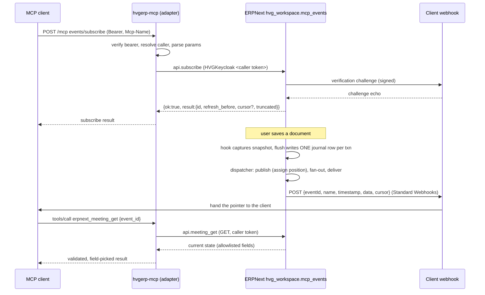

# Extending MCP Events to more event types

This document is the engineering guide for adding new event families (tasks,
leave approvals, orders, ...) to MCP Events. It records how the meeting events
shipped in 3.6.0 and 3.7.0 actually work end to end, which parts are already
generic, which parts are hard-wired to meetings, and the exact steps and checks
a new family needs on both sides.

Read [mcp-events-meetings.md](mcp-events-meetings.md) first: it is the operator
and client reference for the protocol. This document is for whoever builds the
next family.

State described here: hvgerp-mcp 3.7.0 and ERP release `rel-20261008-03`
(`hvg_workspace.mcp_events`), both in production since 2026-10-08.

## 1. The model in one paragraph

A client subscribes to a named event (`meeting.updated`) with optional arguments
(`{event_id}`) and a webhook URL plus signing secret. This server validates the
request and forwards it, under the caller's own bearer token, to ERPNext.
ERPNext stores the subscription, records every relevant change in a durable
journal inside the same database transaction as the change, and later delivers a
small signed webhook that only **points** at what changed (id, revision, which
fields). The client then calls a re-read tool (`erpnext_meeting_get`) to fetch
the current state under its own permissions. Content never travels in the
webhook, and this server never stores anything.

## 2. Data flow



### 2.1 Subscribe path (this repository)

| Step | Where                                             | What happens                                                                                                                                                                      |
| ---- | ------------------------------------------------- | --------------------------------------------------------------------------------------------------------------------------------------------------------------------------------- |
| 1    | `server.ts`                                       | `eventsFlagEnabled()` reads `MCP_EVENTS_ENABLED`; `assertEventsPolicy()` refuses to start unless `MCP_CALLER_IDENTITY=required`, OAuth JWKS is set and no static tokens exist.    |
| 2    | `src/events/adapter.ts` `createEventsAdapter`     | Wraps the SDK fetch handler. It only acts when the SDK answers 404 / `-32601` for an `events/*` method, so every other method is untouched.                                       |
| 3    | adapter                                           | Re-verifies the bearer, resolves the caller identity, checks `Mcp-Name` against `params.name`, applies the limiter (10 active, 50 queued) and the peek budget.                    |
| 4    | `src/events/protocol.ts` `parseSubscribeParams`   | Strict key allowlist, event name, `delivery` (`webhook` only, https URL, `whsec_` secret of 24 to 64 bytes), then `arguments` against the input schema, then ttl, maxAge, cursor. |
| 5    | `src/events/erp-store.ts` `createErpEventsStore`  | Calls `hvg_workspace.mcp_events.api.subscribe` with the caller's client (`actsAs === "caller"` is enforced), unwraps the `{ok,result                                              |
| 6    | `protocol.ts` `toSubscribeResult` / `mapErpError` | Validates the ERP result shape and maps ERP errors through a closed allowlist with fixed messages.                                                                                |

### 2.2 Change capture and delivery (ERPNext, `hvg_workspace/mcp_events/`)

| Module            | Role                                                                                                                                                                                                       |
| ----------------- | ---------------------------------------------------------------------------------------------------------------------------------------------------------------------------------------------------------- |
| `events.py`       | `doc_events` hooks on `Event`, `DocShare` and `User` (wired in `hooks.py`). First touch in a transaction snapshots committed state; `flush()` before COMMIT diffs and writes one net journal row.          |
| `outbox.py`       | The journal (`HVG MCP Event Journal`). `write_row()` inserts `(source_name, revision, change, data, scope)`. Positions are assigned by a single publisher, not auto-increment, so cursors never skip rows. |
| `access.py`       | Who is a member, who may read. The recipient proof (`scope.members` / `scope.readers`, hashed user keys) is computed at write time and rechecked at delivery.                                              |
| `subscription.py` | Lifecycle: eligibility (`subscribe_enabled`, client allowlist, account), callback verification outside row locks, CAS activation, quota (20 per user), rate limits, TTL and auth lease.                    |
| `dispatch.py`     | `run()`: publish, expire, fan-out (`_fan_out_matches`), deliver with claim tokens, retries (12 attempts, 30 s to 30 min backoff), permission recheck before every send.                                    |
| `webhook.py`      | Standard Webhooks signing (`webhook-id`, `webhook-timestamp`, `webhook-signature: v1,<base64>`), DNS-pinned egress, no redirects, 256 KiB body limit.                                                      |
| `readback.py`     | `meeting_get`: current state for a reader, tombstone for a reader who saw the deletion, the same "not available" answer otherwise.                                                                         |
| `contract.py`     | Loads the verbatim copy of the contract JSON, exposes `event_names()`, `change_for_event()`, `contract_digest()`.                                                                                          |
| `api.py`          | Whitelisted entry points `subscribe`, `unsubscribe`, `meeting_get`. The principal always comes from `mcp_auth.verified_identity()`, never from arguments.                                                  |
| `config.py`       | Site-config flags, all off by default: `mcp_events_journal_enabled`, `mcp_events_subscribe_enabled`, `mcp_events_dispatch_enabled`, and the list `mcp_events_allowed_clients`.                             |

The webhook body is built in `dispatch.envelope()`:

```json
{
  "eventId": "evt_...",
  "name": "meeting.updated",
  "timestamp": "2026-10-08T11:02:03Z",
  "data": {
    "event_id": "EV00075",
    "revision": 4,
    "change": "updated",
    "...": "..."
  },
  "cursor": "c2...."
}
```

`data` must validate against the event's `payloadSchema` in the contract.

### 2.3 Re-read path

`erpnext_meeting_get` (`src/tools/calendar.ts`) validates its own arguments,
refuses a shared client (`actsAs !== "caller"`), calls `fetchMeeting()`
(`erp-store.ts`) which does a fresh GET to `api.meeting_get`, then
`pickMeetingFields()` copies only published keys after checking the shape of
every value. Any mismatch becomes the fixed error `Events backend error`.

## 3. What is generic and what is meeting-specific

### 3.1 Already generic (no change needed for a new family)

- `src/events/adapter.ts`: routing, auth, identity, `Mcp-Name`, limiter, peek
  budget, `capabilities.events` injection. It never looks at event names.
- `protocol.ts`: delivery, callback URL, secret, ttl, maxAge and cursor parsing,
  `toSubscribeResult`, `mapErpError`, error codes and fixed messages.
- `erp-store.ts`: `subscribe` / `unsubscribe` forward `name` and `arguments`
  untouched.
- `src/compat/legacy-shim.ts`: `NAME_SOURCE` maps `events/subscribe` and
  `events/unsubscribe` to `params.name` for every event.
- `src/auth/config.ts`: the flag and the policy.
- `deno.json` `publish.include` already ships `src/events/contract/*.json`, and
  the Node bundle inlines JSON imports. New JSON files outside that directory
  (the ledger and the read-back schemas of step 2) must be added to it.
- ERP: subscription lifecycle, outbox positions and cursors, webhook signing and
  egress, retry policy, quota and rate limits.

### 3.2 Hard-wired to meetings (must be generalised once)

This repository:

| Location                                                                            | Coupling                                                                                                                        |
| ----------------------------------------------------------------------------------- | ------------------------------------------------------------------------------------------------------------------------------- |
| `protocol.ts` top-level import                                                      | Imports exactly one file, `meeting-events.v1.json`.                                                                             |
| `protocol.ts` `MEETING_EVENT_NAMES`                                                 | `parseEventName` accepts only these names; anything else is `-32011`.                                                           |
| `protocol.ts` `PAYLOAD_SCHEMA`, `EVENT_INPUT_SCHEMA`                                | One payload schema and one input schema shared by every descriptor; `parseArguments` uses the single input schema.              |
| `protocol.ts` `CHANGE_BY_EVENT`, `validateEventPayload`                             | Read from the one contract.                                                                                                     |
| `src/events/contract_test.ts`                                                       | Hashes one file, reads the hash from `docs/mcp-events-meetings.md`, asserts exactly three event names.                          |
| `src/events/json-schema.ts`                                                         | Supports only the keywords the meeting contract uses (no `pattern`, `minItems`, `maxItems`, `uniqueItems`, `oneOf`, `$ref`...). |
| `src/tools/calendar.ts`, `EVENTS_TOOL_NAMES`                                        | The only re-read tool. `src/client.ts` adds `calendarTools` when `includeEventsTools` is on.                                    |
| `erp-store.ts` `ERP_EVENTS_METHODS.meetingGet`, `fetchMeeting`, `pickMeetingFields` | Meeting read-back and its output validator.                                                                                     |

ERPNext (`hvg_workspace/mcp_events/`):

| Location                                        | Coupling                                                                                                                                                                                                                                                                |
| ----------------------------------------------- | ----------------------------------------------------------------------------------------------------------------------------------------------------------------------------------------------------------------------------------------------------------------------- |
| `dispatch.envelope()`                           | `"name": "meeting." + journal.change`: the family is implied, not stored.                                                                                                                                                                                               |
| `contract.py` `CONTRACT_PATH`                   | One contract file; `change_for_event` and `require_event_name` read only it.                                                                                                                                                                                            |
| Journal columns and keys                        | Rows are keyed by `source_name` (the Event name) with no doctype. `source_change_id` hashes `(site, source_name, revision)`, the unique index is `(source_name, revision)`, and the revision fence is keyed by `source_name`. A Task named like an Event would collide. |
| `dispatch._fan_out_matches`                     | Matches `change_for_event(sub.event_name) == row.change` and `event_filter_id` against `source_name`, with no family check.                                                                                                                                             |
| `events.py`, `hooks.py`                         | Hooks only on `Event` (plus `DocShare` and `User` for meeting audiences).                                                                                                                                                                                               |
| `access.py`                                     | Meeting membership (`MEETING_CATEGORY`, participants, owner, DocShare).                                                                                                                                                                                                 |
| `subscription.normalize_subscription_arguments` | `event_id` is resolved with `access.canonical_event_name` (an Event lookup).                                                                                                                                                                                            |
| `readback.py`, `api.meeting_get`                | Meeting read-back only.                                                                                                                                                                                                                                                 |

## 4. Design decisions for the next version

These are the recommended rules. Changing one of them is a design change, not an
implementation detail.

1. **One contract lineage per family, versioned on its own.** A family's
   contract files are `src/events/contract/<family_slug>-events.v<K>.json`,
   where `K` counts the revisions of that family alone and starts at 1 (for
   example `task-events.v1.json`). A released contract file is frozen: never
   edit it in place, its hash is the agreement between the two repositories.
   Clients validate payloads with `additionalProperties: false`, so any change
   to an existing event's schema, even one added optional field, breaks a client
   that still holds the old schema. Two kinds of release follow from that:
   - **New events only.** `<family_slug>-events.v<K+1>.json` keeps every
     existing event with a byte-for-byte identical effective schema and adds new
     event names. It replaces `v<K>` in `CONTRACTS`; the old file stays in the
     repository (step 2 keeps testing it). Old clients see no difference for the
     events they already use.
   - **Any schema change to an existing event.** A new parallel family
     `<family>.v<G>`, where `G` is the next generation (2, 3, ...), with event
     names `<family>.v<G>.<change>`. It starts its own lineage under its own
     slug: `task.v2` begins at `task_v2-events.v1.json`. The base family keeps
     its lineage, so both can still gain events independently and their file
     names never collide. Both are loaded until clients move, and ERP journals
     each change once per loaded family (decision 6). The first generation never
     carries a version segment.
2. **Event names are `<family>.<change>` and globally unique** across all loaded
   contracts. The registry must refuse to start if two loaded contracts declare
   the same name or the same family. Keep the `change` enum inside each family.
   Family names follow a fixed grammar: a base family is lowercase letters and
   digits starting with a letter (`^[a-z][a-z0-9]*$`, so no `_`, `-` or `.`),
   and a parallel family adds one generation suffix
   (`^[a-z][a-z0-9]*\.v([2-9]|[1-9][0-9]+)$`). Where a family appears inside an
   identifier (file name, tool name, ERP method, flag), use its slug: the family
   with `.` replaced by `_`, so `task.v2` becomes `task_v2`. Frappe reads dots
   in a method path as module separators, and tool names must stay snake_case.
   Under the grammar the slug is snake_case and one-to-one; the registry still
   rejects any family that breaks the grammar and any two families with the same
   slug.
3. **Per-event schemas.** Each contract keeps a shared `inputSchema` and
   `payloadSchema` as the default, and an event entry may override either. The
   catalog descriptor exposes the effective schemas. `parseSubscribeParams`
   already parses `name` before `arguments`, so validating arguments against the
   schema of that name is a local change. An override replaces the default
   whole, so it must restate the default's guarantees: every effective input and
   payload schema, override or not, is `type: object` with
   `additionalProperties: false` and every field bounded. Otherwise a misspelled
   argument could become an unfiltered subscription, or a payload could carry
   undeclared content. "Bounded" is a checked rule for every new contract.
   First, every field, nested ones and array `items` included, declares exactly
   one `type` as a single string naming a type `json-schema.ts` implements,
   never missing and never a list: the validator applies `maxLength`, `minimum`
   or `maxItems` only to values of the matching type, so `{ "maxLength": 140 }`
   with no `type` accepts an object or array of any size. "Field" means a
   declaration: a schema under `properties` or `items` of a schema that itself
   declares a `type`. A conditional subschema (the value of `allOf`, `anyOf`,
   `not`, `if`, `then` or `else`, and the `properties` inside it) declares
   nothing; it only constrains fields its enclosing typed object already
   declares, so it carries no `type` and may use only `required`, `properties`,
   `const`, `enum`, `not`, `anyOf` and `allOf`, every property it names must be
   declared by that enclosing object, and every `const` or `enum` value it uses
   must be of that declared field's type and accepted by its declaration. The
   meeting payload's `if`/`then` clauses (`deleted: { "const": true }`,
   `change: { "const": "cancelled" }`, `all_day: { "const": false }`) are
   exactly this form and pass without an exemption. Then a string has
   `maxLength`, `enum` or `const`, or `format: date` (fixed length);
   `format: date-time` is not a bound on its own, because its pattern accepts
   any number of fractional-second digits, so a date-time field also needs
   `maxLength` (35 covers nanoseconds with an offset); an `integer` or `number`
   has both `minimum` and `maximum`, finite and inside the safe-integer range
   (`-9007199254740991` to `9007199254740991`), because `Number.isInteger`
   accepts larger values that no longer round-trip exactly and two revisions
   could then compare equal; an array has `maxItems` (not yet in
   `SUPPORTED_KEYWORDS`, so the first contract with an array adds it through
   step 3) and bounded `items`; a nested object is closed the same way. A bound
   only counts when it is well formed, because the validator silently skips a
   malformed one (it applies `maxLength` only when it is a number): `minLength`,
   `maxLength` and `maxItems` are non-negative integers with `minLength` not
   above `maxLength`, `minimum` and `maximum` are finite numbers with `minimum`
   not above `maximum`, `enum` is a non-empty array of values of the declared
   type, and `const` is a value of the declared type (a string field's `const`
   is a string, so `{ "type": "string", "const": 7 }` is rejected rather than
   left as a field no value can ever satisfy). `maxLength: "140"` is therefore
   an unbounded string. The same holds for every other supported keyword, since
   the validator also skips a control keyword of the wrong container type
   (`required: "field"` is never enforced, an object-valued `allOf` is never
   applied): `checkSchemaShape` in `json-schema.ts` walks every schema and
   requires `type` and `format` and `description` to be strings, `properties` an
   object whose values are schemas, `required` an array of distinct strings (in
   a typed object schema at any depth, each also declared in that object's own
   `properties`, so an optional nested object cannot require a key no value can
   carry; in a conditional subschema, each declared by its enclosing typed
   object), `additionalProperties` a boolean, `items` one schema, `allOf` and
   `anyOf` non-empty arrays of schemas, `not`, `if`, `then` and `else` schemas,
   and `then` or `else` only beside an `if`. `buildRegistry` runs it on every
   effective schema, the meeting contract included (it already passes), and the
   test fixtures cover each malformed shape. `format` is limited to the values
   `formatMatches` in `json-schema.ts` really checks (`date` and `date-time`
   today), because it returns `true` for any other format; a new format is
   implemented and tested there first. The frozen `meeting-events.v1.json`
   predates this rule (`time_zone` has no `maxLength`, `changed_fields` no item
   limit, `revision` no `maximum`) and is the only exemption. The exemption is
   bound to the entry, not to a string: it applies only to the `CONTRACTS` entry
   whose family is `meeting` and whose file is the object imported from that
   exact file, and `buildRegistry` rejects duplicate contract ids and any other
   file that claims the id `meeting-events.v1`. Subscription arguments are
   identity-only: the family's id filter and, for a multi-doctype family, its
   `source_doctype`, given together or not at all (a lone doctype is not an
   identity). The filter is optional for every family: `{}` is a valid,
   unfiltered subscription, so no effective input schema may require the
   identity. The id field is declared, never guessed: each `CONTRACTS` entry
   names it as `identityField` (`event_id` for meetings; candidates use
   different conventions such as `task_id`, `leave_id` or `doc_id`), and every
   effective input schema of the family must declare exactly that property, plus
   `source_doctype` for a multi-doctype family, and nothing else. Whether a
   family is multi-doctype is declared the same way: the entry lists its closed
   doctype set as `sourceDoctypes`, and only when that set is present does every
   effective input and payload schema carry `source_doctype` with an `enum`
   equal to it, so an override that drops the property cannot turn the family
   single-doctype for one event. Every effective payload schema also requires
   the canonical pointer fields: the `identityField`, `revision`, `change` and,
   for a multi-doctype family, `source_doctype`; without them a webhook could
   not name the record to re-read or take part in revision ordering. Two of
   those fields have one canonical schema per family. The identity property (and
   `source_doctype`) must be deeply equal in every effective input and payload
   schema of the family, so an override cannot let a payload carry an id longer
   than the input, and the re-read tool, accept. That identity schema is always
   exactly `type: string` with an explicit `minLength` of at least 1 and a
   `maxLength`, and no other keyword, never an integer, boolean, an
   `enum`/`const` string or one narrowed by `pattern` or `not`: ERP document
   names are strings, the re-read tool derives its argument bounds from those
   two keywords, and its strict id comparison against ERP's string value would
   fail on anything else. `revision` must be `type: integer` with exactly
   `minimum: 1` and `maximum: 9007199254740991`, the full range the
   source-global allocator can emit: a bounded `number` would let a fractional
   revision validate that no journal counter, fence or read-back validator can
   produce, and a narrower range (`minimum: 2`, `maximum: 100`) would reject
   legitimate rows the allocator does produce. ERP persists and matches only
   that identity, so any other argument would either be refused there or
   silently ignored, which widens the subscription. A new kind of filter is a
   design change that ERP ships first (normalise, persist, match in
   `_fan_out_matches`).
4. **Payload stays a pointer.** Ids, revision, change, changed field names and
   the minimum scheduling or status data needed to decide whether to re-read.
   Never titles, descriptions, amounts, emails, names of people or free text.
   Content belongs in the re-read tool, behind a live permission check. This is
   enforced, not left to the author: `protocol.ts` keeps
   `PAYLOAD_FIELD_ALLOWLIST`, a closed map from each payload property name any
   family may use to the one schema that name stands for. Today it holds the
   meeting payload's names with bounded schemas: `deleted`, `series_changed` and
   `all_day` `{ "type": "boolean" }`, `time_zone` a string with `maxLength: 64`,
   `starts_at` and `ends_at` `format: date-time` with `maxLength: 35`,
   `start_date` and `end_date_exclusive` `format: date`, `revision` the
   canonical schema of decision 3, plus two shapes whose values are the family's
   own: `change` is `{ "type": "string", "enum": [...] }` whose values are drawn
   from the family's `changeByEvent` values, `changed_fields` is an array with
   `maxItems` whose `items` are `{ "type": "string", "enum": [...] }`, and
   `source_doctype` is the decision 3 enum. `buildRegistry` rejects any
   effective payload property that is neither the entry's `identityField` nor in
   the map, and any listed property whose schema is not deeply equal to the
   map's (for the three family-valued shapes: equal in every keyword except the
   `enum` values, which must be non-empty distinct strings, and `maxItems`), so
   a reserved name cannot be redefined as an integer or object carrying content.
   The frozen meeting file predates the bounds (decision 3) and is checked by
   name only. Adding a name or changing its schema is its own reviewed pull
   request, with a comment saying why the field is routing or scheduling
   metadata and not content, never a line slipped into a family's pull request.
   When a family spans several doctypes (decision 6), the pointer carries
   `source_doctype` as a closed enum next to the id, and the re-read tool takes
   both, because two doctypes can hold records with the same `name`.
5. **Each family has exactly one re-read tool**,
   `erpnext_<family_slug>_event_get`, built like `erpnext_meeting_get`: strict
   argument allowlist, `actsAs === "caller"`, fresh GET with no cache, output
   passed through an allowlist validator that checks every value's shape, fixed
   error messages, a deleted record returns only the tombstone keys. The name
   must not collide with any existing tool: `erpnext_task_get` and
   `erpnext_leave_application_get` already exist with different semantics (they
   run under shared credentials too), and a second tool with the same name would
   be listed twice by `toMCPFormat` and overwrite the first in
   `buildHandlersMap`. Add a test that the combined tool list has no duplicate
   name. A versioned family `<family>.v<G>` (decision 1) reuses the base
   family's tool and ERP method when the read-back shape is unchanged; if it
   needs a different shape, its tool is `erpnext_<family>_v<G>_event_get` and
   its ERP method `<family>_v<G>_get` (the slug, decision 2), registered and
   tested the same way. The dependency is recorded, not implied: each
   `CONTRACTS` entry names both its `readBackTool` and its `readBackMethod` (the
   key in `ERP_EVENTS_METHODS`), and a test asserts that every entry's tool is
   in `EVENTS_TOOL_NAMES`, its method in `ERP_EVENTS_METHODS` and neither
   `subscribe` nor `unsubscribe` (a lifecycle endpoint takes subscription
   arguments, not an identity, so a GET routed there could never re-read a
   record), and that every tool there and every read-back method there (all keys
   but `subscribe` and `unsubscribe`) is named by at least one entry, so no
   endpoint is left unused. The tool and the method are bound one to one: a tool
   has no family selector and calls one fixed method, and an ERP method serves
   one argument and record shape, so every entry that names a given
   `readBackTool` must name the same `readBackMethod`, and every entry that
   names a given `readBackMethod` must name the same `readBackTool` (a family
   that needs another method needs its own tool, and a new tool needs its own
   method), and the tool test asserts that the handler's one GET goes to exactly
   that method. The pair also has one input schema, derived from a single
   identity contract, so every entry that names it must also share the same
   `identityField`, a deeply equal identity schema and the same `sourceDoctypes`
   (or none on all of them); a family whose identity differs in any of these
   needs its own tool and method, or the shared pair would refuse identities
   that family's webhooks carry, or read the wrong doctype. A test groups the
   entries both by tool and by method and asserts this for every group. A shared
   tool and method therefore stay registered until the last family that names
   them is retired; removing the base family while `<family>.v<G>` still points
   at its tool fails that test instead of leaving v<G> events without a re-read
   path.
6. **The journal records the family and the source doctype.** ERP adds two
   columns: `family` (drives the event name and matching) and `source_doctype`
   (identifies the record; one family can span several doctypes, such as `Task`
   and `ToDo`). The canonical source identity is
   `(source_doctype, source_name)`. One source change produces one row per
   family that covers it (two while `<family>` and `<family>.v2` run side by
   side), so the row identity includes the family: `source_change_id` hashes
   `(site, family, source_doctype, source_name, revision)` and the unique index
   becomes `(family, source_doctype, source_name, revision)`. The migration
   drops the legacy `(source_name, revision)` unique index in the same step that
   creates the new one; adding the new index alone leaves the old constraint in
   place, and it would still reject the second family's row for the same
   revision and collide across doctypes with equal names. The new hash applies
   only to rows inserted after the migration: the backfill sets `family` and
   `source_doctype` on existing rows and never rewrites their
   `source_change_id`, because it is what the webhook `eventId` is built from,
   and a pre-migration row retried or replayed later must keep the id the client
   already deduplicates on. The revision itself stays source-global: it is
   allocated once per source change from a counter keyed by
   `(source_doctype, source_name)`, and every family's row for that change
   carries the same number. Allocation is atomic across transactions: an atomic
   increment of the counter row (or a row lock taken on it) inside the source
   transaction, never a read followed by a separate write, so two concurrent
   transactions on the same source cannot both take the same number and have the
   fence or the unique index drop one of their rows. The fence that rejects a
   stale or repeated revision is checked per
   `(family, source_doctype, source_name)`, so each family's row passes once. A
   shared counter keeps the read-back unambiguous: the revision the ERP method
   returns is the same whichever family the client follows, so a `<family>.v2`
   client never discards a newer event because the base family counted
   differently. `_fan_out_matches` compares `family` as well as change, and
   `envelope()` builds `name` from `family`. Existing rows are backfilled as
   family `meeting`, doctype `Event`, and the legacy per-source fence is copied
   into the new `meeting` fence in the same migration, so a source whose old
   rows were already pruned keeps rejecting stale revisions. This is the largest
   and riskiest change of the whole extension and must ship, migrate and be
   verified before any new family writes a row.
7. **Each new family gets its own ERP gates**, each also gated by the matching
   global flag: `mcp_events_<family_slug>_journal_enabled`,
   `mcp_events_<family_slug>_subscribe_enabled` and
   `mcp_events_<family_slug>_dispatch_enabled`, all default off (a missing key
   reads as off). The meeting family has no per-family keys and keeps following
   the global flags alone, so an upgrade that adds the gates cannot switch
   meetings off on a site where they already run. The gates give the rollout
   states:
   - **shadow**: journal on, subscribe off and dispatch off. Rows are written
     and measured; `events/subscribe` for the family answers `-32012`. Dispatch
     must be off explicitly: turning subscribe off does not remove subscriptions
     already stored in ERPNext (they expire on their own TTL, see the rollback
     section of [mcp-events-meetings.md](mcp-events-meetings.md)), so a family
     rolled back to shadow with dispatch still on would deliver its new rows to
     them. The subscribe gate blocks only creating or refreshing a subscription:
     `events/unsubscribe` from an authenticated caller bypasses it and stays
     idempotent, so a client can always drop a subscription made before the
     rollback instead of waiting for its TTL.
   - **subscribe on, dispatch off**: subscriptions are accepted; deliveries are
     created and stay pending (paused), never dropped or marked skipped, and go
     out once dispatch is on, as long as they are still inside the delivery
     window.
   - **all on**: normal delivery.
8. **Discovery stays static.** `events/list` lists every family compiled into
   the server. Ship a family in an MCP release only after ERP serves it in
   production, otherwise clients see events that always fail with `-32012`.
   `capabilities.events` stays `{}`.
9. **Semver.** Adding a family, adding events to a family (decision 1, first
   case) or adding a `<family>.v<G>` family is a minor release. Removing any
   event, family or `<family>.v<G>` family is a major release, and so is
   renaming the read-back tool of a family that has shipped, pointing it at
   another method or another ERP path, removing or changing an argument it
   takes, or changing its result schema in any way, adding a field included:
   clients that already handle its events call that tool by name and may
   validate its output against the frozen result schema, which is closed, so
   even a new optional key fails their validation. Adding an optional argument
   is minor, since no existing call sends it. Retiring an event must not strand
   the subscriptions ERP still stores for it, because ERP keeps delivering to
   them until their lease expires. So retirement runs in this order: ERP turns
   that family's dispatch gate off (or stops writing the retired events) before
   the MCP major release ships, and that release moves every removed name into
   `RETIRED_EVENTS` in `protocol.ts` instead of deleting it: a map from the name
   to the effective `inputSchema` of the retired contract file that last shipped
   it (retired files stay in `src/events/contract/`, step 2). `events/subscribe`
   with a retired name answers `-32011` like any unknown name, while an
   authenticated `events/unsubscribe` still accepts it, validates `arguments`
   against that retained schema and forwards the request to ERP, which stays
   idempotent. A name leaves `RETIRED_EVENTS` only in a later release, after ERP
   has deleted every stored subscription for it (a migration that deletes them,
   or the longest subscription TTL elapsed since dispatch went off).

## 5. Recipe: this repository

Do the one-time registry refactor (steps 1 to 3) in its own pull request, with
the meeting contract as the only entry and no behaviour change. Then each new
family is steps 4 to 9.

### Step 1. Registry of contracts (one time)

Replace the single import in `protocol.ts` with a registry. Sketch:

```ts
import meetingContract from "./contract/meeting-events.v1.json" with {
  type: "json",
};

interface ContractFile {
  family?: string; // required in every new file; meeting-events.v1 predates it
  contract: string;
  protocolVersion: string;
  changeByEvent: Record<string, string>;
  inputSchema: JsonSchemaObject;
  payloadSchema: JsonSchemaObject;
  events: {
    name: string;
    description: string;
    inputSchema?: JsonSchemaObject;
    payloadSchema?: JsonSchemaObject;
  }[];
}

interface ContractEntry {
  family: string;
  identityField: string; // the only id property subscription arguments may use
  sourceDoctypes?: readonly string[]; // present only for a multi-doctype family
  readBackTool: string; // shared by <family>.v<G> when the shape is unchanged
  readBackMethod: string; // key in ERP_EVENTS_METHODS, shared the same way
  file: ContractFile;
}

export const CONTRACTS: readonly ContractEntry[] = [
  {
    family: "meeting",
    identityField: "event_id",
    readBackTool: "erpnext_meeting_get",
    readBackMethod: "meetingGet",
    file: meetingContract,
  },
];

interface RegisteredEvent {
  family: string;
  contract: string;
  change: string;
  descriptor: EventDescriptor;
}

const REGISTRY: ReadonlyMap<string, RegisteredEvent> = buildRegistry(CONTRACTS);
```

The family is explicit: each entry of `CONTRACTS` names it, and every new
contract file also carries a top-level `family` that must equal it (the frozen
`meeting-events.v1.json` has none, which is why the entry holds it). Never
derive the family from the file name, the contract id or the first event: a file
name says nothing about which of two parallel families it belongs to, and a
mistyped prefix on a later event must not move it into another family's gates.
`buildRegistry` throws at module load on a duplicate name, on two entries for
the same family (decision 1), on a family name outside the grammar or a slug
shared by two families (decision 2), on a file `family` that differs from its
entry, on any event whose name is not exactly `<family>.<changeByEvent[name]>`,
on a name missing from `changeByEvent` or a `changeByEvent` key that names no
event (the keys must equal the event names exactly, or ERP's copy of the
contract would recognise an event this registry does not), on a field without
exactly one supported `type`, on an effective input or payload schema that is
not `type: object` with `additionalProperties: false`, on an unbounded field
(string, number, integer or array), on a `format` outside the implemented set,
on an identity schema whose keys are not exactly `type: "string"`, `minLength`
(an integer, at least 1) and `maxLength` (so no `pattern`, `enum`, `const` or
`not` can narrow it), on an identity or `source_doctype` schema that differs
between any two effective schemas of the family, on a `source_doctype` present
without `sourceDoctypes` on the entry, missing with it, or with a schema other
than exactly `{ "type": "string", "enum": <sourceDoctypes> }`, on an effective
input schema, overrides included, that is not deeply equal to the canonical
identity input derived from the entry (below), on an effective payload schema
that does not require every canonical pointer field, on a `revision` that is not
an integer with exactly `minimum: 1` and `maximum: 9007199254740991` (all
decision 3, with the meeting entry exempt only from the bound rule, which covers
its missing `revision` maximum), on a duplicate contract id or a reuse of
`meeting-events.v1` by another file, or on a `protocolVersion` other than the
one this server speaks.

The canonical identity input is derived, never authored. For a single-doctype
family it is
`{ "type": "object", "additionalProperties": false, "properties": { "<id>": <identity schema> } }`.
A multi-doctype family adds
`"source_doctype": { "type": "string", "enum": <sourceDoctypes> }` to
`properties` and the pair rule
`"allOf": [{ "if": { "required": ["<id>"] }, "then": { "required": ["source_doctype"] } }, { "if": { "required": ["source_doctype"] }, "then": { "required": ["<id>"] } }]`,
with no top-level `required`. Comparing structure, not sampling values, is what
makes "the whole identity or nothing" hold for every identity: a probe only
shows that one chosen identity passes, while an override using `not` or `const`
could still refuse one doctype or one id that payloads advertise and pass every
probe. Probes stay as tests (`{}` and the complete identity accepted, each lone
half refused), not as the check. The meeting input is already canonical.

Then:

- `parseEventName` checks `REGISTRY.has(name)`. `parseUnsubscribeParams` also
  accepts a name in `RETIRED_EVENTS` (decision 9) and validates its arguments
  against the retained schema; the map is empty until an event is retired, and
  module load asserts it shares no name with the registry.
- `parseArguments(name, value)` validates against
  `REGISTRY.get(name).descriptor.inputSchema`.
- `validateEventPayload(name, data)` uses the event's own payload schema and
  change.
- `eventCatalog()` / `handleEventsList` return descriptors in registry order.
- Keep `MEETING_EVENT_NAMES`, `PAYLOAD_SCHEMA`, `EVENT_INPUT_SCHEMA` and
  `CHANGE_BY_EVENT` only as long as tests need them; they are not exported from
  `mod.ts`, so removing them is not a public API change.

### Step 2. Contract test per file (one time)

Generalise `contract_test.ts` to discover every `*.json` file in
`src/events/contract/`, not just the entries of `CONTRACTS`: a retired version
is still published and its hash is still an agreement, so an accidental edit to
it must fail. For each file, hash it and compare with its own
`SHA-256 of the contract file` line in that family's doc
(`docs/mcp-events-<family>.md` keeps one line per version), assert the event
list, and run `collectKeywords` over every schema, including per-event
overrides. Also assert that every entry of `CONTRACTS` is one of the discovered
files, and that across the whole discovered set, retired files included, every
`contract` id is unique and equals its file name without `.json` (so
`task-events.v2.json` holds `task-events.v2`): `buildRegistry` sees only the
live entries, and without this check a successor could reuse a retired version's
id.

The doc hash alone does not freeze a released file: a commit that edits the JSON
and the hash line together passes it. So every contract version is also pinned
in a release ledger, `src/events/contract-ledger.json` (outside
`src/events/contract/`, so step 2's discovery does not treat it as a contract),
from the release that first ships it, not from the release that replaces it.
Each row holds the `contract` id, its SHA-256, its `family`, the `readBackTool`
and `readBackMethod` it shipped with, and `readBackPath`, the Frappe path that
key resolved to (`hvg_workspace.mcp_events.api.meeting_get` for meetings): a key
alone would let a later release keep the key and point `ERP_EVENTS_METHODS[key]`
at another endpoint. Each row also records `readBackInput` and `readBackResult`:
the id and SHA-256 of the input schema the tool accepted and of the result
schema it returned when that version shipped (below). Rows are append-only: a
row is never edited or removed, and a major release that retires a version marks
it `retired` without touching the other fields. Before resolving any row,
`contract_test.ts` asserts that the ledger holds at most one row per `contract`
id, so a second row appended for a released id cannot carry a new tool, method
or path past the tag check, which only sees that the first row is unchanged. It
then asserts that every discovered file has exactly one row with its exact
digest, and that every live `CONTRACTS` entry names the `readBackTool` and
`readBackMethod` of its row and that `ERP_EVENTS_METHODS[readBackMethod]` equals
the row's `readBackPath`, so a minor release cannot rename the tool, switch the
method or re-point its path for a version that is still live. What makes the
ledger itself immutable is the release tag: a test in `release:check` (step 9)
reads the ledger and every contract file at the newest `v*` tag with
`git show <tag>:<path>` and fails if any row present there changed (other than
gaining `retired` in a major release) or disappeared, or if any contract file
present there is not byte-identical now. A tag cannot be edited, so a released
schema or binding cannot be blessed again by rewriting the ledger in the same
commit. The one-time registry pull request creates the ledger with the
`meeting-events.v1` row (family `meeting`, tool `erpnext_meeting_get`, method
`meetingGet`, path `hvg_workspace.mcp_events.api.meeting_get`, input
`erpnext_meeting_get.input.v1`, result `erpnext_meeting_get.result.v1`); until a
tag carries the ledger, the tag check compares the contract files only.

The tool's own interface is pinned the same way, because a binding is not the
whole promise: a release could keep the tool, method and path and still drop an
argument (`erpnext_meeting_get` also takes `occurrence_start`, `window_start`
and `window_end`) or drop or reinterpret a field in `pick<Family>Fields()`. Each
read-back tool has two frozen schema files in `src/events/read-back/`:
`<tool>.input.v<N>.json`, its complete `inputSchema` (the tool test asserts the
registered tool's `inputSchema` deeply equals the live file), and
`<tool>.result.v<N>.json`, a closed, bounded JSON Schema for both shapes it
returns, written as a top-level `anyOf` of two closed object schemas, the record
and the tombstone. Result schemas follow the decision 3 rules with one addition,
because a returned field may be null where a contract field never is (`title`,
`meeting_url`, `recurrence` and the schedule fields of the meeting result): a
nullable field is written exactly as
`{ "anyOf": [{ "type": "null" }, <schema>] }`, with no other keyword beside
`anyOf` and `<schema>` itself following the single-type rule. These two `anyOf`
forms are the only ones a result schema may use; `checkSchemaShape` enforces
that, and fixtures cover the nullable form (null accepted, a bounded value
accepted, an over-long value and another type refused). Cross-field rules the
picker enforces (for meetings, which schedule fields `all_day` requires or
forbids) are written with `if`/`then`, so the samples below are checked against
them. The tool test validates every happy-path and tombstone output against the
live result schema, and asserts that the pick function cannot emit a key outside
it.

Both kinds of file are immutable like contract files: the tag check also
requires every one present at the tag to be byte-identical now, and the ledger
row records `readBackInput` and `readBackResult`, the id and SHA-256 of each as
that version shipped. The two files evolve differently, because a client sends
arguments but validates results. A release that only adds an optional argument
writes `<tool>.input.v<N+1>.json`, and a test asserts that the live input file
of every live entry's tool equals the one its row names or keeps every property
of it with a deeply equal schema, adds no required key and stays closed. The
live result file must equal the one its row names, byte for byte: the result
schema is closed, so a client validating against it rejects any new key, and
adding, removing or changing a returned field, like removing or changing an
argument, is a major release (decision 9) that ships under a new tool name or a
new contract version, never as a minor update of a live row. The one-time
registry pull request writes both meeting files from what `erpnext_meeting_get`
accepts and `pickMeetingFields` returns today.

Validation alone cannot catch a pick function that stops copying an optional
field or stops passing one variant of a field: every output still validates. So
each result schema has a sample set beside it,
`src/events/read-back/<tool>.result.v<N>.samples.json`: an array of
`{ "arguments": ..., "result": ... }` cases, where `result` validates against
the schema and is already in the form the picker emits (a meeting URL already
canonical). The tool test calls the handler with each case's `arguments`, has
the fake client return `result` as the ERP response, and asserts that the output
deeply equals `result`. Coverage is derived from the schema, not left to the
author: a test fails unless every declared property, nested ones included, is
set by some case, every `anyOf` branch (record and tombstone, null and non-null
of each nullable field) is taken by some case, and every `if` holds in one case
and fails in another. Since the live result schema is the one every live row
names, this pins the output each row promises, so a field or variant the schema
still promises cannot be dropped by editing only the happy-path expectation.
Sample sets are immutable like the schemas and checked against the tag the same
way.

`deno.json` `publish.include` lists only `src/**/*.ts` and
`src/events/contract/*.json` today, so the one-time registry pull request adds
`src/events/read-back/*.json` and `src/events/contract-ledger.json`; otherwise
the JSR package ships a tool that imports a schema it does not contain, while
local tests and the esbuild bundle still pass. `release:check` then runs
`deno publish --dry-run --allow-dirty` and fails unless its file list contains
every file under `src/events/contract/` and `src/events/read-back/` and the
ledger.

When a release replaces `v<K>` with `v<K+1>` in `CONTRACTS` (decision 1, new
events only), add a cross-version test: every event of `v<K>` exists in `v<K+1>`
with a deeply equal effective `inputSchema` and `payloadSchema` and the same
`changeByEvent` entry, the `v<K+1>` entry names the `readBackTool` and
`readBackMethod` of the `v<K>` ledger row, `ERP_EVENTS_METHODS[readBackMethod]`
still equals that row's `readBackPath`, the `v<K+1>` row's `readBackResult` is
exactly that of `v<K>`, and its `readBackInput` is that of `v<K>` or a successor
that keeps it (as above): events already announced must keep re-reading through
the same public tool, the same arguments, the same ERP endpoint and the same
fields, so changing any of these is a major release (decision 9), never a side
effect of adding events. Keep that test for as long as `v<K>` is in the
repository. Without it, a changed schema with a freshly recorded hash would pass
every other check.

### Step 3. Schema keywords (only when needed)

If a new contract needs a keyword that `SUPPORTED_KEYWORDS` lacks, or a `format`
value that `formatMatches` does not implement, add it to `json-schema.ts` with
tests first (valid, invalid, error message without the value). A keyword in the
list is not enough for `format`: each format value needs its own check. Error
messages must keep carrying only the path and keyword, never the value. Prefer a
schema that avoids the keyword over growing the validator.

### Step 4. Write the contract

Create `src/events/contract/<family_slug>-events.v1.json` with `family`,
`contract`, `protocolVersion: "2026-07-28"`, `changeByEvent`, `inputSchema`,
`payloadSchema` (`additionalProperties: false`, every field bounded), and
`events` with one sentence of description each. Add it to `CONTRACTS` with its
`identityField`, `readBackTool`, `readBackMethod` and, for a multi-doctype
family, `sourceDoctypes`. Give `revision` exactly
`{ "type": "integer", "minimum": 1, "maximum": 9007199254740991 }` and the id a
string schema such as `{ "type": "string", "minLength": 1, "maxLength": 140 }`
(decision 3). Write the payload as a pointer (decision 4). The required set
always includes the canonical pointer fields (`<id>`, `revision`, `change`, plus
`source_doctype` for a multi-doctype family), which the registry enforces;
`changed_fields` and `deleted` are the usual additions. Write `inputSchema` as
exactly the canonical identity input from step 1 (for a multi-doctype family,
the two `if`/`then` clauses that require the id and `source_doctype` together or
neither, with no top-level `required`, so `{}` stays an unfiltered
subscription); `buildRegistry` rejects anything else. Test both lone cases as
invalid arguments, and `{}` and the full pair as valid ones.

### Step 5. ERP method names

A family with its own read-back shape adds its method to `ERP_EVENTS_METHODS` in
`erp-store.ts` (`hvg_workspace.mcp_events.api.<family_slug>_get`, using the slug
from decision 2, so `task.v2` maps to `api.task_v2_get`, never
`api.task.v2_get`) and names that key as its `readBackMethod`. A `<family>.v<G>`
that keeps the base shape adds nothing here and names the base family's key
instead (decision 5). Subscribe and unsubscribe stay the same methods for every
family.

### Step 6. Re-read tool

Add `src/tools/<family>.ts` (or extend `calendar.ts` only for calendar-like
families) exporting the tool `erpnext_<family_slug>_event_get` (decision 5) and
its name. Check the name against every existing tool first. Register the name in
`EVENTS_TOOL_NAMES` and the tool in the array `ErpNextToolsClient` appends when
`includeEventsTools` is on. Keep it out of `toolsByCategory`, `allTools` and
`getToolByName` (see the comment in `src/tools/mod.ts`): the public registries
would otherwise let a library user run it under service credentials with Events
off. Add a `fetch<Family>()` and a `pick<Family>Fields()` in `erp-store.ts`,
modelled on `fetchMeeting` / `pickMeetingFields`:

- derive the identity part of the tool's input schema (the id's `minLength` and
  `maxLength`, the `source_doctype` enum) from the family's contract entry
  instead of restating it, so every identity a webhook can carry is one the tool
  accepts, and measure the id with `codePointLength` from `json-schema.ts`, as
  `erpnext_meeting_get` does, never with `string.length`: JSON Schema counts
  code points, `length` counts UTF-16 units, and a name with characters outside
  the Basic Multilingual Plane would otherwise pass the contract and be refused
  by the tool;
- check `result.<id> === args.<id>` before anything else, and for a
  multi-doctype family also `result.source_doctype === args.source_doctype`,
  since `Task` and `ToDo` can share an id;
- tombstone keys only when `deleted === true`;
- every enum is a closed `Set`, every date and instant is checked as real, every
  string is bounded, unknown keys are dropped;
- never copy a value you did not validate.

### Step 7. Tests

| File                        | Add                                                                                                                                                                                                                                                                                                                                                                                                                                                                                                                                                                                                                                                                                                                                                                                                                                                                                                                                                                                                                                                                                                                                                                                                                                                                                                                                                                                                                                                                                                                                                                                                                                                                                                                                                                                                                                                                                                                                                                                                                                                                                                                                                                                                                                                                                                                                                                                                                                                                                                                                                                                                                                                                                                                                                                                                                                                                                                                                                                                                                                  |
| --------------------------- | ------------------------------------------------------------------------------------------------------------------------------------------------------------------------------------------------------------------------------------------------------------------------------------------------------------------------------------------------------------------------------------------------------------------------------------------------------------------------------------------------------------------------------------------------------------------------------------------------------------------------------------------------------------------------------------------------------------------------------------------------------------------------------------------------------------------------------------------------------------------------------------------------------------------------------------------------------------------------------------------------------------------------------------------------------------------------------------------------------------------------------------------------------------------------------------------------------------------------------------------------------------------------------------------------------------------------------------------------------------------------------------------------------------------------------------------------------------------------------------------------------------------------------------------------------------------------------------------------------------------------------------------------------------------------------------------------------------------------------------------------------------------------------------------------------------------------------------------------------------------------------------------------------------------------------------------------------------------------------------------------------------------------------------------------------------------------------------------------------------------------------------------------------------------------------------------------------------------------------------------------------------------------------------------------------------------------------------------------------------------------------------------------------------------------------------------------------------------------------------------------------------------------------------------------------------------------------------------------------------------------------------------------------------------------------------------------------------------------------------------------------------------------------------------------------------------------------------------------------------------------------------------------------------------------------------------------------------------------------------------------------------------------------------ |
| `protocol_test.ts`          | Registry builds. One negative test per module-load rejection in step 1: duplicate name, duplicate family, family outside the grammar, shared slug, file `family` differing from its entry, event name not `<family>.<change>`, name missing from `changeByEvent`, a `changeByEvent` key with no event, a field with no `type` (`{ "maxLength": 140 }`) and one with a `type` list, open effective schema, unbounded string, `date-time` without `maxLength`, unbounded number (missing `minimum` or `maximum`, or a limit outside the safe-integer range), unbounded array, malformed bounds (`maxLength: "140"`, a negative or fractional `maxLength`, `minLength` above `maxLength`, `minimum` above `maximum`, an empty `enum`, a string field with `const: 7`), malformed control keywords (`required: "field"`, an object-valued `allOf`, a non-schema `if`, a `then` with no `if`, `properties` holding a non-schema), an optional nested object whose `required` names an undeclared key, a conditional subschema naming an undeclared property, carrying a `type` or using a `const` of another type, a payload property outside `PAYLOAD_FIELD_ALLOWLIST` (`title`, `amount`), a listed payload name with a schema other than its allowlisted one (`deleted` as a bounded integer or a closed object, `time_zone` without its `maxLength`, `changed_fields` items that are not an `enum`), unknown `format`, non-identity input property, an override whose id property differs from the entry's `identityField`, `source_doctype` without `sourceDoctypes` and the reverse, an override dropping `source_doctype` or changing its enum, an input override of a multi-doctype family that drops either `if`/`then` pair clause (each lone probe accepted), an input override that lists the identity in `required` (so `{}` is refused), an input override that passes every probe yet refuses one doctype through `not`/`const`, an identity schema carrying `pattern` or `not`, a payload missing each canonical pointer field in turn, an identity or `source_doctype` schema differing between the input and a payload override, an identity typed `integer`, one that is an `enum`-only string and one without `maxLength`, a `revision` typed `number`, one with `minimum: 0`, one with `minimum: 2` and one with `maximum: 100`, duplicate contract id, another file claiming `meeting-events.v1`, wrong `protocolVersion`; and that the meeting contract still loads under its exemption. Then catalog lists the new descriptors with their own schemas, arguments validated per event, `validateEventPayload` for valid and invalid fixtures of each new event, and an unknown-property fixture (argument and payload) for every event with an override. With a fixture `RETIRED_EVENTS` entry: subscribe with the retired name is `-32011`, unsubscribe with it reaches the store with its arguments validated against the retained schema, and a retired name that is also in the registry fails at module load. |
| `adapter_wire_test.ts`      | `events/list` over HTTP returns the new names; `events/subscribe` with a new name reaches the store with `name` and `arguments` unchanged; unknown name still `-32011`.                                                                                                                                                                                                                                                                                                                                                                                                                                                                                                                                                                                                                                                                                                                                                                                                                                                                                                                                                                                                                                                                                                                                                                                                                                                                                                                                                                                                                                                                                                                                                                                                                                                                                                                                                                                                                                                                                                                                                                                                                                                                                                                                                                                                                                                                                                                                                                                                                                                                                                                                                                                                                                                                                                                                                                                                                                                              |
| `erp-store_test.ts`         | The new fetch: id mismatch, doctype mismatch for a multi-doctype family, extra keys dropped, every shape violation is `Events backend error`, 401 / 403 / 429 mapping.                                                                                                                                                                                                                                                                                                                                                                                                                                                                                                                                                                                                                                                                                                                                                                                                                                                                                                                                                                                                                                                                                                                                                                                                                                                                                                                                                                                                                                                                                                                                                                                                                                                                                                                                                                                                                                                                                                                                                                                                                                                                                                                                                                                                                                                                                                                                                                                                                                                                                                                                                                                                                                                                                                                                                                                                                                                               |
| `contract_test.ts`          | Covered by step 2, including the ledger: two rows for one `contract` id, a file whose digest differs from its row, a file with no row, and a live entry whose `readBackTool` or `readBackMethod` differs from its row, or whose `ERP_EVENTS_METHODS` path differs from the row's `readBackPath`, all fail; in `release:check`, an edited or removed row and an edited released file fail against the newest tag.                                                                                                                                                                                                                                                                                                                                                                                                                                                                                                                                                                                                                                                                                                                                                                                                                                                                                                                                                                                                                                                                                                                                                                                                                                                                                                                                                                                                                                                                                                                                                                                                                                                                                                                                                                                                                                                                                                                                                                                                                                                                                                                                                                                                                                                                                                                                                                                                                                                                                                                                                                                                                     |
| tool test (`src/tools/...`) | Happy path: the handler, called with a caller-scoped client, makes exactly one GET to the read-back method with the expected arguments and returns the picked result. The registered `inputSchema` deeply equals the live input file. Every happy-path and tombstone output validates against the tool's live result schema, and a live input file that drops a property of its row's `readBackInput`, changes one, adds a required key or opens the schema fails, and a live result file that differs in any byte from its row's `readBackResult`, a new optional key included, fails. Every sample case returns its `result` deeply equal (a pick function that drops an optional field or refuses one nullable branch fails), and a sample set missing a declared property, an `anyOf` branch or either side of an `if` fails. Then unknown argument refused with the fixed message, shared client refused, input bounds, parity with the contract (an id at the contract's `minLength` and `maxLength` and every `sourceDoctypes` value accepted, one past each limit refused, the same at `maxLength` with an id made only of characters outside the Basic Multilingual Plane, such as `"😀".repeat(maxLength)`, accepted and one more refused), and no duplicate name in the combined tool list. Gating, for every name in `EVENTS_TOOL_NAMES` (extend the existing `erpnext_meeting_get` assertions): absent from `toolsByCategory`, `allTools` and `getToolByName`, absent from `ErpNextToolsClient` when `includeEventsTools` is false, present when it is true. Dependency: every `CONTRACTS` entry's `readBackTool` is in `EVENTS_TOOL_NAMES` and its `readBackMethod` in `ERP_EVENTS_METHODS` and never `subscribe` or `unsubscribe` (an entry naming either fails), and every name in `EVENTS_TOOL_NAMES` and every read-back key in `ERP_EVENTS_METHODS` (all but `subscribe` and `unsubscribe`) is used by at least one entry, and all entries naming the same `readBackTool` name the same `readBackMethod`, all entries naming the same `readBackMethod` name the same `readBackTool` (two tools sharing one method fail), and every such group shares the same `identityField`, a deeply equal identity schema and the same `sourceDoctypes` (a test, not a module-load check, so `protocol.ts` does not import the tools).                                                                                                                                                                                                                                                                                                                                                                                                                                                                                                                                                                                                                                                                                        |

Run `deno task pre-commit` and `deno task test`, then `deno task release:check`:
a new family adds a contract import and a tool, which changes the published
surfaces, and only that task runs `scripts/build-node.sh` to prove the npm
bundle still builds. CI on a branch runs only on manual dispatch:
`gh workflow run Test --ref <branch>`, so it cannot replace the local check.

### Step 8. Documentation

- `docs/mcp-events-<family>.md`: purpose, the contract hash line, the event
  table, the re-read tool rules. Link it from
  [mcp-events-meetings.md](mcp-events-meetings.md) and this file.
- `docs/tools.md` and the README tool count if they list tools.
- `CHANGELOG.md` under the new minor version.

### Step 9. Release

Follow the normal release flow (version in `deno.json` and `src/version.ts`,
release PR, tag, npm, bundle image). The release PR that first ships a contract
version appends its row to `src/events/contract-ledger.json` (step 2); the tag
cut from that PR is what later releases are checked against. Add the
tag-comparison test to `scripts/release-check.sh` with the one-time registry
work, and make it fail rather than skip when no `v*` tag is reachable (a shallow
clone must fetch tags first), since a skipped check would freeze nothing. Give
ERP the new contract hash so their verbatim copy can be checked against it.

## 6. Recipe: ERPNext side (owned by the ERP repository)

Listed here so both sides agree on the order; the ERP team implements it.

1. **Journal `family` and `source_doctype` columns** (decision 6), with
   migration, backfill, the new unique index in `install.ensure_indexes()` with
   the legacy `(source_name, revision)` unique index dropped in the same
   migration, the new `source_change_id` for new rows only (backfilled rows keep
   theirs) and the fence key (both including `family`), the new meeting fence
   `(meeting, Event, source_name)` seeded atomically from the legacy per-source
   fence and any retained rows (a source whose old rows were pruned still has
   its fence, and an empty new fence would let a stale pre-migration revision
   through under a new `eventId`), the source-global revision counter seeded
   atomically, in the same migration, from the highest revision already
   journaled or fenced for each source, and allocated with an atomic increment
   or row lock in the source transaction. Tests prove: meeting rows, cursors and
   replays are unchanged; a pre-migration row replayed after the migration
   carries the same `eventId` as before; the legacy index is gone and two
   families can journal the same source revision; the first meeting change after
   the migration gets a revision above the last one before it; and two
   concurrent transactions on the same source get distinct revisions and both
   keep their journal rows; and for a source whose journal rows were pruned
   before the migration, a stale revision at or below its legacy fence is still
   rejected after it.
2. **Contract loading**: copy the new contract file verbatim next to
   `meeting-events.v1.json`, generalise `contract.py` to a registry with the
   same explicit family and name rules as `buildRegistry` here, and add a digest
   test against the hash published in this repository.
3. **Capture**: `doc_events` hooks for the new doctype in `hooks.py`, the same
   snapshot then `flush()` pattern as `events.py` (one net row per transaction,
   nothing on rollback, transient DB errors re-raised, other errors logged
   without content and marked with `outbox.note_skipped`).
4. **Audience and proof**: an `access` function returning hashed `members` and
   `readers` for a record, used at write time, at delivery recheck and in the
   read-back. Same rule in all three places.
5. **Subscription arguments**: the family's id argument resolved to a stable
   identity, like `event_identity` for meetings. For a multi-doctype family the
   filter is the pair `(source_doctype, id)`: refuse an id without its doctype
   and a doctype without its id, persist and match the pair, and test two
   records with equal ids in both doctypes. Arguments are identity-only
   (decision 3); refuse any other argument rather than ignoring it.
6. **Dispatch**: `envelope()` takes the name from the row's `family`;
   `_fan_out_matches` compares family as well as change.
7. **Read-back**: `api.<family_slug>_get` with the fixed `{ok,result|error}`
   envelope, the not-available answer for no permission and for missing records
   alike, and a tombstone only for a user the journal proves saw it.
8. **Flags**: `mcp_events_<family_slug>_journal_enabled`,
   `mcp_events_<family_slug>_subscribe_enabled` and
   `mcp_events_<family_slug>_dispatch_enabled` for each new family, all default
   off, each also gated by the global flag (decision 7). Meetings keep the
   global flags only. Subscribe off answers `-32012` to a subscribe or a refresh
   but never blocks `unsubscribe`, which stays available to an authenticated
   caller and idempotent; dispatch off leaves deliveries pending, never dropped.
   Tests prove: in shadow mode, unsubscribing a subscription made before the
   rollback succeeds, a second unsubscribe also succeeds, and no delivery is
   created for it once dispatch is back on.
9. **Rollout**: shadow mode (journal on, subscribe and dispatch off) in
   production, measure row volume and hook latency, then subscribe on with
   dispatch off, check that deliveries queue as pending, then dispatch on.

## 7. Invariants that must not break

- This server stores nothing: no secret, token, URL, cursor or subscription.
- Every ERP call runs as the caller (`HVGKeycloak <token>`,
  `actsAs ===
  "caller"`); a shared service account never subscribes or reads
  back.
- Events require `MCP_CALLER_IDENTITY=required`, OAuth JWKS and no static
  tokens. `capabilities.events` appears only for a verified identity.
- Error messages are fixed per code. ERP messages are never reflected; `data`
  passes only through the allowlist in `mapErpError`.
- No log line carries a token, secret, callback path or query, title or email.
- Payloads are pointers. Content only comes from the re-read tool after a live
  permission check.
- Delivery is at least once. The generic dedupe key is the envelope `eventId`,
  unique per journal row across all families once `family` and `source_doctype`
  are part of `source_change_id` (decision 6). Rows journaled before that
  migration keep their original `source_change_id`, so their `eventId` never
  changes on a retry or replay. Ordering is per record: compare `revision` only
  between events of the same family and the same source (`source_doctype` and id
  when the family spans several doctypes), and a lower revision never overrides
  a higher one. Clients must tolerate replays and out-of-order arrival. The
  meetings rule "dedupe on `(event_id, revision)`" is that family's instance of
  this rule.
- A user who loses access stops receiving events and gets the same answer for
  "no permission" as for "does not exist".
- A contract file never changes after release; its hash is the agreement between
  the two repositories.

## 8. Acceptance checklist for a new family

- [ ] ERP journal `family` and `source_doctype` columns migrated in production,
      meeting events still delivered (compare one real `meeting.updated` before
      and after).
- [ ] Contract hash identical in both repositories.
- [ ] `events/list` from a client with a verified identity shows the new events;
      without identity there is no `capabilities.events`.
- [ ] Subscribe with the allowed client succeeds; with any other client
      `-32012`; unknown name `-32011`; bad arguments `-32602`.
- [ ] A real change produces exactly one journal row per loaded family that
      covers the record (two while `<family>` and `<family>.v2` run side by
      side), all with the same revision and each with its own stable `eventId`.
      Each subscriber receives its family's event at least once; every repeat (a
      retry after a timeout, a replay after re-subscribe) carries the same
      `eventId` and is deduplicated by the client. The body validates with
      `validateEventPayload` and the signature verifies.
- [ ] Two quick saves in one transaction produce one row; a rollback produces
      none.
- [ ] Re-read returns current state for a reader, the not-available error for a
      non-reader, a tombstone after deletion for a former reader.
- [ ] Removing a user's permission stops delivery to that user.
- [ ] Unsubscribe is idempotent and stops delivery.
- [ ] No content in webhook bodies or logs (grep a sample for titles and
      emails).

## 9. Known limitations to keep in mind

- **Only webhook delivery.** `delivery.mode` other than `webhook` is `-32014`.
- **Hooks only see ORM writes.** SQL and `frappe.db.set_value` bypass the
  capture; any family whose doctype is changed that way needs a wrapper like
  `update_attending_status`.
- **Not every visible change emits.** The journal compares a fixed set of
  columns. For meetings a title change alone emits nothing (the title is read
  live by `erpnext_meeting_get`). Decide and document the compared columns per
  family.
- **One client allowlist for all families.** `mcp_events_allowed_clients` holds
  only `hvgerp-mcp` today; the smoke-test client gets `-32012` by design.
  Widening it is a production change for the ERP team, with user approval.
- **The catalog is one page.** `events/list` rejects a cursor. That is fine for
  tens of events; past that, add pagination before adding events.
- **Auth lease.** Delivery pauses when the subscriber's token lease runs out (at
  most 24 h, never past the token's `exp`); the client must re-subscribe before
  `refreshBefore`. With Keycloak offline sessions (30 days idle) a connector
  like ChatGPT keeps refreshing on its own.

## 10. Candidate families

Not decided. Listed with the pointer each would carry, to help pick the next
one.

| Family     | ERPNext doctype      | Events                                                | Pointer fields                                                                                                   | Re-read tool                                                                                           |
| ---------- | -------------------- | ----------------------------------------------------- | ---------------------------------------------------------------------------------------------------------------- | ------------------------------------------------------------------------------------------------------ |
| `task`     | `Task`, `ToDo`       | `task.assigned`, `task.updated`, `task.closed`        | `source_doctype` (`Task` or `ToDo`), `task_id`, `revision`, `change`, `changed_fields`, `status`, `exp_end_date` | `erpnext_task_event_get`, taking `source_doctype` and `task_id` (not `erpnext_task_get`, which exists) |
| `leave`    | `Leave Application`  | `leave.submitted`, `leave.approved`, `leave.rejected` | `leave_id`, `revision`, `change`, `status`, `from_date`, `to_date`                                               | `erpnext_leave_event_get` (not `erpnext_leave_application_get`, which exists)                          |
| `approval` | Workflow transitions | `approval.requested`, `approval.decided`              | `source_doctype`, `doc_id`, `revision`, `change`, `workflow_state`                                               | `erpnext_approval_event_get`, taking `source_doctype` and `doc_id`                                     |

Prefer a family where the audience rule is simple (assignee and owner) for the
first extension, since the access proof is the hardest part to get right.
